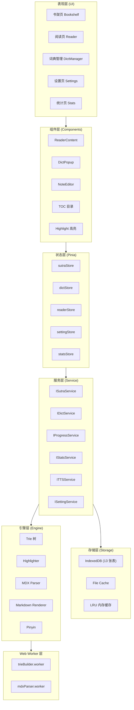
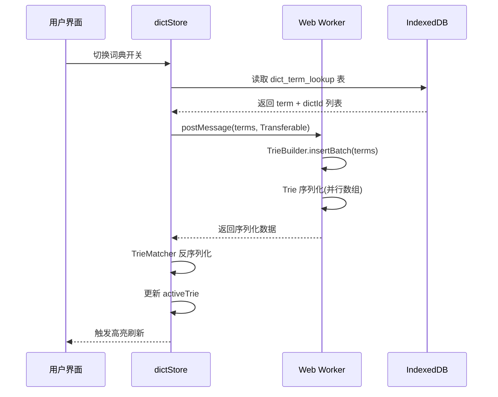
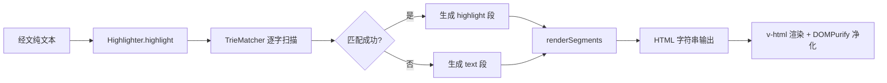
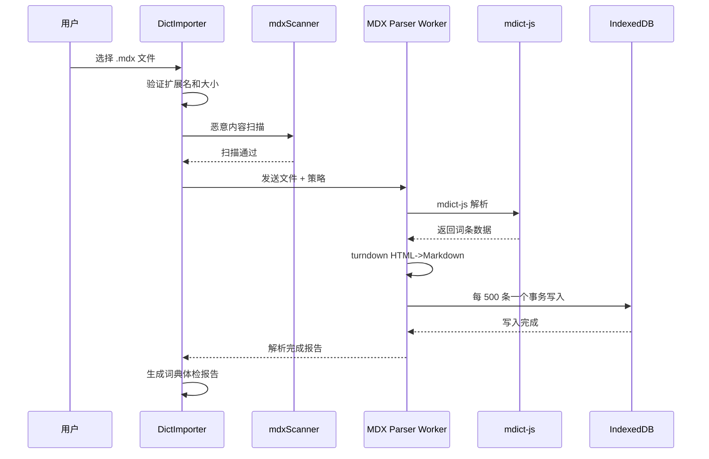

# 般若佛经阅读器 v2.0 — 技术设计说明书

> **版本**：v1.0  
> **日期**：2026-05-03  
> **状态**：待评审  
> **编写依据**：`docs/v2.0-detailed-design.md`

---

## 1. 架构设计

### 1.1 系统架构概览

系统采用六层分层架构，各层职责清晰，层间通过接口通信，支持独立替换和扩展。



### 1.2 分层架构职责

| 层级 | 职责 | 关键技术 |
|------|------|----------|
| 表现层 | 页面布局、用户交互、路由导航 | Vue 3 SFC、Vue Router |
| 组件层 | 可复用 UI 组件、事件委托 | Vant 4、Lucide Icons |
| 状态层 | 局部 UI 状态管理、组件间通信 | Pinia |
| 服务层 | 业务逻辑封装、数据访问抽象 | TypeScript 接口 |
| 存储层 | 持久化数据读写、缓存管理 | IndexedDB (idb) |
| 引擎层 | 核心算法：匹配、解析、渲染 | Trie、DOMPurify、markdown-it |
| Worker 层 | 重型计算任务异步处理 | Web Worker |

### 1.3 核心设计原则

| 原则 | 说明 |
|------|------|
| 接口与实现分离 | Service 层定义 TypeScript 接口，IndexedDB 实现和未来 REST API 实现可互换 |
| 大型数据不入库 | 章节内容、释义全文等大数据不放入 Pinia Store，由 Service 层按需加载 |
| 按需懒加载 | 词典索引按需加载，MDX 按大小分级处理，经书分块存储 |
| 纯前端优先 | 所有数据存储在 IndexedDB，预留后端 API 切换能力 |
| 安全四层防护 | 文件验证 -> MDX 扫描 -> DOMPurify 净化 -> CSP 拦截 |

---

## 2. 数据模型

### 2.1 数据库概览

| 属性 | 值 |
|------|-----|
| 数据库名 | `buddhist-reader-v2` |
| 当前版本 | 1 |
| 存储库 | idb (~3KB gzip) |
| 表数量 | 13 |
| 预估总容量 | 50-200MB（视词典数量） |

### 2.2 13 张表设计

```mermaid
erDiagram
    dictionaries ||--o{ dict_entries : "包含"
    dictionaries ||--o{ dict_term_lookup : "索引"
    dictionaries ||--o{ dictionary_chunks : "分块"
    dictionaries ||--o{ dictionary_versions : "版本"
    sutras ||--o{ sutra_chapters : "章节"
    sutras ||--o{ user_notes : "关联笔记"
    sutras ||--o{ user_highlights : "关联高亮"
    sutras ||--|| reading_progress : "进度"
    sutras ||--o{ statistics : "统计"

    dictionaries {
        number id PK
        string name
        string type "mdx|json|csv|builtin"
        string authority "official|personal"
        boolean isActive
        number entryCount
        string mdxStrategy
        string mdxVersion
        string createdAt
        string updatedAt
    }

    dict_entries {
        string key PK "dictId::term"
        string term
        number dictId FK
        string definition
        string format "markdown|html"
        string pinyin
        string category
        string checksum
        string updatedAt
    }

    dict_term_lookup {
        string key PK "dictId::term"
        string term
        number dictId FK
        string chunkId "仅大词典"
    }

    dictionary_chunks {
        string id PK "dictId::chunkId"
        number dictId FK
        string chunkId
        object entries
        number size
    }

    dictionary_versions {
        number id PK
        number dictId FK
        number version
        string uploadTime
        number entryCount
        string checksum
        string notes
    }

    sutras {
        number id PK
        string title
        string slug UK
        string category
        string translator
        number chapterCount
        number totalChars
        string coverUrl
        string createdAt
    }

    sutra_chapters {
        number id PK
        number sutraId FK
        number chapterIndex
        string title
        string content
        number wordCount
    }

    user_notes {
        number id PK
        string entryKey
        number sutraId FK
        string originalChecksum
        string noteContent
        string noteFormat
        boolean isEncrypted
        string createdAt
        string updatedAt
    }

    user_highlights {
        number id PK
        number sutraId FK
        string term
        string color
        string note
        string createdAt
    }

    reading_progress {
        number sutraId PK
        number chapterIndex
        number scrollPosition
        number readPercentage
        string lastReadAt
    }

    settings {
        string key PK
        any value
        string category
        string updatedAt
    }

    statistics {
        number id PK
        number sutraId FK
        string date
        number readCount
        number readChars
        number readDuration
        number streakDays
    }

    file_cache {
        string key PK
        string type "mdx_original|mdd_resource"
        Blob data
        number size
        string createdAt
        string expiresAt
    }
```



### 2.3 关键表关系说明

| 关系 | 说明 |
|------|------|
| dictionaries -> dict_entries | 一对多，一个词典包含多个词条条目 |
| dictionaries -> dict_term_lookup | 一对多，词条索引表不含释义，仅用于 Trie 构建 |
| dictionaries -> dictionary_chunks | 一对多，大词典分块存储，仅 >5MB 时使用 |
| dictionaries -> dictionary_versions | 一对多，记录每次上传的版本历史 |
| sutras -> sutra_chapters | 一对多，经书分章节存储 |
| sutras -> user_notes | 一对多，用户可针对经书中的词条添加笔记 |
| sutras -> reading_progress | 一对一，每部经书仅一条进度记录 |

---

## 3. 核心引擎设计

### 3.1 Trie 树引擎

#### 3.1.1 数据结构

```javascript
class TrieNode {
  constructor() {
    this.children = new Map()   // char -> TrieNode
    this.isEnd = false          // 是否是词条结尾
    this.dictIds = new Set()    // 包含此词条的词典 ID
  }
}
```

#### 3.1.2 构建流程



#### 3.1.3 匹配算法

采用贪心长词优先策略，从文本起始位置向后扫描，记录最长的匹配词条：

```javascript
match(text, startIdx, maxLen = 20) {
  let node = this.root
  let lastEnd = -1
  let lastDictIds = new Set()

  for (let i = startIdx; i < Math.min(startIdx + maxLen, text.length); i++) {
    const char = text[i]
    if (!node.children.has(char)) break
    node = node.children.get(char)
    if (node.isEnd) {
      lastEnd = i
      lastDictIds = new Set(node.dictIds)
    }
  }

  if (lastEnd >= 0) {
    return { term: text.slice(startIdx, lastEnd + 1), endIdx: lastEnd, dictIds: Array.from(lastDictIds) }
  }
  return null
}
```

### 3.2 高亮渲染引擎

#### 3.2.1 工作流程



#### 3.2.2 高亮颜色分配

```javascript
const colors = ['#FFF3CD', '#D1ECF1', '#D4EDDA', '#E2D5F1']
color = colors[dictId % colors.length]
```

#### 3.2.3 事件委托

高亮词条的点击事件通过事件委托绑定在容器上，而非每个 span 单独绑定：

```javascript
container.addEventListener('click', (e) => {
  const target = e.target.closest('.highlight')
  if (target) {
    const term = target.dataset.term
    const dictIds = target.dataset.dictIds.split(',').map(Number)
    showDictPopup(term, dictIds)
  }
})
```

### 3.3 MDX 解析引擎

#### 3.3.1 分级处理策略

| 文件大小 | 策略 | 存储方式 |
|----------|------|----------|
| < 5MB | 全量预解析 | 词条全部存入 dict_entries |
| 5-10MB | 索引预解析 + 释义懒加载 | 索引存入 dict_term_lookup，释义通过 mdict-js 实时查询 |
| > 10MB | 拒绝导入 | 提示用户文件过大 |

#### 3.3.2 解析流程



---

## 4. Service 层设计

### 4.1 统一返回格式

```typescript
interface ServiceResult<T> {
  success: boolean
  data?: T
  error?: ServiceError
}

interface ServiceError {
  code: string       // 错误码
  message: string    // 用户友好消息
  detail?: string    // 技术详情（开发环境）
}
```

### 4.2 Service 接口清单

| 接口 | 核心方法 | 职责 |
|------|----------|------|
| IDictService | listDictionaries, lookupTerms, importDictionary | 词典管理、词条查询、导入 |
| ISutraService | listSutras, getChapter, searchSutra | 经书浏览、章节加载、搜索 |
| IProgressService | getProgress, saveProgress | 阅读进度读写 |
| IStatsService | recordRead, getStats, getStreakDays | 诵读记录、统计查询 |
| ITTSService | speak, stop, pause, resume, getVoices | TTS 朗读控制 |
| ISettingService | getSetting, setSetting, exportSettings | 用户设置管理 |

### 4.3 Service 工厂模式

```javascript
export function initServices(mode = 'local') {
  if (mode === 'api') {
    // 未来后端 API 实现
    services = { sutra: new SutraServiceApi(), dict: new DictServiceApi(), ... }
  } else {
    // 默认 IndexedDB 实现
    services = { sutra: new SutraServiceLocal(), dict: new DictServiceLocal(), ... }
  }
  return services
}
```

### 4.4 IDictService 核心接口

```typescript
interface IDictService {
  listDictionaries(): Promise<ServiceResult<Dictionary[]>>
  toggleDictionary(id: number, isActive: boolean): Promise<ServiceResult<void>>
  deleteDictionary(id: number): Promise<ServiceResult<void>>
  importDictionary(file: File): Promise<ServiceResult<ImportProgress>>
  lookupTerms(term: string, activeDictIds?: number[]): Promise<ServiceResult<TermDefinition[]>>
  buildTrieIndex(dictId: number): Promise<ServiceResult<void>>
  getDictHealthReport(dictId: number): Promise<ServiceResult<DictHealthReport>>
}
```

---

## 5. 组件设计

### 5.1 页面组件

| 页面 | 路径 | 核心子组件 |
|------|------|------------|
| Bookshelf | `/` | BookshelfList, SutraCard, SearchBar |
| Reader | `/reader/:sutraId` | ReaderHeader, ReaderContent, ReaderTOC, ReaderProgress, DictPopup |
| DictManager | `/dict` | DictList, DictImporter, HealthReport |
| Settings | `/settings` | ThemeSwitcher, FontSizeSlider, ExportImport |
| Stats | `/stats` | StatsOverview, DailyChart, StreakDisplay |

### 5.2 核心组件设计

#### ReaderContent 组件

- 接收章节内容字符串
- 调用 Highlighter 进行高亮处理
- 使用 v-html 渲染净化后的 HTML
- 绑定事件委托处理高亮点击
- 使用 IntersectionObserver 实现段落懒渲染

#### DictPopup 组件

- 接收词条和词典 ID 列表
- 并行查询多词典释义
- 流式展示：先返回的先渲染
- 每个释义卡片底部提供"添加笔记"按钮
- 支持折叠/展开三种展示模式

#### DictImporter 组件

- 支持拖拽上传和文件选择器
- 实时显示导入进度
- 导入完成后展示体检报告
- 支持 .json、.csv、.mdx 三种格式

---

## 6. 状态管理设计

### 6.1 Pinia Store 清单

| Store | 管理状态 | 数据量 |
|-------|----------|--------|
| sutraStore | 经书列表元数据、当前经书信息 | < 10KB |
| dictStore | 词典列表、开关状态、健康度、activeTrie | < 50KB |
| readerStore | 当前章节、阅读进度、TTS 状态 | < 5KB |
| settingStore | 主题、字号、行高、高亮模式等 | < 2KB |
| statsStore | 统计数据、连续天数、里程碑 | < 20KB |

### 6.2 状态与 Service 层边界

| 层 | 存储内容 | 生命周期 |
|----|----------|----------|
| Pinia Store | 轻量 UI 状态：列表、开关、当前选中项 | 组件挂载期间 |
| Service 层 | 大数据：章节正文、释义全文 | 按需加载、LRU 缓存 |
| IndexedDB | 持久化数据：所有业务数据 | 浏览器存储 |
| 内存缓存 | 最近查询的释义（LRU） | 页面生命周期 |

---

## 7. 路由设计

### 7.1 路由表

| 路径 | 组件 | 参数 | 说明 |
|------|------|------|------|
| `/` | Bookshelf | 无 | 经书书架首页 |
| `/reader/:sutraId` | Reader | sutraId: number | 经文阅读页 |
| `/reader/:sutraId/:chapter` | Reader | sutraId, chapter: number | 指定章节阅读 |
| `/dict` | DictManager | 无 | 词典管理页 |
| `/settings` | Settings | 无 | 设置页 |
| `/stats` | Stats | 无 | 功德统计页 |

### 7.2 路由守卫

- 首次访问时自动初始化 IndexedDB
- 路由切换时保存当前阅读进度
- 404 页面重定向至书架首页

---

## 8. 禅意设计系统

详见 `docs/design/ZEN-DESIGN.md`，核心技术要点：

| 要素 | 规范 |
|------|------|
| 色彩系统 | 檀木色 (#8b7355) 为唯一交互强调色 |
| 字体栈 | 宋体优先：Noto Serif SC -> Source Han Serif SC -> SimSun -> serif |
| 正文排版 | 17px / 1.65 行高 / 400 字重 |
| 圆角系统 | 二元：8px（容器）或 9999px（交互元素） |
| 深度系统 | 零阴影，通过背景色和边框实现 |
| 间距系统 | 4px 基础单位：4/8/12/16/24/32/48/64px |

---

## 9. 部署配置

### 9.1 Vercel 配置

```json
{
  "buildCommand": "npm run build",
  "outputDirectory": "dist",
  "rewrites": [{ "source": "/(.*)", "destination": "/index.html" }]
}
```

### 9.2 安全响应头

| 头部 | 值 |
|------|-----|
| Content-Security-Policy | default-src 'self'; script-src 'self' 'unsafe-inline'; style-src 'self' 'unsafe-inline'; img-src 'self' data: blob:; font-src 'self' data:; connect-src 'self'; object-src 'none'; frame-src 'none'; base-uri 'self'; form-action 'self' |
| X-Content-Type-Options | nosniff |
| X-Frame-Options | DENY |
| X-XSS-Protection | 1; mode=block |

---

*文档版本: v1.0*  
*最后更新: 2026-05-03*
