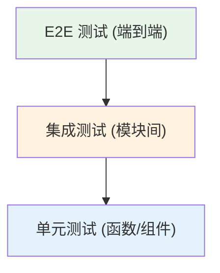

# 般若佛经阅读器 v2.0 — 测试方案

> **版本**：v1.0  
> **日期**：2026-05-03  
> **状态**：待评审  
> **编写依据**：`docs/v2.0-detailed-design.md`、`docs/specs/01-需求规格说明书.md`

---

## 1. 测试策略

### 1.1 测试分层

| 测试层级 | 目标 | 工具推荐 | 覆盖率目标 |
|----------|------|----------|------------|
| 单元测试 | 验证函数、类、组件的独立行为 | Vitest + Vue Test Utils | > 80% 引擎层/Service 层 |
| 集成测试 | 验证模块间协作和数据流 | Vitest + idb-mock | 核心流程 100% |
| E2E 测试 | 验证用户完整操作流 | Playwright | 5 个核心页面 |

### 1.2 测试环境

| 环境 | 配置 | 用途 |
|------|------|------|
| 本地开发 | Node.js 18+, Chrome 最新版 | 单元测试、集成测试开发调试 |
| CI 环境 | GitHub Actions Ubuntu Runner | 自动化回归测试 |
| 浏览器矩阵 | Chrome 90+, Safari 15+, Firefox 90+, Edge 90+ | 兼容性测试 |
| 移动设备 | iPhone 12+ Safari, Android Chrome | 移动端兼容性测试 |

### 1.3 测试数据准备

| 数据类型 | 来源 | 说明 |
|----------|------|------|
| 内置词典 | `src/data/builtinDictionary.js` | 50+ 条佛学术语 |
| 测试经书 | `public/sutras/` | 心经（260 字）、金刚经（5000+ 字） |
| 用户词典 | 测试用例动态生成 | JSON/CSV/MDX 格式各准备一份 |
| 用户设置 | 测试 fixture | 包含三种主题、不同字号配置 |

---

## 2. 单元测试设计

### 2.1 Trie 树引擎测试

| 用例编号 | 测试目标 | 输入 | 预期输出 |
|----------|----------|------|----------|
| UT-TRIE-001 | 单词条插入与匹配 | insert("般若", 1), match("般若波罗蜜", 0) | { term: "般若", endIdx: 1, dictIds: [1] } |
| UT-TRIE-002 | 多词条插入与长词优先 | insert("般若", 1), insert("般若波罗蜜", 1), match("般若波罗蜜多", 0) | { term: "般若波罗蜜", endIdx: 4, dictIds: [1] } |
| UT-TRIE-003 | 跨词典词条匹配 | insert("般若", 1), insert("般若", 2), match("般若", 0) | dictIds: [1, 2] |
| UT-TRIE-004 | 无匹配返回 | insert("般若", 1), match("阿弥陀佛", 0) | null |
| UT-TRIE-005 | 批量插入性能 | insertBatch(10 万条) | 耗时 < 100ms |
| UT-TRIE-006 | 序列化与反序列化 | serialize() -> deserialize() | 匹配结果一致 |
| UT-TRIE-007 | 内存释放 | destroy() 后访问 root | root === null |
| UT-TRIE-008 | 最大匹配长度限制 | match(超长文本, 0, maxLen=20) | 最多扫描 20 个字符 |

### 2.2 高亮引擎测试

| 用例编号 | 测试目标 | 输入 | 预期输出 |
|----------|----------|------|----------|
| UT-HL-001 | 单词条高亮 | content="观自在菩萨行深般若波罗蜜多时", 匹配"般若" | 包含 `般若` |
| UT-HL-002 | 多词条高亮 | content 含"般若"和"波罗蜜" | 两处分别高亮 |
| UT-HL-003 | 重叠词条处理 | 匹配"般若"和"般若波罗蜜" | 长词优先，仅高亮"般若波罗蜜" |
| UT-HL-004 | 过滤未启用词典 | 词条仅在 dictId=2 中，activeDictIds=[1] | 不高亮 |
| UT-HL-005 | 高亮颜色分配 | dictId=0,1,2,3 | 分别对应 4 种预定义颜色 |
| UT-HL-006 | 1000 字性能 | 1000 字经文 + 50 词条匹配 | 耗时 < 10ms |
| UT-HL-007 | 5000 字性能 | 5000 字经文 + 50 词条匹配 | 耗时 < 30ms |

### 2.3 IndexedDB 操作测试

| 用例编号 | 测试目标 | 操作 | 预期结果 |
|----------|----------|------|----------|
| UT-DB-001 | 数据库初始化 | initDB() | 13 张表全部创建 |
| UT-DB-002 | 词典写入与读取 | put(dict) -> get(id) | 数据一致 |
| UT-DB-003 | 复合主键查询 | get("1::般若") | 返回对应词条 |
| UT-DB-004 | 索引查询 | getByIndex("sutraId", 1) | 返回所有匹配记录 |
| UT-DB-005 | 事务批量写入 | 500 条/事务 | 全部写入成功 |
| UT-DB-006 | 版本迁移 | 从 v0 升级到 v1 | 13 张表自动创建 |
| UT-DB-007 | 存储配额监控 | quotaMonitor.check() | 返回已用/总配额比例 |
| UT-DB-008 | Blob 存储 | 存入 MDX 文件 Blob | 取出后大小和校验和一致 |

### 2.4 MDX 解析器测试

| 用例编号 | 测试目标 | 输入 | 预期结果 |
|----------|----------|------|----------|
| UT-MDX-001 | UTF-8 编码 MDX 解析 | UTF-8 编码 .mdx 文件 | 词条正确提取 |
| UT-MDX-002 | GBK 编码 MDX 解析 | GBK 编码 .mdx 文件 | 无乱码，词条正确 |
| UT-MDX-003 | Big5 编码 MDX 解析 | Big5 编码 .mdx 文件 | 繁中词条正确提取 |
| UT-MDX-004 | LZO 压缩 MDX 解析 | 含 LZO 压缩的 .mdx | 使用 lzo-wasm 解压后正确解析 |
| UT-MDX-005 | 恶意脚本检测 | 含 `` | DOMPurify 移除 script，仅保留文本 |
| SEC-002 | 词典释义含 onerror 事件 | `` | DOMPurify 移除事件处理器 |
| SEC-003 | 词典释义含 javascript: 协议 | `<a href="javascript:alert(1)">` | DOMPurify 移除危险 href |
| SEC-004 | 用户笔记含 HTML | `<b>笔记</b>` | script 被移除，bold 标签保留 |

### 7.2 文件上传安全测试

| 用例编号 | 测试场景 | 输入 | 预期结果 |
|----------|----------|------|----------|
| SEC-005 | 非支持格式上传 | 上传 .exe 文件 | 拒绝，提示格式不支持 |
| SEC-006 | 超大文件上传 | 上传 15MB .mdx 文件 | 拒绝，提示超过 10MB 限制 |
| SEC-007 | MDX 含恶意脚本 | 上传含 `<script>` 的 .mdx | mdxScanner 拦截，拒绝导入 |
| SEC-008 | 文件名注入 | 上传 `../../../etc/passwd.json` | 文件名安全处理，不产生路径穿越 |

### 7.3 CSP 测试

| 用例编号 | 测试场景 | 预期结果 |
|----------|----------|----------|
| SEC-009 | 加载外部脚本 | CSP 阻止，控制台报错 |
| SEC-010 | 加载外部样式 | CSP 阻止，控制台报错 |
| SEC-011 | iframe 嵌入 | CSP 阻止（frame-src: none） |
| SEC-012 | 内联对象加载 | CSP 阻止（object-src: none） |

---

## 8. 测试执行计划

### 8.1 Phase 1：单元测试（与开发同步）

| 模块 | 优先级 | 完成标准 |
|------|--------|----------|
| Trie 树引擎 | P0 | 所有 UT-TRIE-* 用例通过 |
| 高亮引擎 | P0 | 所有 UT-HL-* 用例通过 |
| IndexedDB 操作 | P0 | 所有 UT-DB-* 用例通过 |
| MDX 解析器 | P1 | 所有 UT-MDX-* 用例通过 |
| Service 层 | P0 | 所有 UT-SVC-* 用例通过 |

### 8.2 Phase 2：集成测试（Phase 1 完成后）

| 模块 | 优先级 | 完成标准 |
|------|--------|----------|
| 词典高亮集成 | P0 | IT-001 ~ IT-005 通过 |
| 词典导入集成 | P0 | IT-006 ~ IT-013 通过 |
| 路由导航集成 | P1 | IT-014 ~ IT-018 通过 |
| 文件导入集成 | P1 | IT-019 ~ IT-023 通过 |

### 8.3 Phase 3：E2E 测试（功能完成后）

| 旅程 | 优先级 | 完成标准 |
|------|--------|----------|
| 首次使用 | P0 | E2E-001 通过 |
| 词典导入 | P0 | E2E-002 通过 |
| 设置与主题 | P1 | E2E-003 通过 |
| 移动端 | P0 | E2E-004 通过 |
| TTS | P2 | E2E-005 通过 |
| 离线 | P1 | E2E-006 通过 |
| 统计 | P2 | E2E-007 通过 |
| 持久化 | P0 | E2E-008 通过 |

### 8.4 Phase 4：性能与兼容性测试（上线前）

| 类别 | 完成标准 |
|------|----------|
| 性能测试 | 所有指标达到目标值 |
| 兼容性测试 | P0 浏览器全部通过，P1 浏览器无阻塞性 Bug |
| 安全测试 | 所有 SEC-* 用例通过 |

---

## 9. 测试通过标准

| 级别 | 标准 |
|------|------|
| 阻塞 (Blocker) | P0 用例 100% 通过，无未解决的 P0 Bug |
| 发布 (Release) | P0 + P1 用例 95% 通过，无 P0/P1 未解决 Bug |
| 优秀 (Excellent) | 全部用例 100% 通过，性能指标全部达标 |

---

*文档版本: v1.0*  
*最后更新: 2026-05-03*
