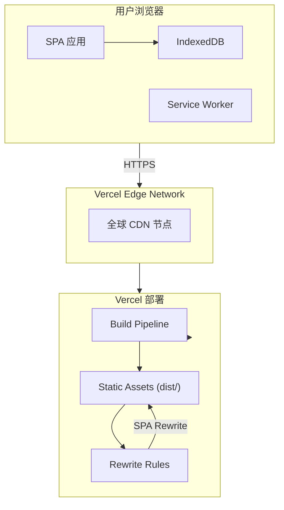
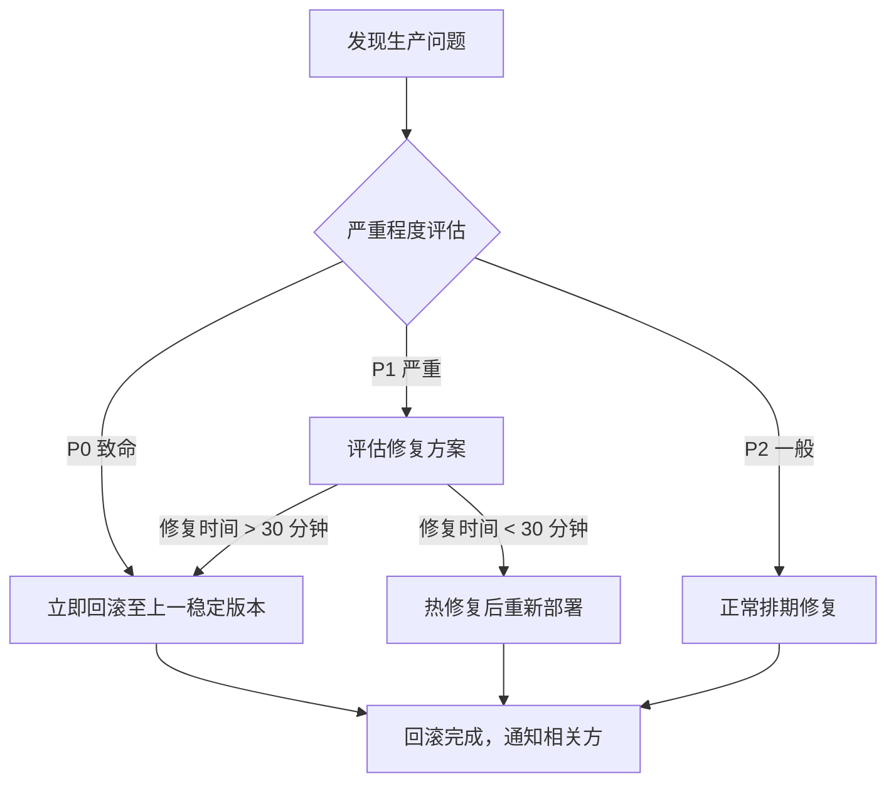

# 般若佛经阅读器 v2.0 — 部署方案

> **版本**：v1.0  
> **日期**：2026-05-03  
> **状态**：待评审  
> **编写依据**：`docs/v2.0-detailed-design.md`、`vercel.json`

---

## 1. 部署架构

### 1.1 架构概览

般若佛经阅读器 v2.0 作为纯前端单页应用（SPA）部署，无需后端服务。所有数据存储在用户浏览器的 IndexedDB 中。



### 1.2 架构特点

| 特点 | 说明 |
|------|------|
| 无后端依赖 | 纯前端应用，无需数据库和应用服务器 |
| CDN 加速 | 通过 Vercel 全球 CDN 分发静态资源 |
| SPA 路由 | 所有路由重写至 index.html，由前端路由处理 |
| 离线支持 | 数据存储在 IndexedDB 中，加载完成后可离线使用 |
| 自动 HTTPS | Vercel 自动配置 SSL 证书 |

---

## 2. 环境配置

### 2.1 构建环境要求

| 项目 | 要求 |
|------|------|
| Node.js | 18.x 或更高版本 |
| npm | 9.x 或更高版本 |
| 操作系统 | Linux / macOS / Windows |
| 内存 | 至少 2GB 可用内存 |

### 2.2 项目构建配置

```json
{
  "name": "ai-buddhist-reader",
  "version": "2.1.0",
  "type": "module",
  "scripts": {
    "dev": "vite",
    "build": "vite build",
    "preview": "vite preview",
    "lint": "eslint . --ext .vue,.js,.ts --fix",
    "build:analyze": "vite build --mode analyze"
  }
}
```

### 2.3 Vite 配置关键项

| 配置项 | 值 | 说明 |
|--------|-----|------|
| `build.outDir` | `dist` | 构建产物输出目录 |
| `server.allowedHosts` | `['.monkeycode-ai.online']` | 允许预览的域名 |
| `optimizeDeps.include` | `['mdict-js']` | mdict-js 需预打包 |
| `define.global` | `'globalThis'` | mdict-js 浏览器兼容 |
| `resolve.alias.@` | `src/` | 路径别名 |

### 2.4 环境变量

| 变量名 | 环境 | 说明 |
|--------|------|------|
| `VERCEL_ENV` | 运行时 | 当前部署环境：production / preview / development |
| `VITE_APP_TITLE` | 构建时 | 应用标题（可选） |
| `VITE_APP_VERSION` | 构建时 | 应用版本号（可选） |

---

## 3. Vercel 部署流程

### 3.1 vercel.json 配置

```json
{
  "buildCommand": "npm run build",
  "outputDirectory": "dist",
  "rewrites": [
    {
      "source": "/(.*)",
      "destination": "/index.html"
    }
  ],
  "headers": [
    {
      "source": "/(.*)",
      "headers": [
        {
          "key": "Content-Security-Policy",
          "value": "default-src 'self'; script-src 'self' 'unsafe-inline'; style-src 'self' 'unsafe-inline'; img-src 'self' data: blob:; font-src 'self' data:; connect-src 'self'; object-src 'none'; frame-src 'none'; base-uri 'self'; form-action 'self'"
        },
        { "key": "X-Content-Type-Options", "value": "nosniff" },
        { "key": "X-Frame-Options", "value": "DENY" },
        { "key": "X-XSS-Protection", "value": "1; mode=block" }
      ]
    }
  ]
}
```

### 3.2 首次部署

#### 方式一：GitHub 集成（推荐）

1. 将代码仓库推送至 GitHub
2. 登录 Vercel 控制台
3. 点击 "New Project"
4. 选择目标 GitHub 仓库
5. 框架预设选择 "Vite"
6. 确认构建命令和输出目录（自动检测 vercel.json）
7. 点击 "Deploy"

#### 方式二：Vercel CLI

```bash
# 安装 Vercel CLI
npm install -g vercel

# 在项目根目录执行
vercel

# 生产部署
vercel --prod
```

### 3.3 部署环境说明

| 环境类型 | 触发条件 | URL | 说明 |
|----------|----------|-----|------|
| Production | 推送至 main/master 分支 | 自定义域名 | 正式生产环境 |
| Preview | 推送至其他分支或 PR | vercel.app 子域名 | 预览环境，每次推送生成新 URL |
| Development | 本地运行 | localhost:5173 | 本地开发环境 |

### 3.4 SPA 路由重写

由于应用使用 Vue Router 的 history 模式，所有非静态资源的请求都需要重写至 `index.html`，由前端路由处理：

```json
{
  "rewrites": [
    { "source": "/(.*)", "destination": "/index.html" }
  ]
}
```

这确保了以下 URL 都能正常访问：
- `/` -> 书架页面
- `/reader/1` -> 阅读页
- `/dict` -> 词典管理页
- `/settings` -> 设置页
- `/stats` -> 功德统计页

---

## 4. CI/CD 配置

### 4.1 GitHub Actions 配置

在项目根目录创建 `.github/workflows/ci.yml`：

```yaml
name: CI

on:
  push:
    branches: [main]
  pull_request:
    branches: [main]

jobs:
  build:
    runs-on: ubuntu-latest
    steps:
      - uses: actions/checkout@v4

      - uses: actions/setup-node@v4
        with:
          node-version: '18'
          cache: 'npm'

      - name: Install dependencies
        run: npm ci

      - name: Lint
        run: npm run lint

      - name: Build
        run: npm run build

      - name: Upload build artifacts
        uses: actions/upload-artifact@v4
        with:
          name: dist
          path: dist/
```

### 4.2 CI 流程说明


| 步骤 | 命令 | 说明 |
|------|------|------|
| 检出代码 | `actions/checkout@v4` | 获取最新代码 |
| 安装依赖 | `npm ci` | 使用锁文件安装精确依赖版本 |
| 代码检查 | `npm run lint` | ESLint 检查代码规范 |
| 构建 | `npm run build` | Vite 构建生产产物 |
| 自动部署 | Vercel GitHub Integration | 推送至 main 分支自动触发生产部署 |

### 4.3 分支策略

| 分支 | 用途 | 部署目标 |
|------|------|----------|
| main | 生产代码 | Vercel Production |
| develop | 开发集成 | Vercel Preview |
| feature/* | 功能开发 | Vercel Preview |
| fix/* | Bug 修复 | Vercel Preview |

---

## 5. 域名配置

### 5.1 自定义域名

1. 在 Vercel 控制台的 Project Settings 中找到 Domains
2. 添加自定义域名（如 `buddhist-reader.example.com`）
3. 按照指引配置 DNS：
   - A 记录指向 `76.76.21.21`，或
   - CNAME 记录指向 `cname.vercel-dns.com`
4. 等待 DNS 生效后，Vercel 自动配置 SSL 证书

### 5.2 SSL 证书

Vercel 自动为所有自定义域名配置 Let's Encrypt SSL 证书：
- 证书自动续期，无需手动管理
- 强制 HTTPS 重定向
- 支持通配符子域名

### 5.3 域名跳转

如需将裸域名跳转至 www 子域名（或反之），在 Vercel Domains 设置中配置 Primary Domain 即可。

---

## 6. 监控告警

### 6.1 Vercel 内置监控

| 监控项 | 说明 | 配置位置 |
|--------|------|----------|
| 部署状态 | 每次部署的成功/失败状态 | Vercel Dashboard -> Deployments |
| 访问量统计 | 每日访问量、带宽使用 | Vercel Dashboard -> Analytics |
| 错误日志 | 函数错误和构建错误 | Vercel Dashboard -> Logs |

### 6.2 前端错误监控

建议在应用中集成前端错误监控服务（如 Sentry）：

```javascript
// main.js
import * as Sentry from "@sentry/vue"

Sentry.init({
  app,
  dsn: import.meta.env.VITE_SENTRY_DSN,
  environment: import.meta.env.VITE_VERCEL_ENV || 'development',
  tracesSampleRate: 0.1,
})
```

### 6.3 性能监控

使用 Vercel Analytics 或 Web Vitals 监控关键性能指标：

```javascript
// 安装 web-vitals
npm install web-vitals

// main.js
import { getFCP, getLCP, getCLS } from 'web-vitals'

getFCP(console.log)
getLCP(console.log)
getCLS(console.log)
```

### 6.4 告警策略

| 告警项 | 阈值 | 通知方式 |
|--------|------|----------|
| 部署失败 | 任何失败 | Vercel 邮件通知 |
| 访问量异常 | 日访问量突增/突降 50% | Vercel Analytics 通知 |
| 前端错误率 | 错误率 > 1% | Sentry 邮件/Slack |
| 性能退化 | LCP > 3s | Sentry Performance |

---

## 7. 回滚策略

### 7.1 Vercel 回滚

Vercel 支持一键回滚至历史部署：

1. 进入 Vercel Dashboard -> Deployments
2. 找到需要回滚到的历史版本
3. 点击该部署的 "Promote to Production" 按钮
4. 确认回滚

回滚操作立即生效，无需重新构建。

### 7.2 回滚决策流程



### 7.3 回滚注意事项

| 注意事项 | 说明 |
|----------|------|
| 数据兼容性 | 回滚需确认新版本未修改 IndexedDB 结构 |
| 用户通知 | 回滚后通知用户可能遇到的短暂不可用 |
| 回滚窗口 | 保留最近 30 天的部署记录可供回滚 |
| 回滚验证 | 回滚后立即执行冒烟测试确认恢复正常 |

### 7.4 数据迁移回滚

如果新版本包含 IndexedDB 结构变更，回滚时需注意：

1. 如果用户浏览器已执行新版本迁移脚本，旧版本代码可能无法读取新结构的数据
2. 建议在数据库迁移时记录版本号，新版本启动时检查版本兼容性
3. 如需支持向前兼容，迁移脚本应保持幂等和可逆

---

## 8. 部署检查清单

### 8.1 部署前检查

- [ ] 代码已通过 CI（lint + build）
- [ ] 所有自动化测试通过
- [ ] 功能验收通过（参考验收方案）
- [ ] 性能指标达标
- [ ] vercel.json 配置正确
- [ ] 环境变量已配置
- [ ] 自定义域名已配置（如适用）
- [ ] Sentry 等监控已接入（如适用）

### 8.2 部署后检查

- [ ] 生产 URL 可正常访问
- [ ] 5 个核心页面加载正常
- [ ] 词典高亮功能正常
- [ ] TTS 朗读功能正常
- [ ] 主题切换功能正常
- [ ] Lighthouse 性能评分达标
- [ ] 浏览器控制台无错误
- [ ] 移动端响应式正常

---

## 9. 运维注意事项

### 9.1 浏览器存储管理

由于应用完全依赖浏览器本地存储：

| 场景 | 影响 | 建议 |
|------|------|------|
| 用户清除浏览器数据 | 所有本地数据丢失 | 提示用户定期导出设置 |
| 存储空间不足 | 无法导入新词典 | 提供存储占用查看和清理功能 |
| 更换设备 | 数据无法迁移 | 提供设置导出/导入功能 |
| 浏览器更新 | IndexedDB API 可能变化 | 保持对主流浏览器的兼容性测试 |

### 9.2 CDN 缓存策略

Vercel 默认对静态资源进行 CDN 缓存：

| 资源类型 | 缓存策略 |
|----------|----------|
| HTML (index.html) | 不缓存，每次请求 |
| JS/CSS 带 hash 文件名 | 长期缓存（1 年） |
| 图片资源 | 长期缓存 |
| 字体文件 | 长期缓存 |

Vite 构建时自动为 JS/CSS 文件名添加内容 hash，确保更新后浏览器获取最新版本。

### 9.3 版本更新通知

当应用发布新版本时：

1. 用户下次打开页面时自动加载新版本（index.html 不缓存）
2. 如果用户已在阅读中，当前会话继续使用旧版本
3. 建议在更新内容涉及 IndexedDB 结构变更时，提示用户刷新页面

---

*文档版本: v1.0*  
*最后更新: 2026-05-03*
