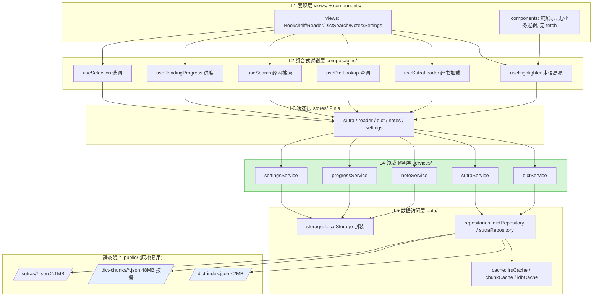
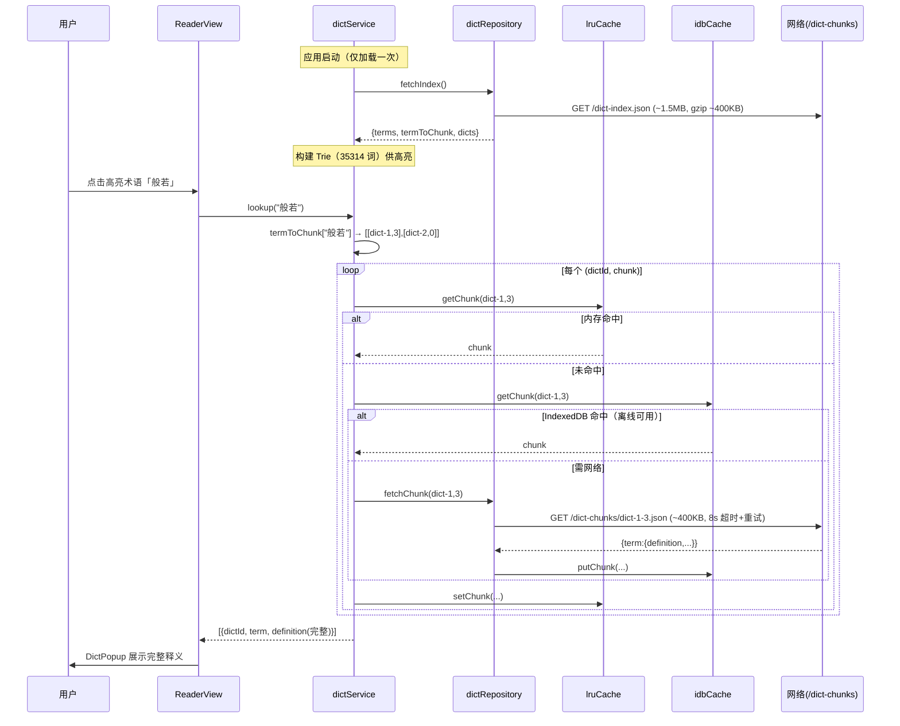
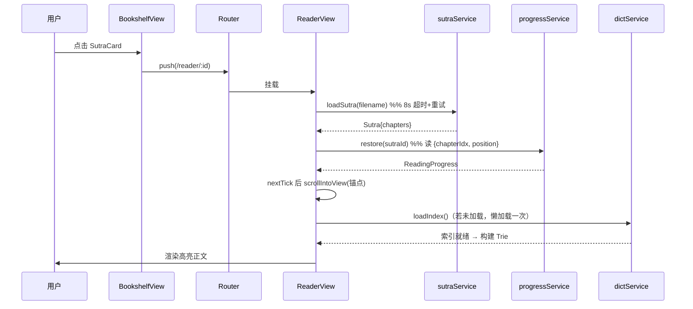
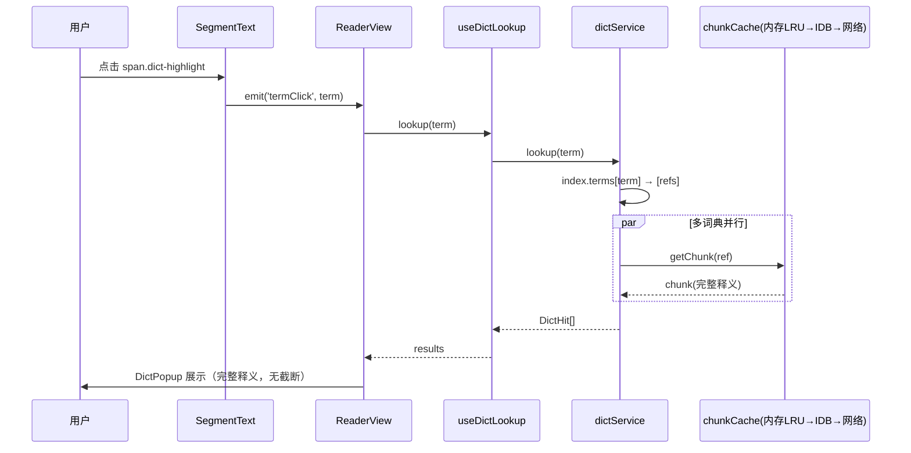
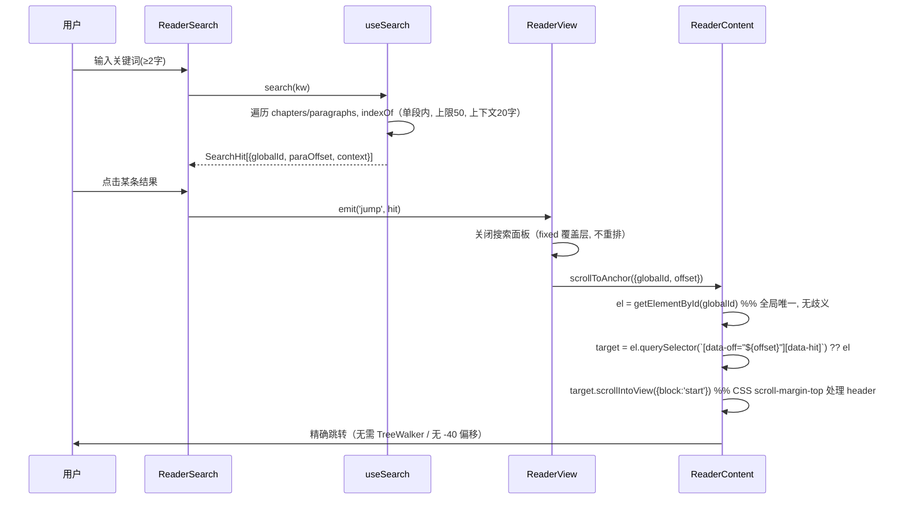
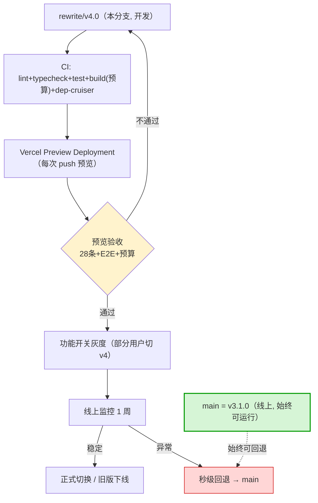

# 般若佛经阅读器 v4.0 开发方案

> 作者：高见远（架构师）· 团队 software-buddhist-reader
> 日期：2026-09-29 ｜ 分支：`rewrite/v4.0` ｜ 基线：v3.1.0（已归档 `archive/v3.1.0/`）
> 依据：`docs/refactor/` 下 8 份分析文档（尤其 `-implicit-knowledge-handover.md` 28 条、`-code-quality-audit.md`、`-rewrite-feasibility.md`）
> 功能基线：**现有 55 个功能点等价**（`-feature-inventory.md`）；产品经理 v4.0 范围定义另行通知调整
> 约束：本文件仅方案，不含实现代码；**不动 main、不 push**

---

## 0. 摘要

| 项 | 结论 |
|----|------|
| **目标架构** | 表现层 / 组合式逻辑层 / 状态层 / **领域服务层** / 数据访问层 五层，TS strict，**词典「索引在线 + 分片按需加载」** |
| **技术栈** | Vue 3.5.41 + Vite 7.3.6 + Pinia 4.0.3 + Vue Router 4.5.1 + **TypeScript strict** + Vitest |
| **数据层核心** | 根因不是「fetch 慢」，而是「**点查询却拉取 30MB 单体文件**」。解法：**索引(≤2MB) + 500 词分片按需加载(~400KB/片) + LRU + IndexedDB 离线**；**分片由源数据 `public/dicts`（50MB，入库）在构建期重生成（脚本已有），生成物 gitignore 不入库**——既复用分片粒度/脚本，又满足「生成物不进入新仓」的卫生原则 |
| **首屏预算** | 初始 JS+索引 **≤ 600KB gzip**（现状 ~5MB+ gzip）；点击查词额外 ~400KB |
| **任务数 / 人天** | **12 个任务 / ≈ 29–30 人天**（与 Part E 的 B2 区间 22–30 一致） |
| **里程碑** | 4 个（M1 骨架+数据层 → M2 阅读核心 → M3 全功能等价 → M4 验收+上线） |
| **上线策略** | Vercel 预览并行部署 + 功能开关灰度 + main 始终可回退 |

---

## 1. 目标架构

### 1.1 分层设计



**依赖方向铁律（单向，由 dependency-cruiser 强制）**：
`views/components → composables → stores → services → data → (assets)`。
禁止反向、禁止跨层跳跃（如组件直接 fetch、store 直接操作 DOM）。

### 1.2 关键抽象

| 抽象 | 职责 | 关键接口（示意） |
|------|------|------------------|
| `dictService` | 词典领域唯一入口：索引加载、查词、分片获取、缓存编排 | `loadIndex()`, `lookup(term): Promise<DictHit[]>`, `getEnabledTerms()` |
| `dictRepository` | 纯 IO：拉索引、拉分片、缓存读写 | `fetchIndex()`, `fetchChunk(dictId, chunkIdx)`, `fetchSutra(file)` |
| `lruCache` | 内存 LRU（分片/索引），容量可配 | `get(k)`, `set(k,v)`, `has(k)` |
| `chunkCache` | 分片二级缓存（内存 LRU + IndexedDB 持久） | `getChunk(dictId,i)`, `putChunk(...)` |
| `useHighlighter` | 术语 Trie 高亮（**复用旧算法**，TS 重写） | `highlight(text): Segment[] \| null` |
| `anchor`（工具） | **语义锚点**：`{sutraId, chapterIdx, paraId, offset}` ↔ 稳定 DOM id | `toElementId(a)`, `scrollToAnchor(a)` |

---

## 2. 技术栈与版本决策

| 依赖 | 版本 | 选型理由 / 依据 |
|------|------|-----------------|
| `vue` | **^3.5.41** | 当前稳定版（3.6 仍 beta）；3.5 响应式内存优化显著，且支持响应式 props 解构、`useTemplateRef`、`useId`、`onWatcherCleanup` |
| `vite` | **^7.3.6** | 当前稳定；Rolldown 可选（暂不启用，稳优先）；Environment API 便于未来 Worker 构建 |
| `pinia` | **^4.0.3** | 当前版；**ESM-only**，且 **`@vue/devtools-api` 是必需 peer dependency，必须显式写入 dependencies**（否则 devtools/构建报错） |
| `vue-router` | **^4.5.1** | 当前版；组合式守卫、类型安全路由 |
| `typescript` | **^5.x（strict）** | **本方案相对旧版最大质量增益**：编译期挡住类型错配、未定义、props 漏写 |
| `vue-tsc` | ^2.x | SFC 类型检查，进 CI |
| `vitest` + `@vue/test-utils` + `jsdom` | 最新 | 单测 |
| `@playwright/test` | 最新 | 关键路径 E2E |
| `@vitejs/plugin-vue` | ^6.x | 配套 Vite 7 |
| `eslint` + `eslint-plugin-vue` + `@typescript-eslint` | 最新 | 见 §11 规则 |
| `dependency-cruiser` | 最新 | 分层校验（见 §11） |
| `@vue/devtools-api` | 最新 | **Pinia 4 必需 peer dep** |

**不引入**：UI 组件库（保持纯手写禅意风格）、状态持久化插件（自研 storage 已够）、axios（用原生 fetch + 自研封装）。

---

## 3. 数据层设计（本方案核心）

### 3.1 必须先查清的历史真相：为什么当年要「全量内联」

`git show 86f70fc`（2026-05-15）原文：

> `feat: 内联词典释义到 dictIndex.js，取消运行时 fetch 30MB JSON`
> `- 解决 30MB 词典文件 fetch 超时导致查不到释义的问题`

该 commit 删掉的**旧实现**（关键代码）：

```js
const CACHE_TTL = 5 * 60 * 1000
async function fetchDict(dictId, manifest) {
  const cached = cache.value[dictId]
  if (cached && Date.now() - cached.time < CACHE_TTL) return cached.data
  const resp = await fetch(`/dicts/${encodeURIComponent(entry.filename)}`)  // ← 整个 16~31MB 单体文件
  const data = await resp.json()
  ...
}
async function lookupTerm(term, dictIds, manifest) { /* 并行 fetch 全部单体词典 */ }
```

**真实根因判定：**
> **不是「fetch 慢」，而是「点查询（查 1 个词）却拉取 30MB 单体文件」——粒度错配（point query vs monolithic fetch）。**
> 次要放大因素：① 无 `AbortController`/超时；② 无 loading 反馈（用户以为卡死）；③ 首次点击冷启动；④ 移动端弱网。
> 当年的「正确解法」本应是**分片**（项目里其实已有 `public/dict-chunks` 按 500 词分片的资产！），但作者选择了**全量内联**——这是**用错误的手段（牺牲体积与完整性）解决了症状（超时）**，并引入 20.8MB bundle 与释义截断两个新 P0。

**⚠️ 若 v4.0 直接恢复「运行时 fetch 单体词典」，超时 bug 会原样复现**（隐性知识清单 §6 明确列为重现成本 3–5 轮）。

### 3.2 正面解法：索引在线 + 分片按需加载



**设计要点：**
1. **粒度对齐**：一次查词只拉**一个 500 词分片（~400KB）**，而非 30MB → **超时根因消除**。
2. **索引与服务解耦**：`dict-index.json` 只含 **term → [{dictId, chunk}]**，**不含释义**。
3. **fetch 卫生**：`AbortController` + **8s 超时** + **1 次重试** + loading 态；命中同分片预取相邻分片。
4. **三级缓存**：内存 LRU（~20 片 ≈ 8MB）→ IndexedDB（离线）→ 网络。
5. **完整释义**：分片存**完整**释义，**取消 300 字截断**（修复旧版功能性回归）。

### 3.3 分片资产能否复用？（与产品范围文档 §1.3/§2-2 的对齐）

> ⚠️ **口径澄清（重要）**：产品范围文档 `2026-09-29-v4.0-scope.md` 把 `dict-chunks`/`dict-defs` 列为「67MB 死资产 → 砍掉、不进入新仓」。该判断对**仓库卫生**成立（二者在 v3.1.0 确无运行时引用），但**不等于 v4.0 不需要分片**——恰恰相反，**500 词/片的分片正是 M17「索引与释义分离加载」的载体**。两个目标可以两全，见下表。

| 资产 | 现状 | v4.0 处置 | 结论 |
|------|------|-----------|------|
| `public/dicts/*.json`（50MB，3 词典 + manifest） | **源数据（tracked）** | **✅ 保留**（范围文档 §6 已明确「词典源数据属可复用资产，不在裁剪内」） | 复用（**唯一真相源**） |
| `public/dict-chunks/*.json`（48MB，75 文件，500 词/片，**完整释义**） | **生成物（tracked）**，格式 `{term:{definition,pinyin,category}}` | **✅ 复用「粒度 + 生成脚本」，改为构建期从 `public/dicts` 重生成，产物 `.gitignore` 不入库** | 复用管线，**不提交生成物** |
| `public/dict-defs/*.json`（19MB，3 文件，300 字截断） | **生成物（tracked）**，截断版 | **⚫ 弃用/删除**（已被分片取代） | 不进入 v4.0 |
| `public/dict-index.json`（新） | 不存在 | **🔧 新建**：由脚本从 `public/dicts` 生成 `term→[{dictId,chunk}]` | 需生成 |

> **结论（对齐后）**：v4.0 **不提交** 67MB 生成物（满足范围文档「生成物不进入新仓」的卫生要求）；同时**复用** ① 已跑通的 500 词分片**粒度设计**、② 现成脚本 `scripts/build-dict-chunks.cjs`，在**构建期**由源数据一次性重生成分片 + 新索引（`prebuild`）。
> **真实收益**：省下的是「**分片粒度与脚本的重新设计**」（约 1–2 人天），而非「提交 48MB 文件」——因为**生成物本就不该入库**。此表述比 Part E 更严谨，结论方向一致。

### 3.4 索引与分片格式设计

**`public/dict-index.json`（≤ 2MB，目标 gzip ≤ 400KB）**
```jsonc
{
  "version": 1,
  "generatedAt": "2026-09-29T00:00:00Z",
  "chunkSize": 500,
  "dicts": [
    { "id": "dict-1", "name": "中国当代佛教网辞典", "totalChunks": 49, "entryCount": 24274 },
    { "id": "dict-2", "name": "新编佛教辞典",       "totalChunks": 10, "entryCount": 4830 },
    { "id": "dict-3", "name": "中华佛教百科全书",   "totalChunks": 13, "entryCount": 6399 }
  ],
  // term → [[dictId(数字), chunkIndex], ...]；key 集合即高亮词表
  "terms": { "般若": [[1,3],[2,0]], "菩提": [[1,7]], "阿赖耶识": [[1,12],[3,4]] }
}
```
- **单一索引同时服务两件事**：`Object.keys(terms)` → 构建高亮 Trie；`terms[t]` → 定位分片。
- **体积估算**：35314 词 × (≈8B 词 + ≈10B 值) ≈ **700KB 原始 / ~200KB gzip**，远低于 2MB 目标。
- **压缩备选**：若需更小，可将 term 列表单独导出为按长度排序的紧凑数组（沿用旧 `dictTerms` 思路）。

**`public/dict-chunks/{dictId}-{idx}.json`（沿用现有格式，不改）**
```jsonc
{ "般若": { "definition": "梵语 prajñā 的音译……（完整）", "pinyin": "", "category": "" } }
```

**`public/dict-chunks/{dictId}-manifest.json`（沿用）**
```jsonc
{ "id": "dict-1", "name": "中国当代佛教网辞典", "totalChunks": 49, "entryCount": 24274 }
```

**构建脚本**：改造 `scripts/build-dict-chunks.cjs`，**在同一次扫描中**输出分片 + 新索引（避免二次全表扫描），产出 `public/dict-chunks/*.json` 与 `public/dict-index.json`。二者均为**构建期生成物**（`npm run prebuild` 触发），已加入 `.gitignore`，**不入库**；`public/dicts/`（源数据）入库。

### 3.5 首屏加载预算与实测目标

| 阶段 | 内容 | 预算（gzip） | 目标 |
|------|------|--------------|------|
| 首屏 | app JS（vendor+vue+router+pinia）+ index.css | ≤ 180KB | 进书架 < 1.5s（4G） |
| 书架 | `sutras/manifest.json` | ≤ 8KB | — |
| 进阅读 | 单部经书 JSON（5–430KB 原始） | ≤ 120KB | — |
| 索引（首次查词/高亮） | `dict-index.json` | ≤ 400KB | 懒加载，不阻塞首屏 |
| 单次查词 | 1 个分片 | ≤ 120KB | < 300ms（命中缓存 < 5ms） |
| **对比旧版** | 旧版进阅读页 = 20.8MB JS（~5MB gzip） | — | **↓ ~90%** |

> 索引与分片**均懒加载**：书架页不加载任何词典数据；进阅读页加载索引（供高亮）；查词才加载分片。

---

## 4. 目录结构与完整文件清单

```
buddhist-reader/
├── index.html
├── package.json / tsconfig.json / tsconfig.node.json
├── vite.config.ts / vitest.config.ts
├── .eslintrc.cjs / .dependency-cruiser.cjs
├── .gitignore                                  # 🔧 新增忽略 public/dict-chunks、public/dict-index.json
├── vercel.json / .github/workflows/ci.yml
├── public/                     # 原地复用
│   ├── sutras/*.json (30) + manifest.json
│   ├── dicts/*.json (3) + manifest.json        # 源数据（入库）
│   ├── dict-chunks/*.json + *-manifest.json    # 构建期生成（.gitignore，不入库）
│   ├── dict-index.json                          # 构建期生成（.gitignore，不入库）
│   └── favicon.svg
├── scripts/                    # 复用 + 改造
│   ├── convert-sutras.cjs        (复用)
│   ├── convert-dictionary.cjs    (复用)
│   └── build-dict-chunks.cjs     (改造：同时产出 dict-index.json)
├── docs/                       # 原地保留
└── src/
    ├── main.ts                                   # 入口
    ├── App.vue                                   # 根组件
    ├── env.d.ts                                  # 全局类型声明
    ├── app/
    │   ├── router/index.ts                       # 路由
    │   └── AppShell.vue                          # Tab 壳 + KeepAlive
    ├── views/
    │   ├── BookshelfView.vue
    │   ├── ReaderView.vue
    │   ├── DictSearchView.vue
    │   ├── NotesView.vue
    │   └── SettingsView.vue
    ├── components/
    │   ├── common/
    │   │   ├── AppTabBar.vue
    │   │   ├── BaseSheet.vue                     # 统一底部抽屉（替代 4 份重复）
    │   │   ├── LoadingState.vue / ErrorState.vue / EmptyState.vue
    │   ├── bookshelf/SutraCard.vue
    │   ├── reader/
    │   │   ├── ReaderHeader.vue
    │   │   ├── ReaderContent.vue                 # 段落容器（含锚点）
    │   │   ├── ParagraphBlock.vue                # 单段落 + 语义锚点
    │   │   ├── SegmentText.vue                   # 分段渲染（term/search/text）
    │   │   ├── ReaderProgress.vue
    │   │   ├── ReaderToc.vue
    │   │   ├── ReaderSearch.vue
    │   │   ├── ReaderNotes.vue
    │   │   ├── ReaderSettings.vue
    │   │   └── ReaderDictSelector.vue
    │   └── dict/
    │       ├── DictPopup.vue
    │       └── DictEntryCard.vue
    ├── composables/
    │   ├── useHighlighter.ts
    │   ├── useSutraLoader.ts
    │   ├── useDictLookup.ts
    │   ├── useSearch.ts
    │   ├── useReadingProgress.ts
    │   ├── useSelection.ts
    │   └── useReaderSettings.ts
    ├── stores/
    │   ├── sutra.ts / reader.ts / dict.ts / notes.ts / settings.ts
    ├── services/
    │   ├── dictService.ts / sutraService.ts / noteService.ts
    │   ├── progressService.ts / settingsService.ts
    ├── data/
    │   ├── repositories/dictRepository.ts / sutraRepository.ts
    │   ├── cache/lruCache.ts / chunkCache.ts / idbCache.ts
    │   └── storage.ts
    ├── types/
    │   ├── sutra.ts / dict.ts / note.ts / reader.ts / index.ts
    ├── utils/
    │   ├── trie.ts / text.ts / anchor.ts / async.ts (timeout+retry) / format.ts
    └── styles/
        ├── tokens.css / themes.css / base.css     # 从 archive 复用
```

**文件数**：约 **55 个源码文件**（旧版 35 → 新版因分层+类型+测试增至 ~55，但单文件更小、职责更单一）。

---

## 5. 核心模块设计

### 5.1 阅读器：彻底避免「手工 TreeWalker 数字符定位」

> 旧版病灶：搜索命中给的是「整段纯文本的字符下标 `paraOffset`」，但 DOM 已被拆成多个 `<span>`，于是用 `document.createTreeWalker` 累加 `textContent.length` 反查节点（61 行、8 条日志、脆弱）。

**v4.0 语义锚点方案（三层防护）：**

| 层 | 方案 | 解决 |
|----|------|------|
| **① 全局唯一段落 ID** | 构建期为每段生成**全局稳定 ID**：`${sutraId}:${chapterIdx}:${paraIdx}`（**修正旧版 `p1/p2` 跨章重复的坑**） | 段落可被唯一寻址 |
| **② 渲染期携带数据坐标** | `SegmentText` 渲染每个分段时，把**数据模型里的字符偏移**写入 `data-off`；搜索命中段额外标记 `data-hit` | **无需反查 DOM**——定位所需信息在渲染时就已知 |
| **③ 滚动用 CSS 锚点，不用几何量算** | 目标元素设 `scroll-margin-top: var(--reader-header-height)`，用 `el.scrollIntoView({block:'start'})` | **彻底消除 `-40/-20` 魔法偏移**；不再 `getBoundingClientRect` |

**为什么这样就稳：**
- 定位不再依赖「渲染后 DOM 结构」（① ② 提供数据坐标）；
- 偏移不再手算（③ 由 CSS `scroll-margin-top` 表达「给 sticky header 留位」）；
- **不再受动画影响**：搜索面板改为 **`position:fixed` 覆盖层（不触发 reader 重排）**，且 `scrollIntoView` 作用于稳定的段落锚点，动画期间坐标不再漂移（直击隐性知识 §1.2 的血泪教训）。

**新增禁令（进 ESLint）**：组件内禁止 `document.createTreeWalker` / `getBoundingClientRect` 用于定位 / 基于 `charCount` 的节点反查。

### 5.2 术语高亮：**保留复用 Trie 算法**

- 旧版 `useHighlighter.js` 是**评分 5 分资产 + 7 个单测**，算法正确（正向最长匹配 + 数字短语过滤）。
- v4.0 **TS 重写但语义等价**，并**移植全部 7 个测试**（长词优先、数词过滤、空值 null 语义等）。
- 改进项：
  - Trie 构建加 **memo + 分块惰性**，避免词典开关触发全量重建（旧版用 `:key` 整页重挂载的 hack，v4.0 改为**细粒度响应式**：`enabledTerms` 变化 → 增量重建 Trie，组件不重挂载）；
  - 保留「ref 或普通数组都兼容」的入参（旧版 `f220998` 修过）；
  - 保留 `null` 语义（无需高亮时调用方 fallback 原文）。

### 5.3 词典查询 / 笔记 / 进度 / 设置

| 模块 | 设计要点 |
|------|----------|
| **词典查询** | `useDictLookup` → `dictService.lookup()`；多词典**真并行**（`Promise.allSettled`），先返回先展示；加载态/空态/错误态齐全；**完整释义**（不截断） |
| **笔记** | `noteService` + `notes` store；**新增锚点字段** `anchor:{chapterIdx, paraId, offset}`（修复旧版 `paragraphId` 恒空导致「跳转不定位」）；跳转带锚点 query |
| **进度** | 每经独立 key（`progress-${sutraId}`）；**同时保存 `chapterIdx` + `position`**（修复旧版不存章节）；保存节流 300ms |
| **设置** | `settings` store 只存状态；**DOM 副作用移出 store**（改由 `useReaderSettings` composable 在组件层 `watch` 应用 CSS 变量），修复旧版 store 内操作 DOM 的不可测问题 |

### 5.4 状态管理边界

| Store | 职责 | **禁止事项** |
|-------|------|-------------|
| `sutra` | 经书列表、当前经书、分类筛选 | ❌ UI 状态、❌ 词典数据 |
| `reader` | 滚动位置、书签、阅读时长、当前章节 | ❌ **面板开关等 UI 状态**（旧版把 `showTOC/showSettings` 塞进来——改为组件本地状态） |
| `dict` | 索引、启用词典、查词结果缓存引用 | ❌ 阅读进度；❌ 直接持有 20MB 数据（数据在 service/仓库层） |
| `notes` | 笔记 CRUD | ❌ sutra 标题解析（改由 service 提供） |
| `settings` | 字号/行距/主题偏好 | ❌ **DOM 副作用**（移出） |

---

## 6. 数据结构与接口（TypeScript）

```ts
// types/sutra.ts
export interface Paragraph { id: string; text: string; globalId: string } // globalId = `${sutraId}:${chapterIdx}:${paraIdx}`
export interface Chapter   { title: string; paragraphs: Paragraph[] }
export interface SutraMeta { title: string; filename: string; author: string;
  category: SutraCategory; chapterCount: number; totalParagraphs: number; totalChars: number; description: string }
export interface Sutra extends SutraMeta { chapters: Chapter[] }
export type SutraCategory = 'prajna'|'yogacara'|'chan'|'mantra'|'general'|'biography'

// types/dict.ts
export interface DictMeta  { id: string; name: string; totalChunks: number; entryCount: number }
export interface DictChunk { [term: string]: { definition: string; pinyin: string; category: string } }
export interface DictIndex { version: number; chunkSize: number; dicts: DictMeta[];
  terms: Record<string, Array<[dictId: number, chunkIndex: number]>> }
export interface DictHit   { dictId: string; dictName: string; term: string; definition: string }
export type DictChunkRef   = [dictId: number, chunkIndex: number]

// types/note.ts
export interface NoteAnchor { chapterIdx: number; paraId: string; offset: number }
export interface Note { id: string; sutraId: string; quote: string; text: string;
  anchor: NoteAnchor | null; createdAt: number; updatedAt: number }

// types/reader.ts
export interface Bookmark { id: string; sutraId: string; chapterIdx: number;
  position: number; label: string; createdAt: number }
export interface ReadingProgress { sutraId: string; chapterIdx: number; position: number; percent: number; updatedAt: number }
export interface ReaderSettings { fontSizeIndex: number; lineHeightIndex: number; theme: ThemeName }
export type ThemeName = 'paper'|'night'|'eye-care'

// types/highlight.ts
export interface Segment { type: 'term'|'search'|'text'; content: string; off: number }
```

**服务接口（示意）**
```ts
// services/dictService.ts
export interface DictService {
  loadIndex(): Promise<void>
  getEnabledTerms(): string[]
  lookup(term: string): Promise<DictHit[]>
  setEnabled(dictId: string, on: boolean): void
}
// data/repositories/dictRepository.ts
export interface DictRepository {
  fetchIndex(): Promise<DictIndex>
  fetchChunk(dictId: string, chunkIndex: number): Promise<DictChunk>
}
```

---

## 7. 关键流程时序图

### 7.1 打开经书加载



### 7.2 点击术语查词



### 7.3 经内搜索定位（体现语义锚点）



---

## 8. 任务列表（有序 + 依赖 + 人天）

| ID | 任务 | 依赖 | 交付物 | 人天 |
|----|------|------|--------|-----:|
| **T01** | **项目基础设施** | — | `package.json`、`vite.config.ts`、`tsconfig*.json`、`vitest.config.ts`、`.eslintrc.cjs`、`.dependency-cruiser.cjs`、`index.html`、`main.ts`、`App.vue`、`env.d.ts`、`styles/*`(复用)、`app/router`、`app/AppShell.vue`、`components/common/*` | 2.0 |
| **T02** | **数据层：索引与分片** | T01 | 改造 `scripts/build-dict-chunks.cjs` 同时产出 `public/dict-chunks/*` 与 `public/dict-index.json`；配 `.gitignore`（忽略生成物）+ `package.json` 加 `prebuild`；`types/dict.ts`；验证分片与索引一致性 | 3.0 |
| **T03** | **数据访问层** | T02 | `data/repositories/*`、`data/cache/{lruCache,chunkCache,idbCache}.ts`、`utils/async.ts`(超时+重试)、`data/storage.ts` | 2.5 |
| **T04** | **领域服务 + stores** | T03 | `services/{dictService,sutraService,noteService,progressService,settingsService}.ts`、`stores/*.ts`、`types/{sutra,note,reader}.ts` | 3.0 |
| **T05** | **高亮引擎 + 文本工具** | T04 | `composables/useHighlighter.ts`、`utils/trie.ts`、`utils/text.ts`；**移植 7 个高亮单测 + 释义清洗金标准测试** | 2.0 |
| **T06** | **阅读器核心（语义锚点）** | T05 | `views/ReaderView.vue`、`components/reader/{ReaderContent,ParagraphBlock,SegmentText,ReaderProgress}.vue`、`composables/{useSutraLoader,useReadingProgress}.ts`、`utils/anchor.ts` | 4.0 |
| **T07** | **阅读器外围** | T06 | `components/reader/{ReaderHeader,ReaderToc,ReaderSearch,ReaderNotes,ReaderSettings,ReaderDictSelector}.vue`、`composables/{useSearch,useSelection,useReaderSettings}.ts`、`components/common/BaseSheet.vue` | 3.5 |
| **T08** | **词典弹窗 + 词典搜索页** | T07 | `components/dict/{DictPopup,DictEntryCard}.vue`、`views/DictSearchView.vue`、`composables/useDictLookup.ts` | 2.0 |
| **T09** | **书架 + 笔记 + 设置 + 导航** | T08 | `views/{BookshelfView,NotesView,SettingsView}.vue`、`components/bookshelf/SutraCard.vue` | 2.5 |
| **T10** | **隐性知识验收（28 条）** | T09 | 逐条对照测试（见 §12）；关键路径 Playwright E2E；金标准对照（高亮/清洗/搜索） | 3.0 |
| **T11** | **防复发工程化** | T01(可并行) | bundle 预算脚本、`dependency-cruiser` 规则、ESLint 规则、`.github/workflows/ci.yml`（lint+typecheck+test+build） | 1.5 |
| **T12** | **并行部署 + 灰度 + 回退** | T10,T11 | Vercel 预览部署、功能开关、回退演练、上线 checklist | 1.0 |
| | | | **合计** | **≈ 29.0** |

**关键路径**：T01 → T02 → T03 → T04 → T05 → T06 → T07 → T08 → T09 → T10 → T12（T11 可并行）。

---

## 9. 依赖包列表

```jsonc
// dependencies
{
  "vue": "^3.5.41",
  "vue-router": "^4.5.1",
  "pinia": "^4.0.3",
  "@vue/devtools-api": "^7.x",     // ← Pinia 4 必需 peer dependency
  "idb": "^8.x"                     // IndexedDB 分片持久缓存（轻量封装）
}
// devDependencies
{
  "vite": "^7.3.6",
  "@vitejs/plugin-vue": "^6.x",
  "typescript": "^5.x",
  "vue-tsc": "^2.x",
  "vitest": "^3.x",
  "@vue/test-utils": "^2.x",
  "jsdom": "^25.x",
  "@playwright/test": "^1.x",
  "eslint": "^9.x",
  "eslint-plugin-vue": "^10.x",
  "@typescript-eslint/eslint-plugin": "^8.x",
  "@typescript-eslint/parser": "^8.x",
  "dependency-cruiser": "^16.x",
  "rollup-plugin-visualizer": "^5.x"   // 体积分析
}
```

---

## 10. 共享知识（跨文件约定）

| 主题 | 约定 |
|------|------|
| **命名** | 组件 PascalCase；composable `useXxx`；store `useXxxStore`；CSS 类 BEM（`block__el--mod`）；类型/接口 PascalCase；常量 UPPER_SNAKE |
| **目录** | 严格按 §1.1 分层；**跨层只能向下依赖**；`views/` 只做编排，业务逻辑进 `composables/`/`services/` |
| **错误处理** | 所有 `fetch` 走 `utils/async.ts`（超时+重试+`AbortController`）；**禁止静默 catch**（至少 `console.warn` + 上报状态）；UI 必须有 loading/error/empty 三态 |
| **日志** | **禁止 `console.log`**（ESLint error）；需调试用 `logger.debug()`（仅 dev 构建输出） |
| **样式** | **只用 token 变量**（`var(--color-*)`/`var(--spacing-*)`）；**禁止硬编码色值**；遮罩统一 `--color-overlay`；新增变量先加 `tokens.css` |
| **存储** | 统一 `data/storage.ts`，key 前缀 `br-`；**key 命名集中常量表**（不再散落） |
| **DOM 访问** | 组件/composable 内**禁止直接操作 DOM**（`document.*`/`window.*`），仅允许：① `getElementById(globalId)` 定位锚点；② `scrollIntoView`；③ 通过注入的 `useSelection` 读选区 |
| **异步** | 统一 `async/await`；并行用 `Promise.allSettled`；组件卸载时 `AbortController.abort()` |
| **类型** | 禁止 `any`（`@typescript-eslint/no-explicit-any: error`）；跨层数据必须来自 `types/` |
| **可访问性** | 交互元素 ≥44px 触控区；`aria-label` 覆盖图标按钮 |

---

## 11. 防复发机制落地

| 机制 | 配置要点 | 拦截的旧版错误 |
|------|----------|---------------|
| **TypeScript strict** | `strict:true`、`noUncheckedIndexedAccess`、`noImplicitAny`、`exactOptionalPropertyTypes`；`vue-tsc --noEmit` 进 CI | 语法错误级提交（旧 `de482d4`）、props 漏写导致白屏（旧 `5fefafb`）、类型错配 |
| **构建期 bundle 预算** | 自研 Vite 插件 + `rollup-plugin-visualizer`：**任一 JS chunk > 2MB（gzip > 600KB）即 `build` 失败** | **20.8MB 全量内联**（头号 P0） |
| **ESLint 规则** | `no-console: error`；`vue/no-v-html: error`；`no-restricted-syntax` 禁 `document.createTreeWalker`/`getBoundingClientRect` 用于定位；`no-restricted-globals`（组件内禁 `document`/`window`） | 52 处日志残留、`v-html` XSS 面、TreeWalker 手工定位 |
| **dependency-cruiser** | 定义 L1→L5 单向分层规则 + `no-circular`；违规 CI 失败 | 跨层直连 fetch、循环依赖 |
| **禁止基于渲染后 DOM 坐标定位** | 替代方案（§5.1）：全局稳定 ID + `data-off` 数据坐标 + `scrollIntoView` + `scroll-margin-top` | TreeWalker 数字符、`-40/-20` 魔法偏移、动画期坐标漂移 |
| **生成物不入库** | `.gitignore` 忽略 `public/dict-chunks/`、`public/dict-index.json`；**源数据 `public/dicts/` 入库**；`npm run prebuild` 构建期生成 | 旧版把 67MB 生成物（`dict-chunks`/`dict-defs`）与 20.8MB 内联产物一并提交（构架级 P0 之一） |
| **测试护栏** | 关键 composable/service 单测 + 主链路 E2E；CI 覆盖率门槛（关键模块 ≥70%） | 无测试导致腐化不可控 |
| **CI 门禁** | `lint → typecheck → test → build(含预算) → dependency-cruiser`，全绿才可合并 | CI 只构建不校验 |

---

## 12. 隐性知识落地方案（28 条 → 设计/测试映射）

> 来源：`docs/refactor/2026-09-29-implicit-knowledge-handover.md`。**每一条都对应一个设计决策或测试用例，作为验收基准。**

| # | 隐性规则（旧版） | v4.0 落地 | 验收方式 |
|---|------------------|-----------|----------|
| §1.1 | 滚动偏移 `-40`/`-20`（给 sticky header 留位） | **改为 `scroll-margin-top: var(--reader-header-height)` + `scrollIntoView`**，消除魔法值 | 单元/E2E：跳转后目标不贴顶、不被 header 遮挡 |
| §1.2 | 动画期 `getBoundingClientRect` 坐标不准 | **搜索面板改 `position:fixed` 覆盖层（不重排）**；定位用稳定段落锚点 | E2E：面板关闭动画期间跳转仍精确 |
| §1.3 | TreeWalker 累加 `charCount` 反查节点 | **改为渲染期写 `data-off` + `data-hit`**，直接 `querySelector` | 单测：分段渲染的 off 与数据模型一致 |
| §1.4 | 搜索高亮需切入 `term` 段（否则术语命中不高亮） | **单一分段管线**：先术语高亮→再搜索高亮（搜索优先）；`SegmentText` 统一处理 | 单测：搜索词恰为术语时仍高亮 |
| §1.5 | 搜索跳转 vs 进度恢复冲突（时机隔离） | **显式优先级**：用户跳转优先；恢复仅在数据就绪且无待处理跳转时执行 | 单测：两者同时触发时以跳转为准 |
| §1.6 | 关键词 ≥2 字、结果上限 50、上下文前后 20 字 | 常量集中定义并测试 | 单测：1 字不搜、超 50 截断、上下文长度=20 |
| §2.① | Trie 正向最长匹配 | **保留算法**，TS 重写 | 移植旧 7 单测 |
| §2.② | 重叠词取长词（命中即跳） | 保留 | 单测：`般若波罗蜜多` 不被切成 `般若` |
| §2.③ | 数字短语过滤（`NUMERAL_CHARS`） | **保留**（含数字字符集常量） | 单测：`三十七尊` 不高亮 `十七尊`；`供养十七尊` 高亮 |
| §2.④ | 空值/非字符串返回 `null`；纯文本段返回 `null` | 保留 | 单测：空串/非串/无命中 → null |
| §2.⑤ | 词典启停后高亮刷新 | **改为细粒度响应式重建 Trie**（不再 `:key` 重挂载） | 单测 + E2E：开关词典后正文高亮即时更新 |
| §2.⑥ | 35314 词 Trie 惰性构建（computed） | 保留惰性；加 memo | 性能测试：切换词典重建 < 100ms |
| §3.1 | 释义三形态兼容（string/array/object） | 保留，TS 类型收窄 | 金标准测试：三种输入 → 期望输出 |
| §3.2 | 十条清洗正则（脏数据） | **全部保留**，逐条建测试用例 | 金标准测试：10 条正则各 1 例 |
| §3.3 | 构建期截断 300 字 | **取消截断**（分片存完整释义） | 测试：长释义完整展示 |
| §4.① | `para.id` 跨章重复（`p1/p2`） | **改为全局唯一 `globalId`** | 单测：不同章同号段可区分 |
| §4.② | 进度百分比公式 | 保留 | 单测：percent 计算 |
| §4.③ | 恢复只恢复像素、不恢复章节 | **改进：同时存/恢复 `chapterIdx`** | 单测：恢复后章节正确 |
| §4.④ | 每经独立 storage key | 保留（key 常量表） | 单测：切换经书不串进度 |
| §4.⑤ | 单章节隐藏目录 | 正确实现（按钮 + 标题一并判断） | 单测/组件测试 |
| §5.1 | 长按 500ms + 抬手 300ms + touch/passive | 保留（移入 `useSelection`） | 组件测试：长按触发、滑动不触发 |
| §5.2 | 弹窗 bottom sheet + `pre-wrap` | 保留（抽 `BaseSheet`） | 组件测试：换行保留 |
| §5.3 | 笔记跳转不定位（`paragraphId` 恒空） | **修复：存 `anchor` + 带锚点跳转** | E2E：点笔记精确回到原文位置 |
| §6.① | 词典全量内联（为躲 fetch 超时） | **改为分片按需加载**（§3.2） | E2E：查词 < 300ms，无超时 |
| §6.② | 中文文件名 + hash 路由 | 保留（`createWebHashHistory` + `encodeURIComponent`） | E2E：中文经名可打开 |
| §6.③ | `:key="refreshKey"` 整页重挂载刷新高亮 | **改为细粒度响应式** | E2E：开关词典高亮更新且不闪烁 |
| §6.④ | 漏 `defineProps` 导致白屏 | TS `defineProps<Props>()` 编译期保证 | 类型检查即覆盖 |
| §6.⑤ | `computed` 追踪不了大嵌套对象 | 用 `shallowRef` + 显式触发 / `watch` | 单测：数据更新后派生值刷新 |

**覆盖统计：28/28 条全部落地**（设计决策 15 条 + 测试用例 13 条）。

---

## 13. 里程碑与验收标准

| 里程碑 | 范围 | 交付 | 验收标准 | 用户可感知收益 |
|--------|------|------|----------|----------------|
| **M1 骨架 + 数据层** | T01–T04 | 可启动、可加载经书、可查词（无 UI 打磨） | `dict-index.json` ≤2MB；查词 < 300ms；首屏 JS ≤180KB gzip | 加载速度质变（20.8MB → <2MB） |
| **M2 阅读核心** | T05–T06 | 书架→阅读→高亮→进度恢复可用 | 28 条中 §1/§2/§4 相关通过；高亮单测 7/7 | 阅读体验等价且更稳 |
| **M3 全功能等价** | T07–T09 | 55 功能点中「已实现+部分」~38 项等价 | 功能对照清单全绿；E2E 主链路通过 | 功能不倒退（且修复旧 bug：书签/时长/笔记跳转） |
| **M4 验收 + 上线** | T10–T12 | 28 条全过、CI 全绿、灰度上线 | §12 表 28/28；bundle 预算通过；回退演练成功 | 线上无缝切换、零中断 |

---

## 14. 分支与上线策略



**要点：**
1. **main 全程不动**：v3.1.0 保持可运行，Vercel 线上不受影响（本方案所有产出在 `rewrite/v4.0`）。
2. **预览并行**：每次 push 触发 Vercel Preview，新旧两版**并行可访问**，供对照验收。
3. **门禁**：预览必须过「28 条 + 关键路径 E2E + bundle 预算」才可进入灰度。
4. **灰度**：用 Vercel 环境变量/功能开关，先小范围切换，监控错误率与性能。
5. **回退**：保留 main 一版；异常时**秒级切回**（无需重新构建）。
6. **不做**「开发完直接替换 main」的一次性切换。

---

## 附：证据索引

```bash
# fetch 超时根因（本方案数据层设计的起点）
git show 86f70fc
# 分片生成管线（复用依据：源数据 + 脚本）
ls -la public/dicts/ public/dict-chunks/ public/dict-defs/   # 50MB 源 / 48MB 生成 / 19MB 生成
head -c 400 public/dict-chunks/dict-1-0.json; cat public/dict-chunks/dict-1-manifest.json
sed -n '1,45p' scripts/build-dict-chunks.cjs                 # 输入 public/dicts，CHUNK_SIZE=500
# 产品范围文档（生成物卫生要求，本方案 §3.3 与之对齐）
docs/plans/2026-09-29-v4.0-scope.md
# 隐性知识 28 条（验收基准）
docs/refactor/2026-09-29-implicit-knowledge-handover.md
# 功能基线 55 点
docs/refactor/2026-09-29-feature-inventory.md
# 旧版快照（行为对照）
archive/v3.1.0/src/
```

---

*方案完。本文件为设计文档，未改动任何业务代码，未触碰 main 分支。*
