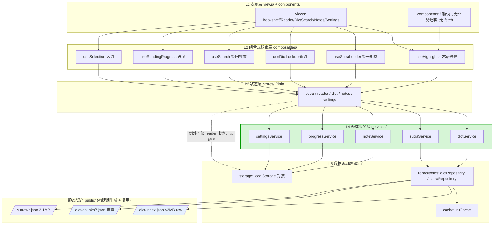
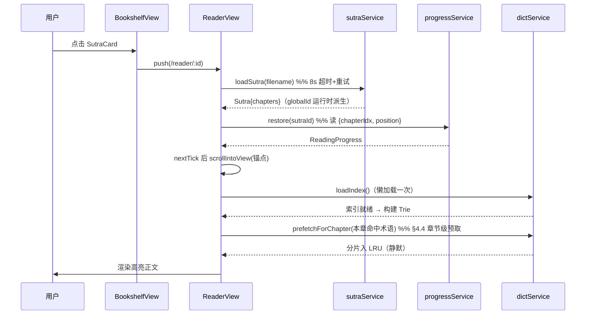
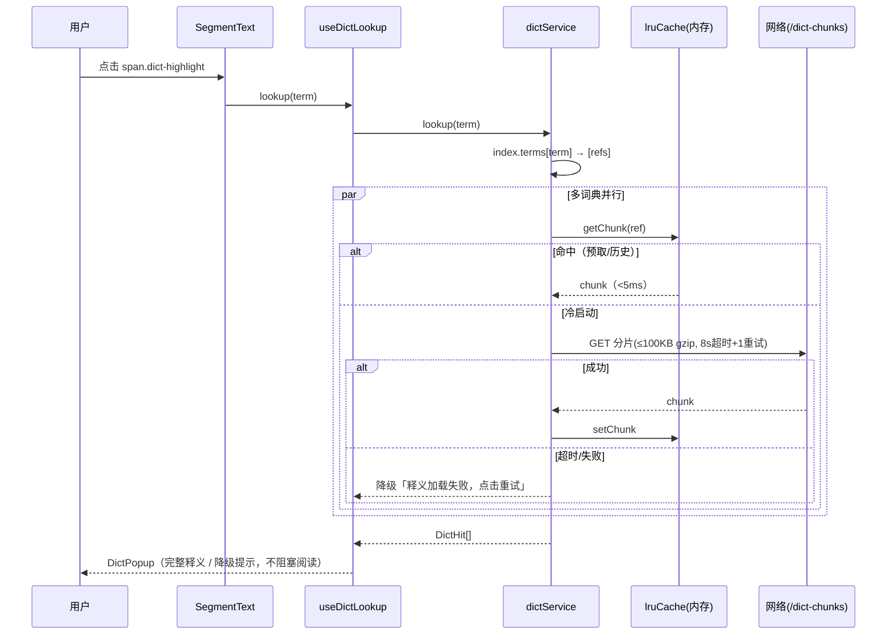
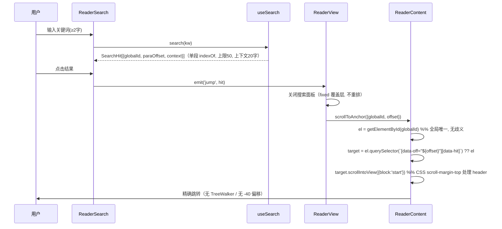
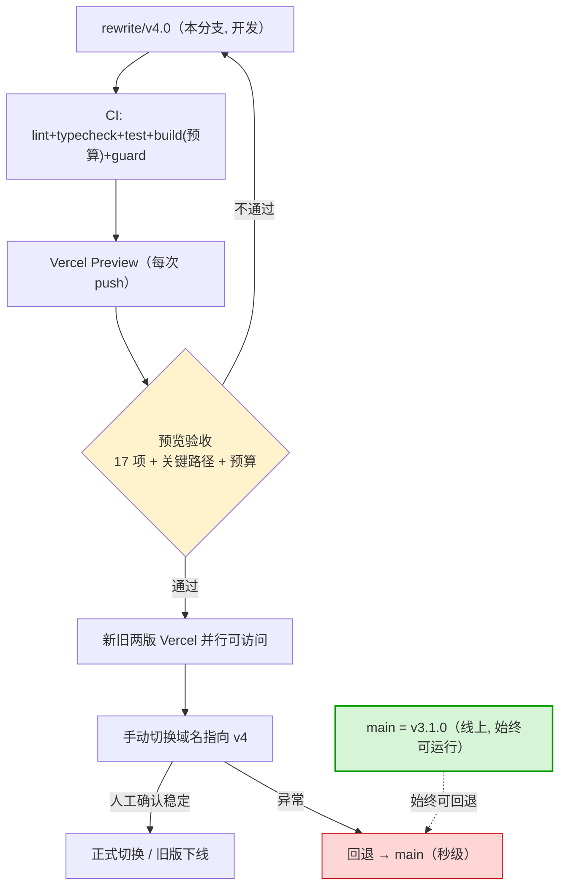

# 般若佛经阅读器 v4.0 开发方案（v2 · 按三司会审修订）

> 作者：高见远（架构师）· 团队 software-buddhist-reader
> 日期：2026-09-29（v2 修订）｜ 分支：`rewrite/v4.0` ｜ 基线：v3.1.0（已归档 `archive/v3.1.0/`）
> 依据：`docs/refactor/` 下 8 份分析文档；**本稿依据** `docs/reviews/2026-09-29-v4.0-sansi-huishen-review.md`（三司会审，判决「不通过（条件性）」）
> **功能基线：以 `docs/plans/2026-09-29-v4.0-scope.md` §5 的 17 项必做为准**（旧稿「55 功能点」为 v3.1.0 存量盘点，非 v4.0 范围）
> 约束：本文件仅方案，不含实现代码；**不动 main（push 仅限工作分支 `rewrite/v4.0`）、不改任何业务代码**

---

## 修订记录（v2 · 2026-09-29）

> 触发：三司会审判决「**不通过（条件性）**」——技术方向基本正确（分片按需确是 20.8MB 病灶正解），但**三个立论前提未经验证即写死，其中两个被仓库现成数据证伪**；且与同日上游决策文档结论相反却零引用。评分：完整性 5/5 · 证据链 5/5 · 洞察力 5/5 · **可执行性 1/5**。
> 本稿为**按报告做减法**的修订版（用户已定重写路线，不回退渐进），方向对齐报告五行诀倾向的 **C 方案（拆弹 + 分期）**。

| # | 审查问题 | 本稿修正（定位） |
|:--:|----------|------------------|
| **建议2** | 与 `2026-09-29-refactor-vs-rewrite-decision.md`（结论「推荐渐进」）**结论相反、引用次数 0** | **新增 §0**：显式记录两文档关系、选择重写的理由、并**诚实记录三项关键反证**（人写代码仅 124KB / 重写史 0/2 / 用户心理动因） |
| **建议3** | 数据层预算被实测证伪（§3.5「≤120KB gzip」实测 **1159KB，差 9.7 倍**） | **重做 §4**：改**按字节切分**（≤256KB raw/片）+ 共现聚类；重算预算并**标注测量环境**；**删除「预取相邻分片」**；回应破妄 **W1**；评估 **sql.js-httpvfs** |
| **建议4** | 两套基线打架（55 点 vs 17 项） | 统一以 **scope §5 的 17 项**为准（§1/§14）；补齐**主题数 / 书签闭环 / `dictSearchEngine` 迁移 / 阅读时长**四处缺口 |
| **建议5** | 工程化过重（1 人项目维护 5 类自维护规则＝新腐化源） | **减法**：砍 dependency-cruiser / 功能开关灰度 / Playwright 套件 / 覆盖率门槛 / IndexedDB 分片缓存；**保留** TS strict + bundle 预算 + 生成物 gitignore + `git rm -r --cached` |
| **P0-1** | 老病灶**确定性自动复活链路**（`vite.config.js` 钩子 + 生成器脚本 + 已 tracked 生成物三件套齐全），旧稿 §3.4 只字未提 | **§4.6 显式记录复活链路 + 拆弹清单**（由工程师并行落地；本稿只设计护栏） |
| **P0-2** | 核心性能指标被实测证伪 | §4.3/§4.8 重算（见建议3） |
| **P0-3** | bundle 预算对 `public/` 静态分片**结构性失明** | §12 新增**分片三上限护栏**（单片 / 总量 / 索引） |
| **P0-4** | 主题数三方打架（scope §2-7/§3-4＝4、scope §5＝3、plan §6＝3） | **统一 4 主题**（宣纸/墨夜/护眼/日间），改 §7 + scope §5 |
| **P0-5** | §14「功能开关灰度 + 线上监控 1 周」**不可执行**（无账号体系、无监控设施） | §15 改「**新旧两版 Vercel 并行 + 手动切换**」 |
| **P0-6** | **「生成物不入库」被虚构计入**（旧稿 L17/L202/L240/L599/L265 四处口径矛盾；实测 `.gitignore` dict 条目 **0 条**、生成物仍 tracked、`git rm` 出现 0 次） | 全稿改为**待办口径**：明确「**当前未落地**」，`git rm -r --cached` + `.gitignore` 列为**未完成待办**（§4.6） |
| **版本** | 多处落后 / 写错（`@vue/devtools-api` 写 `^7.x` **装不上**） | §3/§10 全表修正（详见 §3.2） |
| **P1/P2** | 条目数口径混用 / `globalId` 无生成任务 / 50MB 源数据随 dist 部署 / ESLint 禁 `document` 与自身允许 `getElementById` 矛盾 / 预算量纲混乱 / §12「28/28」含水分 | 逐条处理（§7/§5/§13 等，详见对应小节） |
| **用户裁决（跟进）** | 3 项待裁决（释义级搜索 / 离线 / 主题数） | 用户拍板：① 搜索**降级词头三级**；② **离线＝缓存已查过的词**（**新增 §4.9 完整设计**，调和「报告建议5 砍 IndexedDB」）；③ 主题 **4 套**；并**核实 Vercel 缓存头**（§4.9④）；**§16 由 7 项收敛为 0 项待决（7 项全闭环，见 v2.2）** |
| **方向** | 旧稿 29 人天一次走完才见效（五行诀：*「~90% 篇幅用于防『改不动』，0% 用于防『又停了』」*） | §9/§14 重排为**分期**：**M1「拆弹 + 数据地基」≈5.5 人天先交付可感知收益** |

**净减人天：29 → 22.0（净减 ≈7.0 人天；其中「拆弹 / `git rm` / guard 断言」已由工程师 commit `6333065` 先行落地）。**

### v2.1 修订（2026-09-29 · 文档一致性对齐，据实更新落地状态）

> 触发：M1 四任务（T01–T04）与 guard 断言已由工程师 / 基础设施**并行落地**，文档多处状态与仓库实测**漂移**。**本稿只改文档、不动任何代码**；每条均以 `git show` / `test -f` 实测为据。

| # | 漂移项 | 本稿修正（依据） |
|:--:|--------|------------------|
| 1 | §5 `utils/` 缺 `logger.ts`——§11 明令「禁 `console.log`、调试用 `logger.debug()`（仅 dev）」却**无实现载体** | §5 补 `logger(仅 dev 的 debug，§11 禁 console.log)`（实现见 `cdbb0f1`，22 行） |
| 2 | §5/§12.3 断言数与脚本实测不符 | 全稿同步为 **12 项 = A 类 7 + B 类 5**；A 类补第 7 项 `assertNoFile('scripts/__tests__/build-dict-index.test.cjs')`（防「删生成器、留测试」） |
| 3 | §12.3 `.eslintrc.cjs` 告警「仍在仓库、须先删再启用断言」 | **已闭合**：`cdbb0f1` 删除该文件（74 行），本稿实测 `test -f .eslintrc.cjs` = 不存在 → `assertNoFile` 可安全启用 |
| 4 | §12.3 ③ `assertNotTracked('public/dicts/')` 标「**待加**」 | **已落地**（`cdbb0f1`）；补**目录前缀匹配口径**（`/` 结尾）+ **反向验证硬规则**（见 §12.3） |
| 5 | §9 T02 行「**T02 剩余**」、T03/T04 无状态；§14 M1 行「T03/T04 **进行中**」 | 据实更新：**T02 ✅（`127f08e`+`7913cb2`）、T03 ✅（`a3e6145`）、T04 ✅（`bb8e3ea`）——M1 四任务全部落地** |

### v2.2 修订（2026-09-29 · §16 收尾闭环）

> 触发：§16 原「已决 5 / 待决 2」已过时——原 C-1/C-2 两项用户均已裁决并执行。**只改文档、不动代码。**

| # | 漂移项 | 本稿修正（依据） |
|:--:|--------|------------------|
| 1 | §16 标「已决 5 项 / 待决 2 项」 | 改为 **「已决 7 项 / 待决 0 项」**；C-1/C-2 移入已闭环表 |
| 2 | C-1「push 铁律冲突」原标「待裁决」 | **已闭环**：通过「**push 到工作分支 `rewrite/v4.0`、main 保持不动**」消解——铁律 2 未被豁免，而是目标分支收窄（用户批准并已执行多次） |
| 3 | C-2「50MB 源数据部署」原标「建议」 | **已闭环**：T02 已 `git mv public/dicts → data/dicts`（`127f08e`），不随 dist 部署 |
| 4 | §7 顶部约束、§15、文末 3 处「**不 push**」旧口径 | 同步改为「**不动 main（push 仅限工作分支 `rewrite/v4.0`）**」，与 C-1 闭环口径一致 |

### v2.3 修订（2026-09-29 · 据 M1 架构合规审查回填）

> 触发：`docs/reviews/2026-09-29-m1-architecture-compliance-review.md`（提交 `e229b4c`）D-2 / S-1。**只改文档、不动代码**；D-1（`BaseSheet` 硬编码色值）与 S-3（`eslint.config.js` 陈旧注释）已派 infra-engineer 处理，不在本稿范围。

| # | 漂移项 | 本稿修正（依据） |
|:--:|--------|------------------|
| 1 | §12.1 写「构建期 bundle 预算 … **自研 Vite 插件 + `rollup-plugin-visualizer`**」，与实现（独立脚本）不符 | 改为「**独立脚本 `scripts/check-bundle-budget.mjs`**（`npm run budget`，CI 门禁；**非 Vite 插件、不含 visualizer**）」；四条阈值同步补 `raw/gzip` 量纲 |
| 2 | §10 依赖表列 `rollup-plugin-visualizer`（实际 v4.0 全树零引用＝死依赖） | 移出 devDependencies，并入「已移除」清单（体积分析改由脚本承担） |
| 3 | §6.2 写「Trie 构建加 **memo + 分块惰性**」，实际只做 memo | 改为「**memo（已落地）** + **分块惰性延后（未做）**」并补**理由 + 触发条件**（实测构建非瓶颈；瓶颈出现再引入） |

> **口径更正（自曝）**：M1 审查报告原 S-2「§4.9② 值对象多 `name` 字段」**不成立**——该 `name` 仅存在于**工作树未提交版本**（工程师 T05 在途改动），`git show HEAD:src/data/cache/termCache.ts` 的 `CachedEntry` **只有 `{definition,pinyin,ts}`**。**S-2 撤销，暂缓至 T05 提交后再评估**（避免把在途改动写成既成事实）。
> **S-2 已闭环（T05 提交后）**：T05 已提交（`a662409`），`CachedEntry.name` 成为既成事实 → 已据实补齐 §4.9② 存储结构（见 **v2.4**）。

### v2.4 修订（2026-09-29 · T05 审查回填 · S-2 闭环）

> 触发：T05 已提交（`a662409`），`CachedEntry.name` 由「在途」转为「既成事实」。**只改文档、不动代码。**

| # | 漂移项 | 本稿修正（依据） |
|:--:|--------|------------------|
| 1 | §4.9② 存储结构字面为 `{definition,pinyin,ts}`，缺 `name` | 补为 `{definition,pinyin,**name**,ts}`，并注明 `name`（T05 增补）用途＝离线命中时无需索引即展示来源词典名；`normalize()` 对存量条目向后兼容（`termCache.ts:175-182`） |

> 来源：`docs/reviews/2026-09-29-t05-architecture-compliance-review.md`（提交 `a25ceac`）。该审查另列 2 项低危偏离（D-1 `reader` 跳层、D-2 `dict.results` 字节上限）与 2 项注释/清单同步（N-1/N-2），**待 team-lead 裁决后处理**，本稿暂不预改。

### v2.5 修订（2026-09-29 · T05 审查裁决回填）

> 触发：team-lead 对 T05 审查 4 项裁决。**只改文档、不动代码。**

| # | 裁决项 | 本稿修正 |
|:--:|--------|----------|
| **D-1** | `reader` store 直连 `data/storage` 落书签（跳层 + 不对称） | **记录为「已知例外 / T09 待处理」（非「已修」）**：§6.8 加例外注（理由 + T09 抽 `bookmarkService`）；§2.1 补 `ST -.-> STORE` 虚线边 + 例外说明。**现不抽 service**（§5 本无 `bookmarkService`，T09 一次做对） |
| **D-2** | `dict` store 的 `results` 仅按条数封顶 | **推 T08 处理**（届时 `results` 真实使用模式才明确；`lruCache` T03 已建、正可替换手写淘汰）——本稿**不改**，仅登记 |
| **N-2** | §5 文件清单缺 `src/utils/id.ts` | §5 `utils/` 行补 `id`；文件数 `~50` → `~51` |
| **N-1** | `termCache.ts:11` 注释未同步 `name` | **转软件工程师**（代码文件，待 T06 后处理）——本稿**不改** |
| — | `prefetchForChapter` 静默失败 | team-lead 认可「优化路径可接受降级」；**不改**（`logger.warn` 在 prod 同为 no-op，属无效改动） |

### v2.6 修订（2026-09-29 · T06 审查裁决回填）

> 触发：team-lead 对 T06 审查 4 项裁决（F-1 修 / N-1 记录 / N-2 改 §11 / N-3 转工程师）。**只改文档、不动代码**（F-1/N-3 属代码项，由软件工程师处理，见下表「转出」行）。

| # | 裁决项 | 本稿修正 |
|:--:|--------|----------|
| **N-1** | `views → services` 跳层（`ReaderView` 直连 `dictService`） | **记录为「已知权宜 / T08 待归位」（非「已合规」）**：§2.1 依赖方向说明补一条，明确 `ReaderView.vue` 直连 `dictService` 为**权宜**，T08 引入 `useDictLookup` 后归位到「`views → composables → services`」正轨 |
| **N-2** | §11「DOM 访问」行边界不清（经模板 ref 读元素布局属性是否算「直接 DOM 访问」） | §11「DOM 访问」行**补明边界**：受限的是 `document.*`/`window.*` **全局访问**；经**模板 ref** 读元素布局属性（`scrollTop`/`offsetTop`/`scrollHeight`/`clientHeight`）**不属此限**；但**写入**滚动位置仍须走 `anchor.ts#setScrollTop` |
| **F-1** | `useSutraLoader` 的 `AbortController.signal` 未下传至 `sutraService`/`sutraRepository` | **转软件工程师**（代码项，T07 后处理）——本稿**不改** |
| **N-3** | `ACTIVE_CHAPTER_OFFSET = 96` 魔法数缺注释 | **转软件工程师**（加注释，代码项）——本稿**不改** |

### v2.7 修订（2026-09-29 · T07 审查裁决回填）

> 触发：team-lead 对 T07 审查 6 项裁决（**F-2 修根因** / **F-3 修** / **N-4 并入 F-2** / **N-5 修** / **N-6 修** / **N-7 记录确认**；其中 F-2 拆为「分段不变量」+「`data-hit` 歧义」两条、并含「`scrollToAnchor` 返回语义」一条，故下表落地为 **8 条**）。**只改文档、不动代码。**
> ✅ 下列均为**「已实施（`139a4ca`）」**——由软件工程师于 T07 审查裁决批一次落地（`git show 139a4ca:<path>` 逐条可核）。

| # | 裁决项 | 本稿修正（**✅ 已实施（`139a4ca`）**） |
|:--:|--------|----------|
| **F-2** | 相邻命中被合并成单段，第 2 条命中无 `[data-off]` 元素 → `scrollToAnchor` 静默回退整段（且返回 `true`） | **§6.1 ② 新增「分段不变量」**：**每个搜索命中必须各自成段**——分段边界在 `hit.paraOffset` 与 `hit.paraOffset + keywordLength` 处**强制断开**，**禁止跨命中合并**（`applySearch` 不得仅按 `type` 合并）。此为 F-2 的**根因约束** |
| **F-2 隐患** | `data-hit` 一物二用（`term`+`search` 共用）→ `[data-off][data-hit]` 查询**结构性歧义** | **§6.1 ② 数据属性口径**：`search` 段须带**独立** `data-search` 属性（**不再**与 `term` 共用 `data-hit`）；锚点查询改为 `[data-off="${offset}"][data-search]`；`data-hit` **保留给 `term`**（样式/统计用途）。**可达性复核见 §v2.7.1** |
| **F-3** | 上下文窗口固定 20 字，关键词 >20 字时「必含关键词」不成立 | **§8.3 补例外**：窗口 `≤20 字` 在**关键词本身 >20 字**时**让位于**「必含关键词」硬不变量，窗口取 `max(SEARCH_CONTEXT_CHARS, keywordLength)`（软目标让位硬不变量） |
| **返回语义** | `scrollToAnchor` 返回 `boolean`，回退段落时仍返回 `true`——调用方**无法区分**精确/降级（「返回值撒谎」，与 F-1 假 abort 同族） | **§6.1 ③ / §8.3**：返回值由 `boolean` 改为可区分结果类型（如 `'exact' \| 'paragraph' \| 'none'`），使调用方**真正据以降级**。**并指出**：现文档注释 `anchor.ts:75`「未找到返回 false，调用方可据此降级」与实现**不一致**（实现回退段落时返回 `true`） |
| **N-4** | `searchHits` 与 `searchKeyword` 失配时全部命中降级（无守卫） | **并入 F-2 测试要求**（见 **N-6 ③**）：锁定「`searchHits` 有值 ⇒ `searchKeyword.length ≥ SEARCH_MIN_KEYWORD`」 |
| **N-5** | 档位数量在 `settingsService`（`FONT_SIZE_STEPS`/`LINE_HEIGHT_STEPS`）与 `useReaderSettings`（`FONT_SIZE_SCALE.length`/`LINE_HEIGHT_SCALE.length`）**双真源** | **§6.3 设置行**：`useReaderSettings` 改为 `import` `settingsService` 的常量并**删除重复声明**，消除漂移风险 |
| **N-6** | 定位链测试仅覆盖单命中 happy path | **§8.3 补测试要求（3 条）**：① 相邻命中**各自**可精确命中；② 关键词 >20 字时 `context` **含完整关键词**；③ `searchHits` 有值而 `searchKeyword` 为空时**不产生** `search` 段，且 `scrollToAnchor` 返回 `'paragraph'`/`'none'` 而非假装成功 |
| **N-7** | §2.1「已知权宜」状态 | **§2.1 回填**：`views → services`（`ReaderView` 直连 `dictService`）标注为「**T08 实施中，落地后需回填为「已归位」**」 |

**🔎 v2.7.1 · 关于「`data-hit` 一物二用」隐患的独立复核（诚实结论）**

team-lead 提出：「`[data-off][data-hit]` 在命中被合并掉、但恰有 `term` 段起于该偏移时，会匹配到**无关的 `term` 段**并返回 `true`（比返回 null 更糟）」。经**实测**（jsdom 运行**真实 `anchor.ts`** + 复刻 `applySearch`）：

- **正常操作（`keywordLength ≥ 2`）下不可达**：`applySearch` 对命中区间 `[paraOffset, paraOffset+keywordLength)` **强制写 `types[i]='search'`**，会**覆盖**同位置的 `term`。故**任何命中偏移处都不会有 `term` 段起头**——`querySelector('[data-off=命中偏移][data-hit]')` 要么命中 `search` 段（精确），要么返回 `null`（相邻合并时回退段落），**不会**命中无关 `term`。实测：`text="般若般若"`、`base` 含 `term@2`、`hits@[0,2]` → merged=`search@0:"般若般若"` → `[data-off="2"][data-hit]` → **null** → 回退段落。
- **仅在 N-4 失配（`keywordLength=0` 且 `searchHits` 非空）下可达**：此时**无任何 `search` 段**，若命中偏移处恰有 `term` 段，则 `querySelector` **匹配到该 `term`** 并返回 `true`（静默落到术语段）。实测：`kwLen=0`、`base` 含 `term@3`、`hits@[3]` → merged=`text@0:"观自在"  term@3:"般若"` → `[data-off="3"][data-hit]` → **匹配 `term@3`** → 返回 `true`。
- **结论**：`data-hit` 一物二用**确为锚点查询的结构性歧义**（查询无法表达「搜索命中」语义），**值得按裁决引入 `data-search` 消歧**；但 team-lead 描述的「**正常流程即静默定位到错误位置**」**不成立**——正常流程只会在相邻合并时**回退段落**（其返回值语义问题见「返回语义」行），**不会**误配术语段。据此**记录**裁决（引入 `data-search`），并**如实标注可达性**（潜在歧义 ≠ 当前可利用）。

### v2.8 修订（2026-09-29 · M3 收口回填 · D-1/N-1 归位 + 里程碑据实）

> 触发：M3 收口（T08+T09 完成）。**只改文档、不动代码。** 每条均以 **`git show <hash>:<path>`** 实测为据（**不读工作树**——遵 S-2 口径教训）。

| # | 回填项 | 本稿修正（**已归位 / 已实施**） |
|:--:|--------|----------|
| **D-1** | `reader` store 直连 `data/storage` 落书签 | §2.1 虚线边注 + §6.8 例外注均改为「**已归位（`2a41d57`）**」——**保留审计轨迹**（不删原例外记录，写清「原例外已消除，归位于 `2a41d57`」）。据 `git show 2a41d57:src/stores/reader.ts`：**无** `@/data/storage`、**含** `@/services/bookmarkService` |
| **N-1** | `ReaderView` 直连 `dictService` | §2.1 权宜注改为「**已归位（`f40fd97`）**」。据 `git show f40fd97:src/views/ReaderView.vue`：**无** `@/services/` import、改消费 `@/composables/useDictLookup` |
| **D-2** | `dict` store 结果缓存仅条数封顶 | 已换通用 `LruCache`（`f40fd97`）：`maxEntries=50` + `maxBytes=512KB`（据 `git show f40fd97:src/stores/dict.ts`） |
| **v2.7 七项** | 上版标「已裁决 · T08 后由软件工程师实施，非『已修』」 | 全部改为「**已实施（`139a4ca`）**」：F-2 分段边界 / `data-search` 消歧 / N-4 守卫 / `ScrollResult` 三态 / F-3 窗口 / N-5 单真源 / N-6 三条测试（据 `git show 139a4ca:<path>` 逐条可核） |
| **§9 任务表** | T05–T09 无状态 | 据实补 ✅（T05 `a662409` / T06 `d0146a9` / T07 `76091db`+`139a4ca` / T08 `f40fd97` / T09 `2a41d57`）——**T01–T09 全部完成** |
| **§14 里程碑** | M2/M3 无状态 | M1 ✅ / **M2 ✅**（T05–T07）/ **M3 ✅**（T08–T09）；**M4 进行中**（T11 ✅ 已落地、**T10 进行中**、T12 待办） |

> **口径纪律**：本次**不改** §13 的「28 条」数字（其口径由 P2 修正确定为「**28 条全部有落地对策；其中 ≈22 条有独立测试用例，≈6 条由类型/架构约束保证**」，见 §13 P2 修正）。**T10 正在补那 ≈6 条，落地后另行复核该数字**——本稿**不**预先改动，亦**不**出现「28/28 全覆盖」之类被 P2 否定的表述。

### v2.9 修订（2026-09-29 · T10 验收后口径修订）

> 触发：T10（隐性知识验收，`400ca71`）报 **4 条实测发现** + §13 数字复核。**只改文档、不动代码**（工程师补丁在途：M9 实现 + 正则 ⑧⑨ 重排）。所有行号据 **`git show 400ca71:<path>`**（**未读工作树**）。

| # | 项 | 本稿修正（**已实施（`0509d38`）**——状态由 v3.0 回填） |
|:--:|--------|----------|
| **1** | scope §5 M7 debounce 300ms ≠ 实现 200ms | **改 scope M7 为 200ms**（§1.1 + §5 两处），并加 §5 口径修订 ⑤：**口径由 team-lead 定，理由＝与渲染节流同源**。据 `git show 400ca71:src/composables/useDictLookup.ts:31` `DICT_SEARCH_DEBOUNCE_MS=200`。**代码不动** |
| **2** | scope §5 M16「降级内存」措辞模糊 | **改 M16 为可核对的具体行为**：读失败→`fallback`；写失败→`false`；`isStorageAvailable()` 供分支；非静默吞错（据 `git show 400ca71:src/data/storage.ts:4-9` 契约注释）。**接受现实现** |
| **3** | scope §5 M9 单章段落列表未实现（P0） | **已实施（`0509d38`）**：`ReaderToc` 增单章段落分支、`ReaderView` 经 `applyJump` 语义锚点路径定位。据 `git show 400ca71:src/components/reader/ReaderToc.vue` 原仅章节 `v-for`、无单章分支。**不收窄 scope** |
| **4** | plan §13 §4.⑤（单章隐藏目录）实现漂移 | 同上，§13 该行标注 **T10 发现 + 已实施（`0509d38`）**（与 M9 同源） |
| **5** | plan §13 §3.2 正则 ⑧⑨ 死代码 | **记录移植缺陷（保住规则、丢了顺序）**：⑦ 先于 ⑧、⑥ 先于 ⑨（同起始锚点先吞）。据 `git show 400ca71:src/utils/text.ts:45-48`。**已实施（`0509d38`）**：按 specific→general 重排（⑧ 先于 ⑦、⑨ 先于 ⑥，`git show 0509d38:src/utils/text.ts:51-54`），**不删规则** |
| **6** | plan §13 覆盖数字（旧「≈22/≈6」） | **独立复核后据实更新**（见 §13 P2 修正）：**T10 时**逐行 **25 有 / 2 约束 / 1 无**；**勘误**映射表「有 26」为**算术笔误**（26+2+1=29≠28）；§4.⑤ 补测后（`0509d38`）**26 / 2 / 0** |

> **纪律**：M9 补丁与正则重排**已于 `0509d38`（T10b）落地**，本表状态由「实施中」更新为「**已实施**」；收口详情见 **v3.0**。

### v3.0 修订（2026-09-29 · T10 收口回填 · M9/正则「实施中」→「已实施」）

> 触发：T10b 补丁（`0509d38`）+ T10c 补测（`01194db`）落地，且独立验收审计（`d1c5b11`）**条件已闭合**。**只改文档、不动代码**。所有行号据 **`git show 01194db:<path>`**（**未读工作树**）。

| # | 项 | 本稿修正（**已实施，非「待办」**） |
|:--:|--------|----------|
| **1** | M9 单章段落列表（scope §5 / plan §13 §4.⑤） | 「**实施中**」→「**已实施（`0509d38`）**」：scope `:164`、plan v2.9 表 + §13 §4.⑤ `:1000`。据 `git show 0509d38:src/components/reader/ReaderToc.vue`（`chapters.length===1` 段落分支） |
| **2** | 清洗正则 ⑧⑨ 重排（plan §13 §3.2） | 「**实施中**」→「**已实施（`0509d38`）**」：plan §13 §3.2 `:994`。⑧ 先于 ⑦、⑨ 先于 ⑥（`git show 0509d38:src/utils/text.ts:51-54`） |
| **3** | §13 覆盖数字 | 据实为 **26 有 / 2 约束 / 0 无**（Σ=28）；映射表 `合计` 两度算术笔误已勘误（见 §13 P2 修正） |
| **4** | 映射表 M 表数字 | **14 有 / 3 部分 / 0 无**（M9 于 T10b、M16 于 T10c 各由「部分」升「有」）——工程师已落地于 `01194db` |
| **5** | §9 任务表 T10 | 据实：✅ 已完成（`400ca71` + `0509d38` + `01194db`），附独立审计 `d1c5b11` |
| **6** | §14 里程碑 M4 | **T11 ✅ / T10 ✅ / T12 待办** |
| **7** | 审计报告闭合 | `docs/reviews/2026-09-29-t10-acceptance-audit.md` 追加「F1–F6 闭合复核」+ **最终判定** |

> **纪律**：**T12（部署 + 回退）尚未开始**，本稿不得写成已完成。审计判定「有条件通过 → 条件已闭合」；F4–F6（补测/改注）已由 `01194db` 落地，并经架构师**复跑变异体独立核实**。

---


## 0. 与上游决策文档的关系（必读 · 建议2）

> 三司会审 **F3/F4**：`docs/refactor/2026-09-29-refactor-vs-rewrite-decision.md`（268 行，**同一作者**）结论为「推荐 **A 渐进改造 12–16 人天**；从零重建 30–45 人天，**已被本项目历史证伪（两次重写 0/2 成功）**」，而旧稿 v4.0 方案对该文档**引用次数 = 0**。结论相反却零引用、零反驳，是「不通过」的主因之一。**本节补上这一环。**

### 0.1 两文档的立场

| | 决策文档（A） | 本方案（v4.0） |
|---|---|---|
| 结论 | 渐进升级改造（改数据层 + 拆上帝组件 + 补质量） | 从零重写（用户已定；`src/` 已清空） |
| 成本 | 12–16 人天（最坏 ≤22） | 30–45（旧稿 29；本稿 22.0） |
| 依据 | 技术栈不过时；病灶是**单点**（数据层）；重写史 0/2 | 用户要一套**全新可控**的代码库 |

### 0.2 为何最终选择重写（**推翻 A 的理由，逐条**）

1. **前提被新证据削弱（最重要）**：决策文档的核心论据之一是「代码没坏到必须重写」——但该结论建立在**体积**上（`dictIndex.js` 一个生成物占 99.4%）。破妄 **W3** 指出：v3.1.0 的 40 个文件中，除 `dictIndex.js` 外的 **39 个人写文件合计仅 124KB（平均 3.2KB、最大组件 10.9KB）**。
   > **这是把双刃剑，必须诚实呈现两面**：
   > - **支持 A**：124KB 人写代码 → 改造面极小，「渐进 12–16 人天」在**工程量**上确实成立。
   > - **支持重写**：124KB 的存量意味着**重写成本同样被大幅高估**——旧稿 B 估算（30–45 人天）主要花在「重建 55 功能点」，而其中真正的人写逻辑只有 124KB。**重写的边际成本远低于历史 v2.0 那次（59 文件、含 engine/services/storage/IndexedDB）。**
2. **重写史 0/2 的归因被重新审视**：决策文档据「v1→v2、v2→v3 两次重写均失败」判定「重写被证伪」。但拆解两次失败——
   - v2.0 失败主因：**范围失控**（80–120h，engine+services+storage+IndexedDB+TTS+MDX，33/57 任务未完成即归档）；
   - v3.0 失败主因：**数据层自伤**（丢弃 v2.0 已正确的按需加载，改 20.8MB 内联）。
   > 即：**历史失败 ≈70% 是过程/范围问题，≈30% 是工具能力问题**。本次重写的关键差异：① 范围**被明确裁剪**（scope 17 项，非 55 点）；② 数据层方案**有历史根因分析兜底**（§4.1）；③ 有隐性知识清单（28 条）防「重新踩坑」。
3. **产品/心理动因（决策文档 §3 维度 14 已识别，但被轻描淡写）**：用户明确诉求是**一套全新、可控、无历史包袱的代码库**。决策文档自己也承认这是 B 的**唯一胜项**（「满足『从零』心理」）。**当技术成本差距被 124KB 证据压缩后，这一动因的权重上升为决定性。**
4. **回退窗口已关闭**：用户已清空 `rewrite/v4.0` 的 `src/`、归档 v3.1.0。此时**再论证 A 已无操作意义**——A 的物料（`main` 分支 40 文件）虽完好，但用户已明确不走 A。

### 0.3 关键反证（**不粉饰，明确记录**）

> 以下三项**对重写不利**，本方案不回避；它们是「若重写失败，复盘时的第一批红旗」：

| # | 反证 | 本方案的应对 |
|:--:|------|--------------|
| 1 | **人写代码仅 124KB** → 「重写必要性」在体积上不成立 | 承认：**重写的正当性主要来自「可控/无包袱」，而非「存量已烂」**；故本稿**大幅做减法**，把成本压到与 A 接近（22.0 vs A 最坏 22） |
| 2 | **重写史 0/2**（v1→v2、v2→v3 均未解决问题） | 设**三道防线**防重蹈：① 范围锁定 17 项（不重演 v2.0 范围失控）；② 数据层方案经根因分析（不重演 v3.0 自伤）；③ 隐性知识 28 条 + 金标准测试（不重演「重新踩坑」） |
| 3 | **用户的诉求含心理动因**（要「全新」），非纯成本计算 | 明确记录：这是**产品决策而非纯工程决策**。工程侧的职责是**把重写成本压到最低、把失败模式降到最少**，而非替代用户拍板 |

### 0.4 与五行诀「C 方案」的合流

报告五行诀给 A/B/C 打分 **8 / 16 / 23**，倾向 **C（手术 + 分期）**，第一期 ≤5 人天做完即上线。用户已选重写，故本方案**把 C 的「分期 + 先交付」精神移植进重写**：
> **M1 只做「拆弹 + 数据地基 + 高亮」（≈5.5 人天）就交付可感知收益**（词典从 20.8MB → ≤2MB 索引 + 按需分片；查词可用），**而不是 22 人天走完才见效**。后续 M2–M4 按需推进，任一期可独立验证。

---

## 1. 摘要（v2）

| 项 | 结论 |
|----|------|
| **目标架构** | 表现层 / 组合式逻辑层 / 状态层 / 领域服务层 / 数据访问层 五层，TS strict，**词典「索引在线 + 分片按需加载」** |
| **技术栈** | Vue 3.5.43 + Vite 8.3.1 + Pinia 4.0.3 + Vue Router 5.3.1 + **TypeScript strict** + Vitest 5（版本详见 §3.2） |
| **数据层核心** | 根因是「**点查询却拉 30MB 单体文件**」（粒度错配）。解法：**索引(≤2MB raw) + 按字节切分分片(≤256KB raw/片) + 内存 LRU + 章节级预取**；分片由源数据在**构建期**生成、**不入库** |
| **离线口径** | **缓存已查过的词**（词条级 localStorage LRU ≤500 条/≤512KB，§4.9）；未查过的词需联网；**CDN 缓存不支撑离线**（Vercel 默认 `max-age=0, must-revalidate`） |
| **功能基线** | **scope §5 的 17 项必做**（非 55 点）；对齐后缺口 4 处已补齐（§9/§14） |
| **首屏预算** | 初始 JS **≤180KB gzip**；索引 ≤400KB gzip（懒加载）；单次查词 ≤100KB gzip（详见 §4.8） |
| **任务数 / 人天** | **12 个任务 / ≈ 22.0 人天**（旧稿 29，净减 ≈7.0；拆弹已先行落地） |
| **里程碑（C 方案分期）** | **M1 拆弹+数据地基（≈5.5 人天，先交付）** → M2 阅读主链路 → M3 功能等价 → M4 上线 |
| **上线策略** | **新旧两版 Vercel 并行 + 手动切换**（无账号体系，不做灰度） |

---

## 2. 目标架构

### 2.1 分层设计



**依赖方向（单向）**：`views/components → composables → stores → services → data → (assets)`。
> ⚠️ **修订**：旧稿用 **dependency-cruiser** 强制分层——**本稿砍掉**（建议5：1 人项目维护 5 类自维护规则本身是新腐化源）。改为**约定 + Code Review + ESLint 轻量约束**（§12），不引入独立工具。
> 🔸 **已知例外（1 处 · ✅ 已归位（`2a41d57`））**：图中 `ST -.-> STORE` 虚线＝`reader` store **曾暂**直连 `data/storage` 落盘书签（`src/stores/reader.ts`），**跳过 service 层**。方向仍是 `L3→L5`（向下，**不违反**「只能向下依赖」），但与其余 4 个 store 走 service 的做法**不对称**。**处置（已落地）**：T09 已抽出 `bookmarkService`，`reader` store 改为**只持状态 + 委托 service**。**状态：原例外已消除，归位于 `2a41d57`**（`git show 2a41d57:src/stores/reader.ts` 已无 `@/data/storage`、含 `@/services/bookmarkService`）。来源：T05 架构审查 D-1。
> 🔸 **已知权宜（1 处 · ✅ 已归位（`f40fd97`））**：`views → services` 曾存在一处**跨层跳连**——`ReaderView.vue`（`76091db` 口径 `:58,99-100,115`；T07 后 `:121,191,232`）直接 `import` 并调用 `dictService.loadIndex()`/`getEnabledTerms()`/`prefetchForChapter()`，**跳过 composables 层**（`views → services` 而非 `views → composables → services`）。方向仍**向下**（不违反「只能向下依赖」），但违反 §2.2「composables 是 Vue 响应式胶水」的分工约定——响应式状态与卸载取消**本该**由 composable 承担，直接调 service 会把 `ref`/`onUnmounted` 逻辑倒灌进视图。**处置（已落地）**：T08 引入 `useDictLookup` 后归位（`ReaderView` 只消费 composable，不再直连 `dictService`）。**状态：原例外已消除，归位于 `f40fd97`**（`git show f40fd97:src/views/ReaderView.vue` 已无 `@/services/` import、改消费 `@/composables/useDictLookup`）。来源：T06 架构审查 N-1 / T07 审查 N-7。

### 2.2 关键抽象

| 抽象 | 职责 | 关键接口（示意） |
|------|------|------------------|
| `dictService` | 词典领域唯一入口：索引加载、查词、分片获取、缓存编排、章节预取 | `loadIndex()`, `lookup(term): Promise<DictHit[]>`, `prefetchForChapter(terms)`, `getEnabledTerms()` |
| `dictRepository` | 纯 IO：拉索引、拉分片 | `fetchIndex()`, `fetchChunk(dictId, chunkIdx)` |
| `lruCache` | 内存 LRU（分片/索引），容量可配 | `get(k)`, `set(k,v)`, `has(k)` |
| `useHighlighter` | 术语 Trie 高亮（**复用旧算法**，TS 重写） | `highlight(text): Segment[] \| null` |
| `anchor`（工具） | **语义锚点**：`{sutraId, chapterIdx, paraId, offset}` ↔ 稳定 DOM id | `toElementId(a)`, `scrollToAnchor(a)` |

> **修订（P2：composables 与 services 职责重叠）**：明确边界——**services 是框架无关的纯逻辑/IO**（可在 Node 下单测）；**composables 是 Vue 响应式胶水**（`ref`/生命周期/卸载时 `abort`），**不含领域算法**。例：`dictService.lookup()` 是纯 Promise；`useDictLookup` 只包 `ref` 状态与 `onUnmounted` 取消。

---

## 3. 技术栈与版本决策

### 3.1 选型原则

- 全量 TS strict（本方案相对旧版最大质量增益）；
- 不引入 UI 组件库（保持纯手写禅意风格）、不引入状态持久化插件、不用 axios（原生 fetch + 自研封装）。

### 3.2 版本（**按会审 §2.4 全表修正**）

| 依赖 | 旧稿 | **本稿** | 说明 |
|------|------|---------|------|
| `vue` | ^3.5.41 | **^3.5.43** | latest（caret 覆盖，取最新） |
| `vite` | ^7.3.6 | **^8.3.1** | latest；7.3.6 已打 `previous` 标签（旧稿落后 1 大版本） |
| `pinia` | ^4.0.3 | **^4.0.3** | ✅ = latest，非虚构 |
| `vue-router` | ^4.5.1 | **^5.3.1** | latest；**T01 实测：5.3.1 通过 typecheck/build/路由单测 → 无需守 4.x 线** |
| **`@vue/devtools-api`** | **^7.x** | **^8.1.5** | ❌ 旧稿**区间不满足、装不上**；pinia 4.0.3 peer 要求 `^8.1.5`（`optional:false`） |
| `vitest` | ^3.x | **^5.0.2** | latest |
| `jsdom` | ^25.x | **^30.1.1** | latest |
| `eslint` | ^9.x | **^10.11.0** | latest；**v10 已移除 `.eslintrc.*` → 改用扁平配置 `eslint.config.js`（`.eslintrc.cjs` 删除）** |
| `@eslint/js` | — | **^10.0.1** | **新增（必需）**：ESLint v10 扁平配置的基础规则集 |
| `@types/node` | — | **^22.20.4** | **新增（必需）**：Node 类型（构建脚本 / 配置文件） |
| `@vitejs/plugin-vue` | ^6.x | ^6.0.1 | ✅ |
| `eslint-plugin-vue` | ^10.x | ^10.6.0 | ✅ |
| `@typescript-eslint/*` | ^8.x | ^8.56.0 | ✅ |
| `idb` | ^8.x | **⛔ 移除** | 与 scope §1.3「IndexedDB 不做」硬冲突（建议5 已处理） |
| `dependency-cruiser` | ^16.x | **⛔ 移除** | 建议5 砍掉 |

> **T01 实测结论（已落地 commit `67d60ac`）**：
> 1. **Vite 8.3.1（默认 Rolldown）+ `@vitejs/plugin-vue` 6.0.1 兼容 → 无需回退 7.3.6**；`vue-router` 5.3.1 通过 typecheck/build/路由单测 → 无需守 4.x 线。原「回退保底 / 守 4.x」假设**已被实测排除**。
> 2. **ESLint v10 移除 `.eslintrc.*`** → 工作配置改为扁平 `eslint.config.js`；`.eslintrc.cjs` 删除（对应 §12.3 A 类 `assertNoFile`）。故新增 2 个 devDep：`@eslint/js`、`@types/node`。
> 3. **新增 2 个冒烟测试**：`src/app/router/__tests__/router.spec.ts`、`src/components/common/__tests__/EmptyState.spec.ts`——**否则 `vitest run` 无测试文件会 exit 1**。

---

## 4. 数据层设计（重做 · 建议3）

### 4.1 历史真相：为什么当年要「全量内联」

`git show 86f70fc`（2026-05-15）原文：

> `feat: 内联词典释义到 dictIndex.js，取消运行时 fetch 30MB JSON`
> `- 解决 30MB 词典文件 fetch 超时导致查不到释义的问题`

该 commit 删掉的**旧实现**（关键代码）：

```js
async function fetchDict(dictId, manifest) {
  const resp = await fetch(`/dicts/${encodeURIComponent(entry.filename)}`)  // ← 整个 16~31MB 单体文件
  const data = await resp.json()
}
```

**根因判定**：不是「fetch 慢」，而是「**点查询却拉 30MB 单体文件**」——粒度错配。当年「正确解法」本应是**分片**（项目里其实已有 `public/dict-chunks`！），作者却选了**全量内联**（牺牲体积与完整性解决症状），引入 20.8MB bundle 与释义截断两个新 P0。
> ⚠️ **若 v4.0 恢复「运行时 fetch 单体词典」，超时 bug 原样复现**（隐性知识 §6）。

### 4.2 旧方案（500 词/片）被实测证伪（**P0-2**）

> 旧稿 §3.5 承诺「单次查词 ≤120KB gzip」。**实测（本稿作者独立复核）**：

| 口径 | 72 片均值 | 最大片 `dict-3-3.json` | 全库 |
|------|----------:|----------------------:|-----:|
| 原始 | 676KB | **2790KB** | 47.5MB |
| gzip | 282KB | **1159KB** | 18.2MB |
| brotli | 224KB | 897KB | 15.7MB |

**结论**：即便按最乐观的 brotli，最大片仍是承诺值的 **7.5 倍**（gzip 口径 **9.7 倍**）；13 片 >1MB。
**失败机理**：定长「**词数**」切分，在**释义长度方差大**时失效（最大/均值 = 4.3 倍）——一个 500 词分片可能装着 500 条 5 字短释，也可能装着 500 条长论。

### 4.3 新切分方案：**按字节 + 共现聚类**

> **主切分键改为「字节」**（报告建议3），保证单片上限可控；**辅以「经内共现聚类」**降低单经阅读的分片散布（回应 W1，见 §4.4）。

| 维度 | 旧（词数） | **新（字节 + 共现）** |
|------|-----------|----------------------|
| 切分键 | 每 500 词一片 | **累计原始字节 ≤256KB 一片**（硬上限） |
| 最坏单片 | 2790KB raw / 1159KB gzip | **≤256KB raw / ≈≤100KB gzip** |
| 片数估算 | 72 | **实测 197**（dict-1/2/3 = 60/18/119；≈47.5MB ÷ 256KB，实际因单词条不拆略多） |
| 共现优化 | 无 | **同一经高频共现的术语尽量聚入同片**（降低单经散布） |

> **备选切分键**：萌典 moedict-webkit 的「**按首字码点 mod 1024 分桶**」。作为备选记录，**默认不采用**（模运算分桶的片大小仍不均，且不利共现）。

**取舍说明**：≤256KB **实测 197 个分片文件**（T02 落地）。静态托管对文件数不敏感；若文件数成为运维负担，可放宽至 **≤512KB**——**此权衡 T02 已用实测数据定，维持 256KB**。

### 4.4 破妄 W1 回应：连续阅读的「散列」问题（**必须回应**）

> **W1（P0）**：实测《心经广义》2651 个命中术语**散布 72/72 片**。连续阅读查词必然散列 → 「按需」退化为「高频多拉」，弱网 8s 超时会**复现旧版同一症状「查不到释义」**。

**这不是理论质疑，是实测事实，必须正面解法（三层）：**

1. **共现聚类（治本）**：构建期把**同一经高频共现的术语聚入同片** → 读某部经时命中的术语**集中在少数片**，而非散落 72 片。这是把「按词切」改为「**按经的实际阅读单元切**」。
2. **章节级预取（替代旧「预取相邻分片」）**：进入某章时，用该章文本命中术语的索引，**预取该章所需分片**（进入即静默拉取，用户点词时已命中缓存）。
   > ⚠️ **删除旧稿「命中同分片预取相邻分片」**——字典序切分下相邻片与阅读无关，命中率≈0（P1）。
3. **弱网降级（兜底，直击「查不到释义」死结）**：
   - **先查本地词条缓存**（§4.9）：命中即离线可用（已查过的词）；
   - 未命中 → 分片拉取 **8s 超时 + 1 次重试**；仍失败 → 弹窗展示「**该词释义需联网获取 / 加载失败，点击重试**」，**不阻塞阅读、不空白**；
   - **离线范围明确**：已查过的词可查、未查过的词需联网（§4.9 ③）。

> **诚实的残余风险**：即使做了共现聚类，**首次冷启动**仍会拉取若干分片。故 §4.8 的「查词 ≤100KB」**以「命中内存 LRU」为口径**；冷启动单次拉取口径单列，**不混为一谈**（旧稿量纲混乱的根因）。

### 4.5 资产复用与「拆弹」（**P0-1 / P0-6**）

#### 4.5.1 资产处置表

| 资产 | 现状（本稿实测） | v4.0 处置 |
|------|------------------|-----------|
| `public/dicts/*.json`（50MB，3 词典 + manifest） | **源数据，tracked** | **✅ 保留**（唯一真相源）；**但需移出 `public/`**（见 §4.5.2 P1） |
| `public/dict-chunks/*.json`（48MB，75 文件） | **生成物**；会审时 tracked，**已 `git rm --cached`（commit 6333065）** | **✅ 复用「粒度 + 脚本」**；构建期重生成，**生成物不入库** |
| `public/dict-defs/*.json`（19MB，3 文件） | **生成物**，300 字截断版；**已移出跟踪** | **⚫ 弃用/删除** |
| `public/dict-index.json`（新） | 不存在 | **🔧 新建**：由脚本从源数据生成 `term→[{dictId,chunk}]` |

> **与 scope §1.3/§2-2 已对齐**（PM 已改稿）：源数据入库；`dict-defs` 弃用；`dict-chunks` 保留分片粒度、改为构建期重生成 + `.gitignore`。

#### 4.5.2 「生成物不入库」：从「被虚构计入」到「已真实落地」（**P0-6**）

> 三司会审 **P0-6**：旧稿把这条防线**虚构计入**（L240「已加入 `.gitignore`」、L599 列为「已就位防线」），而**实测 `.gitignore` 中 dict 条目 0 条、`dict-chunks` 仍 tracked 75 文件、全文 `git rm`/`--cached` 出现 0 次**。**性质不只是漏项，而是把待办写成既成事实——执行者会误判防线已就位而跳过。**

**状态时间线（据实记录，不粉饰）**：

| 时点 | 状态 | 依据 |
|------|------|------|
| **会审时**（2026-09-29，review 依据） | ❌ 未落地：`.gitignore` dict 条目 **0 条**、`dict-chunks` **75** / `dict-defs` **3** 仍 tracked、`git rm` 0 次 | 三司会审 F12 |
| **本稿修订时** | ⏳ 据实改为**待办口径**（不再宣称已就位） | 本稿修订记录 P0-6 |
| **现时（工程师并行落地）** | ✅ **已落地**：commit `6333065`「拆除 20.8MB 词典索引自动复活链路 + 落地护栏断言」 | 本稿复核（见下） |

**落地验证（本稿复核 commit `6333065`）**：

| 检查项 | 落地后实测 | 结论 |
|--------|-----------|------|
| `.gitignore` 含 `public/dict-chunks/`、`public/dict-defs/`、`src/data/dictIndex.js` | ✅ 3 条 | 已忽略 |
| `git ls-files public/dict-chunks` / `public/dict-defs` | **0 / 0** | 已 `git rm --cached` |
| `vite.config.js` 的 `buildDictIndexPlugin` | **已删除** | 复活钩子拆除（P0-1） |
| `scripts/build-dict-index.cjs` / `build-dict-defs.cjs` | **已删除** | 生成器拆除（P0-1） |
| `.eslintrc.cjs` `ignorePatterns` | 已移除 `src/data/dictIndex.js` | 复活链路第四件拆除 |
| `scripts/guard-forbidden.mjs` + `guard-baseline.json` | **已新增**（基线 `75 / 3`，后经 `3821b16` 下调至 `0 / 0`） | A/B/C 断言就位（§12.3） |

> ✅ **残余小项已闭合**：`public/dict-index.json` 已补入 `.gitignore`（commit `5162ee4`）。当前 dict 段 **4 行**：`src/data/dictIndex.js` / `public/dict-chunks/` / `public/dict-defs/` / `public/dict-index.json`（生成前先挡，防 `git add` 误提交）。
> ⚠️ **顺序正确性**：`.gitignore` 对**已 tracked 文件无效**——commit `6333065` 已**先 `git rm -r --cached` 再忽略**，顺序正确（否则 §12 棘轮断言恒假）。

### 4.6 老病灶的「自动复活链路」（**P0-1**）

> 三司会审 **F1/F2/F13**：旧稿把老病灶当「已归档」，实际它**三件套齐全、会确定性自动复活**：

| # | 复活组件 | 会审时状态 | **落地后（commit 6333065）** |
|:--:|----------|-----------|------------------------------|
| 1 | `vite.config.js` `buildDictIndexPlugin()` → `buildStart()` 执行 `execSync('node scripts/build-dict-index.cjs')` | 仍在 `plugins` 数组 | ✅ **已删除** |
| 2 | `scripts/build-dict-index.cjs`（L63 `mkdirSync(recursive)` 自愈建目录、L64 必然写出 ~20.8MB） | 仍存在 | ✅ **已删除** |
| 3 | `public/dict-chunks`（75）/`dict-defs`（3）**已 tracked** | 仍 tracked | ✅ **已 `git rm --cached`（0/0）** |
| 4 | `.eslintrc.cjs` `ignorePatterns` 引用 `src/data/dictIndex.js` | 仍存在 | ✅ **已移除** |

> **工程含义**：新 `vite.config.ts` **绝不可**从旧配置复制该钩子。**拆弹须在 T01 首步完成，不得后移**——旧配置一旦被复制进新 `vite.config.ts`，P0 立即复活。

### 4.7 索引与分片格式（**修正条目数口径，P1**）

**`public/dict-index.json`（≤2MB raw / 目标 gzip ≤400KB）**
```jsonc
{
  "version": 1,
  "generatedAt": "2026-09-29T00:00:00Z",
  "chunkByBytes": 262144,           // 256KB
  "dicts": [
    // ⚠️ entryCount=过滤后值；totalChunks=按字节切分【实测值】（合计 197，非旧「500 词/片」口径 49/10/13）
    { "id": "dict-1", "name": "中国当代佛教网辞典", "totalChunks": 60,  "entryCount": 24274 },
    { "id": "dict-2", "name": "新编佛教辞典",       "totalChunks": 18,  "entryCount": 4752  },
    { "id": "dict-3", "name": "中华佛教百科全书",   "totalChunks": 119, "entryCount": 6288  }
  ],
  "terms": { "般若": [[1,3],[2,0]], "菩提": [[1,7]], "阿赖耶识": [[1,12],[3,4]] }
}
```
> **P1 修正说明**：旧稿 §3.4 索引样例用**未过滤值**（dict-2=4830、dict-3=6399），而分片脚本用**过滤值**（4752、6288）→ 新建索引的 `entryCount` 会与分片 manifest **对不上**。本稿统一为**过滤后值**（24274 / 4752 / 6288，与 `*-manifest.json` 实测一致）。
> `chunkByBytes` 取代旧 `chunkSize:500`，与 §4.3 新切分键一致。

**`public/dict-chunks/{dictId}-{idx}.json`（沿用格式，切分改为按字节）**
```jsonc
{ "般若": { "definition": "梵语 prajñā 的音译……（完整）", "pinyin": "", "category": "" } }
```
**`public/dict-chunks/{dictId}-manifest.json`（沿用；数字为 T02 实测）**
```jsonc
{ "id": "dict-1", "name": "中国当代佛教网辞典", "totalChunks": 60, "entryCount": 24274, "bytes": 15563569 }
```

**构建脚本**：改造 `scripts/build-dict-chunks.cjs`，**一次扫描**同时输出：① 按字节切分分片；② 新索引 `dict-index.json`；③ manifest（含每片字节数，供 §12 护栏断言）。触发方式 `npm run prebuild`。

### 4.8 首屏与查词预算（**统一量纲 + 标注测量环境，P1**）

> **量纲约定**：本表**未标注者一律为 gzip**；同时列出原始值。**测量环境单列**（旧稿 400KB/120KB/200KB 单位混乱的根因）。

| 阶段 | 内容 | 原始 | **gzip** | 测量环境 | 目标时延 |
|------|------|-----:|--------:|----------|----------|
| 首屏 | app JS（vue+router+pinia+app） | — | **≤180KB** | 4G(~5Mbps) 冷启动 | 进书架 < 1.5s |
| 书架 | `sutras/manifest.json` | ≤30KB | ≤8KB | 同上 | — |
| 进阅读 | 单部经书 JSON | 5–430KB | ≤120KB | 同上 | — |
| 索引（首次查词/高亮） | `dict-index.json` | ≤2MB | **≤400KB** | 同上，懒加载 | 不阻塞首屏 |
| 单次查词 · **冷启动** | 1 分片 | **≤256KB** | **≤100KB** | 4G 冷启动，8s 超时 | ≤600ms |
| 单次查词 · **命中 LRU** | 0 传输 | 0 | 0 | 内存 | **< 5ms** |
| **对比旧版** | 旧版进阅读页 | 20.8MB JS | ~5MB | — | **↓ ~90%** |

> **修订点**：① 索引原始上限**明确为 2MB raw**（旧稿「≤2MB」与「≤400KB gzip」并列易混）；② 查词**分冷启动 / 命中两口径**（旧稿把「≤120KB」与「<300ms」混说，且被实测证伪）；③ 明确**索引与分片均懒加载**。

### 4.9 离线口径与「已查词缓存」（**用户裁决：缓存已查过的词**）

> **背景**：破妄 **W4** 指出 v3.1.0 首载后断网可查、v4.0 按需拉分片后断网即无释义。用户裁决采用**折中方案**：**首载后自动缓存「查过的」释义，常用词可离线；未查过的词需联网。**

**① 与报告建议5「砍掉 IndexedDB 分片缓存」的冲突澄清（不矛盾）**

| 主张 | 粒度 | 介质 | 结论 |
|------|------|------|------|
| 报告建议5「砍掉 IndexedDB 分片缓存」 | **分片级**预缓存全部数据 | IndexedDB（`idb`） | 砍掉（与 scope §1.3「IndexedDB 不做」冲突） |
| 用户「缓存已查过的词」 | **词条级**、仅缓存**实际查过的** | localStorage（scope M16 已有） | 采纳 |

> **二者不冲突**：一个反对「分片级 IndexedDB 预缓存」，一个要求「词条级 localStorage 按需缓存」——**粒度不同、介质不同**。方案据此同时满足：**砍分片级 IndexedDB，加词条级 localStorage**。

**② 缓存设计（四要素）**

| 要素 | 设计 | 理由 |
|------|------|------|
| **介质** | **`localStorage`**（词条级 LRU），封装进 `data/cache/termCache.ts` | scope M16 已强制 localStorage；**零新增依赖**；数据量小（几百 KB）；**不引入 IndexedDB**（守 scope §1.3）。**排除** `Cache Storage API`（面向 Request/Response，需 SW 离线路由，重）与「依赖 CDN 缓存」（见 ④，不能支撑离线） |
| **容量上限** | **条数 ≤500** / **总字节 ≤512KB** / **单条 ≤16KB**（超限词条不入缓存） | 500×~1KB ≈ 500KB ≪ localStorage ~5MB 上限；单条上限防个别长释义挤爆 |
| **淘汰策略** | **LRU**（按最近访问时间；写满时逐出最久未用，直至满足「条数 + 字节」双上限） | 常用词自然保留，冷词自动淘汰 |
| **存储结构** | 单 key `br-dictcache`（`{entries:{[dictId+term]:{definition,pinyin,name,ts}}, order:[...]}`），**写入节流**（同进度保存） | 避免频繁序列化；key 前缀统一（§11）。**`name`（T05 增补）**：离线命中时**无需加载索引**即可展示来源词典名；`normalize()` 对缺 `name` 的存量条目补空串（向后兼容，见 `termCache.ts:175-182`） |

**③ 断网后「哪些可查 / 哪些不可查」（用户预期，写进方案与 UI 提示）**

| 场景 | 行为 | UI 提示 |
|------|------|---------|
| 离线 + **词已查过**（命中缓存） | ✅ 正常显示释义 | 可标「离线（已缓存）」 |
| 离线 + **词未查过** | ❌ 无法获取 | 「**该词释义需联网获取**（此词尚未查过）」——**不是**「加载失败」，避免误判为 bug |
| 清空浏览器数据 / 隐私模式 | 缓存失效，回到「未查过」 | — |

> **文案定位（须同步修正）**：v4.0 由「完全离线」改为「**常用词离线可查**」。

**④ Vercel 缓存头核实（报告 §5.1 第 4 点「未确认」→ 本稿已确认）**

> 报告遗留「未确认：Vercel 对非哈希文件名的默认缓存头行为」。**本稿核实**（源：Vercel 官方 Cache-Control / System Headers 文档 + 多份部署实践，2026-09）：

- **默认值**：Vercel 对静态文件（含 `public/` 下**非哈希文件名**）默认发送 **`Cache-Control: public, max-age=0, must-revalidate`**——**Vercel CDN 在边缘缓存（并在每次部署时失效），但浏览器每次必须回源校验**。
- **Vercel 不按文件名是否哈希自动区分**：hashed 资源的 `immutable` 是**框架**（如 Next.js）自己设的；本项目 `public/` 下分片**非哈希** → 走上述默认。
- **关键推论**：`max-age=0, must-revalidate` ⇒ **浏览器 HTTP 缓存不提供离线可用性**（断网时无法完成 revalidation）→ **「靠 CDN 缓存支撑离线」不成立**。
- **可覆盖**：`vercel.json` 的 `headers` 可为 `/dict-chunks/*`、`/dict-index.json` 显式设 `Cache-Control`。
- **本方案决定**：① **接受默认**（浏览器安全、CDN 已在缓存）；如需 CDN 长缓存，可显式设 `public, max-age=0, s-maxage=31536000`（浏览器仍校验，**不引入陈旧风险**）——**这是性能优化，不是离线方案**；② **离线一律由 ②③ 的 localStorage 词条缓存承担**。

> **残余**：完整离线（**未查过的词也能离线**）需 Service Worker/PWA → **延后 v4.1**（scope §1.2 可选-P2）。

### 4.10 备选路径评估：**sql.js-httpvfs**（报告 §5.1）

> 报告建议评估「更轻的替代路径」：SQLite 静态托管 + HTTP Range + B-tree 索引，单次点查询约 7 次 page read（KB 级），**或可整体省掉「索引 + 48MB 分片 + 构建期生成」四件套**。

| 维度 | sql.js-httpvfs | 本方案（索引 + 分片） |
|------|----------------|----------------------|
| 点查询传输 | ~7 page read（KB 级） | 1 分片（≤100KB gzip） |
| 依赖 | WASM（sql.js ~1MB+）+ 自建 SQLite 文件 | 无额外运行时依赖 |
| 构建 | 需把词典装入 SQLite（新工具链） | 现成脚本改造 |
| 控制力 | 传输粒度由 SQLite page 决定（较黑盒） | 分片粒度完全可控 |
| 离线/降级 | 依赖 Range 支持 | 可显式降级（§4.4） |

> **结论：v4.0 暂不采纳**。理由：① 按字节切分已把最坏单片压到 ≤100KB gzip（9.7 倍问题已解）；② 引入 WASM + SQLite 工具链与「做减法、快交付」冲突；③ 分片方案的可控性更利于 §4.4 的共现聚类与降级。
> **列为 v4.1 备选**；**重启评估触发条件**：若 M1 实测分片冷启动时延 / 流量仍不达标，或共现聚类效果不佳。

---

## 5. 目录结构与文件清单

```
buddhist-reader/
├── index.html
├── package.json / tsconfig.json / tsconfig.node.json
├── vite.config.ts / vitest.config.ts / eslint.config.js   # ESLint v10 扁平配置（唯一生效；.eslintrc.cjs 已弃用）
├── .gitignore                                  # ✅ 已忽略 dictIndex.js/dict-chunks/dict-defs/dict-index.json（6333065+5162ee4）
├── vercel.json / .github/workflows/ci.yml
├── data/
│   └── dicts/*.json (3) + manifest.json        # 🔧 源数据移出 public（P1：不随 dist 部署）
├── public/                     # 构建期生成 + 复用
│   ├── sutras/*.json (30) + manifest.json      # 直接服务
│   ├── dict-chunks/*.json + *-manifest.json    # 构建期生成（不入库）
│   ├── dict-index.json                          # 构建期生成（不入库）
│   └── favicon.svg
├── scripts/                    # 复用 + 改造
│   ├── convert-sutras.cjs        (复用)
│   ├── convert-dictionary.cjs    (复用)
│   ├── build-dict-chunks.cjs     (✅ 已落地 127f08e：按字节切分 + 产出 dict-index.json)
│   ├── guard-forbidden.mjs       (✅ 已落地 6333065+cdbb0f1：A/B/C 断言 **12 项 = A7/B5**，见 §12)
│   └── check-bundle-budget.mjs   (✅ 已落地：分片三上限 + JS chunk 预算，见 §12.1)
├── docs/                       # 原地保留
└── src/
    ├── main.ts / App.vue / env.d.ts
    ├── app/
    │   ├── router/index.ts
    │   └── AppShell.vue                          # Tab 壳 + KeepAlive
    ├── views/
    │   ├── BookshelfView.vue / ReaderView.vue
    │   ├── DictSearchView.vue / NotesView.vue / SettingsView.vue
    ├── components/
    │   ├── common/ AppTabBar / BaseSheet / LoadingState / ErrorState / EmptyState
    │   ├── bookshelf/ SutraCard.vue
    │   ├── reader/ ReaderHeader / ReaderContent / ParagraphBlock / SegmentText /
    │   │           ReaderProgress / ReaderToc / ReaderSearch / ReaderNotes /
    │   │           ReaderSettings / ReaderDictSelector
    │   └── dict/ DictPopup.vue / DictEntryCard.vue
    ├── composables/
    │   ├── useHighlighter / useSutraLoader / useDictLookup / useSearch /
    │   │   useReadingProgress / useSelection / useReaderSettings
    ├── stores/ sutra / reader / dict / notes / settings
    ├── services/ dictService / sutraService / noteService / progressService / settingsService
    ├── data/
    │   ├── repositories/ dictRepository / sutraRepository
    │   ├── cache/ lruCache.ts / termCache.ts      # termCache=已查词 localStorage LRU（§4.9）；⛔ 无 idbCache
    │   └── storage.ts
    ├── types/ sutra / dict / note / reader / index
    ├── utils/ trie / text / anchor / async(timeout+retry) / format / logger(仅 dev 的 debug，§11 禁 console.log) / id(共用唯一 id 生成)
    └── styles/ tokens.css / themes.css / base.css  # 从 archive 复用
```
> **修订**：⛔ 删除 `.dependency-cruiser.cjs`、`data/cache/idbCache.ts`、Playwright 配置（建议5）；🔧 新增 `data/dicts/`（源数据移出 public）、`scripts/guard-forbidden.mjs`、`utils/id.ts`（T05 共用唯一 id 生成）。文件数由 ~55 → **~51**。

---

## 6. 核心模块设计

### 6.1 阅读器：彻底避免「手工 TreeWalker 数字符定位」

> 旧版病灶：搜索命中给「整段纯文本字符下标 `paraOffset`」，但 DOM 已被拆成多个 `<span>`，于是用 `document.createTreeWalker` 累加 `textContent.length` 反查节点（61 行、8 条日志、脆弱）。

**v4.0 语义锚点方案（三层）：**

| 层 | 方案 | 解决 |
|----|------|------|
| **① 全局唯一段落 ID** | 构建/加载期为每段生成 `${sutraId}:${chapterIdx}:${paraIdx}`（**修正旧版 `p1/p2` 跨章重复**） | 段落可被唯一寻址 |
| **② 渲染期携带数据坐标** | `SegmentText` 把**数据模型的字符偏移**写入 `data-off`；命中段标记 `data-hit` | **无需反查 DOM** |
| **③ 滚动用 CSS 锚点** | 目标设 `scroll-margin-top: var(--reader-header-height)` + `el.scrollIntoView({block:'start'})` | 消除 `-40/-20` 魔法偏移、不再 `getBoundingClientRect` |

> **P1 修正（`globalId` 无生成任务）**：`globalId` **不在源数据中、也不在构建期写死**，而是**运行时派生**——由 `sutraService` 在加载时按 `${sutraId}:${chapterIdx}:${paraIdx}` 计算并写入 `Paragraph.globalId`（纯函数 `utils/anchor.ts#makeGlobalId`）。**故无需独立「生成任务」**；对应实现归入 **T05（sutraService）与 T06（ReaderContent 渲染锚点）**。

> ✅ **已实施（`139a4ca`）**——② 数据坐标口径与分段不变量、③ 返回值语义：
> 1. **② 数据属性口径（F-2 隐患）**：`search` 段须带**独立** `data-search` 属性（**不再**与 `term` 共用 `data-hit`）；锚点查询改为 `[data-off="${offset}"][data-search]`；`data-hit` **保留给 `term`**（样式/统计）。消除「`data-hit` 一物二用」的查询歧义（可达性复核见 §v2.7.1）。
> 2. **② 分段不变量（F-2 根因，新增）**：**每个搜索命中必须各自成段**——分段边界在 `hit.paraOffset` 与 `hit.paraOffset + keywordLength` 处**强制断开**，**禁止跨命中合并**（`applySearch` 不得仅按 `type` 合并；相邻命中不得塌成单段）。
> 3. **③ 返回值语义**：`scrollToAnchor` 返回值由 `boolean` 改为可区分结果类型（如 `'exact' | 'paragraph' | 'none'`），使调用方能**真正据以降级**。**并订正文档注释**：现 `anchor.ts:75` 注「未找到返回 false，调用方可据此降级」**与实现不一致**（实现回退段落时仍返回 `true`）。

### 6.2 术语高亮：**保留复用 Trie 算法**

- 旧版 `useHighlighter.js` 是**评分 5 分资产 + 7 个单测**，算法正确（正向最长匹配 + 数字短语过滤）。
- v4.0 **TS 重写但语义等价**，移植全部 7 个测试。
- 改进：Trie 构建加 **memo**（`WeakMap` 按词表引用缓存，已落地 `useHighlighter.ts:43-52`）；**分块惰性延后（未做）**——理由：24k 词表的一次性构建为 O(总字符数)，实测**非瓶颈**；**触发条件**：若实测 Trie 构建耗时成为首屏/交互瓶颈再引入（避免为未验证的收益增加复杂度与语义等价性风险）。词典开关改**细粒度响应式**（不再 `:key` 整页重挂载）；保留「ref 或普通数组都兼容」入参与 `null` 语义。

### 6.3 词典查询 / 笔记 / 进度 / 设置

| 模块 | 设计要点 |
|------|----------|
| **词典查询** | `useDictLookup` → `dictService.lookup()`；**先查 `termCache`（离线可查已查过的词，§4.9）**；多词典 `Promise.allSettled` 真并行，**先返回先展示**（回应 scope §2-8「多词典并行名不副实」）；加载/空/错误三态；**完整释义**（不截断）；命中后写入 `termCache` |
| **词典搜索** | **⚠️ 见 §6.4（释义级匹配缺口）** |
| **笔记** | `noteService` + `notes` store；**新增锚点** `anchor:{chapterIdx, paraId, offset}`（修复旧版 `paragraphId` 恒空）；跳转带锚点 |
| **进度** | 每经独立 key；**同时存 `chapterIdx` + `position`**（修复旧版不存章节）；保存节流 300ms |
| **设置** | `settings` store 只存状态；**DOM 副作用移出 store**（改由 `useReaderSettings` 在组件层 `watch` 应用 CSS 变量）。✅ **已实施（`139a4ca`，N-5）**：档位刻度与档位数已**上提至 `settingsService`（单一真源）**，`useReaderSettings` 仅 `import` 并 re-export（`git show 139a4ca:src/composables/useReaderSettings.ts`） |
| **书签** | **⚠️ 见 §6.5（书签闭环缺口）** |

### 6.4 缺口①：词典搜索「释义级」匹配（**建议4 / 破妄 W2**）

> **冲突**：scope §5 M7 要求「完全/前缀/包含/**释义**」四级匹配（P0）；但本方案索引**不含释义**，且已判 `dict-defs` 弃用 → **旧稿无实现载体**（W2）。

**决策：v4.0 降级为「词头三级匹配」（完全 > 前缀 > 包含）；释义级匹配延后 v4.1。**
- 理由：释义级匹配需扫描全部释义 → 与「按需加载」根本冲突（等于把 48MB 拉回）；为它单独建「释义倒排索引」是新重资产，与「做减法、快交付」相悖。
- 影响：`dictSearchEngine` **不作为独立迁移项**——搜索直接用 `dict-index.json` 的 `terms` 键做完全/前缀/包含三级匹配（**无需旧 `utils/dictSearchEngine.js`**）。
- **需 PM 确认**（已在 §16 升级）；scope §5 M7 已同步标注。

### 6.5 缺口②：书签闭环（**建议4**）

> scope §2-4 判「**修复**（v4.0；排期紧则 v4.1）」，§3-2 判「补齐 v4.0/v4.1」；**旧稿 plan 无书签任务**。

**决策**：v4.0 **纳入书签闭环**（添加 + 列表 + 回看），归入 **T09**。理由：旧版半成品（只写不读），闭环成本低，且属「留得住」的用户价值。`Bookmark` 类型已在 §7 定义。

### 6.6 缺口③：阅读时长（**建议4**）

> scope §2-5 判「**延后 v4.1**；v4.0 **暂不采集**，待统计页一并设计，避免再产生死数据」；旧稿 `reader` store 含「阅读时长」。

**决策**：v4.0 **移除阅读时长采集与存储**（连采集都不做），与 scope §2-5 一致。

### 6.7 缺口④：主题数（**P0-4，统一为 4**）

> **三方打架**：scope §2-7/§3-4 判「补齐日间 = **4 主题**」；scope §5 M12 写「**三主题**」；旧稿 plan §6 `ThemeName` 只有 **3 值**。

**决策：统一 4 主题**（`paper` 宣纸 / `night` 墨夜 / `eye-care` 护眼 / **`day` 日间**）。依据：§2-7 是「落差修复决策」（补齐日间），优先级高于 §5 清单的笔误。→ 本稿 §7 `ThemeName` 已改 4 值；scope §5 M12 已同步。

### 6.8 状态管理边界

| Store | 职责 | **禁止事项** |
|-------|------|-------------|
| `sutra` | 经书列表、当前经书、分类筛选 | ❌ UI 状态、❌ 词典数据 |
| `reader` | 滚动位置、书签、当前章节 | ❌ **面板开关等 UI 状态**；❌ 阅读时长（§6.6） |
| `dict` | 索引、启用词典、查词结果缓存引用 | ❌ 阅读进度；❌ 直接持有大对象（在 service/仓库层） |
| `notes` | 笔记 CRUD | ❌ sutra 标题解析（由 service 提供） |
| `settings` | 字号/行距/主题偏好 | ❌ **DOM 副作用** |

> 🔸 **已知例外（✅ 已归位（`2a41d57`））**：`reader` store **曾**直接经 `data/storage` 落盘书签（`src/stores/reader.ts`），**未走 service 层**——与其余 4 个 store（`notes→noteService` / `settings→settingsService` / `sutra→sutraService` / `dict→dictService`）**不对称**。方向为 `L3→L5`（向下，**不违反** §2.1「只能向下依赖」），但**跳层**且把持久化业务逻辑放进 store，与本节「store 只存状态、业务逻辑进 service」有张力。
> **处置（已落地）**：T09 做书签闭环时一并抽出 `bookmarkService` 归位。**状态：原例外已消除，归位于 `2a41d57`**——`reader` store 现只持状态 + 委托 service（`git show 2a41d57:src/stores/reader.ts` 已无 `@/data/storage`、含 `@/services/bookmarkService`）。来源：T05 架构审查 D-1；§2.1 图中对应 `ST -.-> STORE` 虚线边。

---

## 7. 数据结构与接口（TypeScript）

```ts
// types/sutra.ts
export interface Paragraph { id: string; text: string; globalId: string } // globalId 运行时派生（§6.1）
export interface Chapter   { title: string; paragraphs: Paragraph[] }
export interface SutraMeta { title: string; filename: string; author: string;
  category: SutraCategory; chapterCount: number; totalParagraphs: number; totalChars: number; description: string }
export interface Sutra extends SutraMeta { chapters: Chapter[] }
export type SutraCategory = 'prajna'|'yogacara'|'chan'|'mantra'|'general'|'biography'

// types/dict.ts
export interface DictMeta  { id: string; name: string; totalChunks: number; entryCount: number } // entryCount 用过滤值
export interface DictChunk { [term: string]: { definition: string; pinyin: string; category: string } }
export interface DictIndex { version: number; chunkByBytes: number; dicts: DictMeta[];
  terms: Record<string, Array<[dictId: number, chunkIndex: number]>> }
export interface DictHit   { dictId: string; dictName: string; term: string; definition: string }
export type DictChunkRef   = [dictId: number, chunkIndex: number]

// types/note.ts
export interface NoteAnchor { chapterIdx: number; paraId: string; offset: number }
export interface Note { id: string; sutraId: string; quote: string; text: string;
  anchor: NoteAnchor | null; createdAt: number; updatedAt: number }

// types/reader.ts
export interface Bookmark { id: string; sutraId: string; chapterIdx: number;
  position: number; label: string; createdAt: number }
export interface ReadingProgress { sutraId: string; chapterIdx: number; position: number; percent: number; updatedAt: number }
export interface ReaderSettings { fontSizeIndex: number; lineHeightIndex: number; theme: ThemeName }
export type ThemeName = 'paper'|'night'|'eye-care'|'day'   // ← 4 值（P0-4 统一）

// types/highlight.ts
export interface Segment { type: 'term'|'search'|'text'; content: string; off: number }
```

**服务接口（示意）**
```ts
// services/dictService.ts
export interface DictService {
  loadIndex(): Promise<void>
  getEnabledTerms(): string[]
  lookup(term: string): Promise<DictHit[]>
  prefetchForChapter(terms: string[]): Promise<void>   // §4.4 章节级预取
  setEnabled(dictId: string, on: boolean): void
}
// data/repositories/dictRepository.ts
export interface DictRepository {
  fetchIndex(): Promise<DictIndex>
  fetchChunk(dictId: string, chunkIndex: number): Promise<DictChunk>
}
```

---

## 8. 关键流程时序图

### 8.1 打开经书加载（含章节级预取）



### 8.2 点击术语查词（冷/热两口径 + 降级）



### 8.3 经内搜索定位（语义锚点）



> ✅ **已实施（`139a4ca`）**：
> 1. **上下文窗口例外（F-3）**：`context` 窗口 `≤20 字` 在**关键词本身 >20 字**时**让位于**「必含关键词」硬不变量，窗口取 `max(SEARCH_CONTEXT_CHARS, keywordLength)`（软目标让位硬不变量）。
> 2. **`scrollToAnchor` 返回值**：由 `boolean` 改为可区分结果类型（`'exact' | 'paragraph' | 'none'`），使调用方能真正据以降级（详见 §6.1 ③ 订正）。
> 3. **测试要求（N-6，必做）**：定位链测试须覆盖 ① 相邻命中**各自**可精确命中（F-2 回归）；② 关键词 >20 字时 `context` **含完整关键词**（F-3 回归）；③ `searchHits` 有值而 `searchKeyword` 为空时**不产生** `search` 段，且返回 `'paragraph'`/`'none'` **而非假装成功**（N-4 守卫）。
> 4. **锚点查询（F-2 隐患）**：`querySelector` 由 `[data-off][data-hit]` 改为 `[data-off][data-search]`（见 §6.1 ② 数据属性口径）。

---

## 9. 任务列表（重排 · 分期 · 做减法）

> **顺序即执行顺序**；人天为估算。**T01–T04 构成 M1（先交付）**。

| ID | 任务 | 依赖 | 交付物 | 人天 |
|----|------|------|--------|-----:|
| **T01** | **项目基础设施（精简版）** | — | `package.json`、`vite.config.ts`（**不含 dict 钩子**）、`tsconfig*.json`、`vitest.config.ts`、`eslint.config.js`（ESLint v10 扁平配置）、`index.html`、`main.ts`、`App.vue`、`env.d.ts`、`styles/*`(复用)、`app/router`、`app/AppShell.vue`、`components/common/*` | 1.0 |
| **T02** | **数据层（索引与分片）** | T01 | ✅ **已完成**（`127f08e`：源数据 `git mv` → `data/dicts/`、`build-dict-chunks.cjs` 按字节切分 + 索引 + manifest、`types/dict.ts`；`7913cb2`：增量清理陈旧分片，可安全重跑；拆弹/`git rm`/guard 见 `6333065`） | 2.0 |
| **T03** | **数据访问层** | T02 | ✅ **已完成**（`a3e6145`）：`data/repositories/*`、`data/cache/{lruCache,termCache}.ts`（termCache=已查词离线缓存 §4.9；**无 idbCache**）、`utils/async.ts`(超时+重试)、`data/storage.ts`、`types/sutra.ts` | 1.0 |
| **T04** | **高亮引擎 + 文本工具** | T03 | ✅ **已完成**（`bb8e3ea`）：`composables/useHighlighter.ts`、`utils/{trie,text}.ts`、`types/highlight.ts`；高亮单测 + 释义清洗金标准测试（`useHighlighter/text/trie` 三 spec） | 1.5 |
| **T05** | **领域服务 + stores** | T03 | ✅ **已完成**（`a662409`）：`services/{dictService,sutraService,noteService,progressService,settingsService}.ts`、`stores/*.ts`、`types/{sutra,note,reader}.ts`；`sutraService` 派生 `globalId` | 2.5 |
| **T06** | **阅读器核心（语义锚点）** | T04,T05 | ✅ **已完成**（`d0146a9`）：`views/ReaderView.vue`、`components/reader/{ReaderContent,ParagraphBlock,SegmentText,ReaderProgress}.vue`、`composables/{useSutraLoader,useReadingProgress}.ts`、`utils/anchor.ts` | 3.5 |
| **T07** | **阅读器外围** | T06 | ✅ **已完成**（`76091db`；审查裁决批 `139a4ca`）：`components/reader/{ReaderHeader,ReaderToc,ReaderSearch,ReaderNotes,ReaderSettings,ReaderDictSelector}.vue`、`composables/{useSearch,useSelection,useReaderSettings}.ts`、`components/common/BaseSheet.vue` | 3.0 |
| **T08** | **词典弹窗 + 词典搜索页** | T07 | ✅ **已完成**（`f40fd97`；含 D-2/N-1 技术债归位）：`components/dict/{DictPopup,DictEntryCard}.vue`、`views/DictSearchView.vue`、`composables/useDictLookup.ts`；搜索**词头三级匹配**（§6.4） | 2.0 |
| **T09** | **书架 + 笔记 + 设置 + 导航 + 书签闭环** | T08 | ✅ **已完成**（`2a41d57`；含 D-1 归位）：`views/{BookshelfView,NotesView,SettingsView}.vue`、`components/bookshelf/SutraCard.vue`、书签（§6.5）；4 主题（§6.7） | 2.5 |
| **T10** | **隐性知识验收（对齐 17 项）** | T09 | ✅ **已完成**（`400ca71` T10 + `0509d38` T10b 补丁 + `01194db` T10c 补测；独立审计 `d1c5b11`）：逐条对照测试（§13，**26 有 / 2 约束 / 0 无**）；关键路径 E2E（**Vitest + jsdom 组件测试，非 Playwright 套件**）；金标准对照 | 1.5 |
| **T11** | **防复发工程化（减法版）** | T01 | bundle 预算脚本（含分片三上限）、ESLint 规则、`.github/workflows/ci.yml`（lint+typecheck+test+build+guard） | 1.0 |
| **T12** | **并行部署 + 回退** | T10,T11 | Vercel 预览部署、**新旧并行 + 手动切换**、回退演练、上线 checklist | 0.5 |
| | | | **合计** | **≈ 22.0** |

**关键路径**：T01 → T02 → T03 → {T04,T05} → T06 → T07 → T08 → T09 → T10 → T12（T11 可并行）。

**净减说明（建议5 减法）**：砍 dependency-cruiser（−0.5）、Playwright 套件（−1.5）、覆盖率门槛（−0.3）、IndexedDB 分片缓存（−1.0）、功能开关灰度（−0.5）＝ **−3.8**；新增 分片三上限护栏 + A/B/C 断言（+0.3）；**拆弹 / `git rm` 已由 commit `6333065` 完成（−0.5）**；其余差额来自分期压缩与 T10/T12 精简。**旧稿 29 → 本稿 22.0（净减 ≈7.0）。**

---

## 10. 依赖包列表（**版本修正 · 建议5 减法**）

```jsonc
// dependencies
{
  "vue": "^3.5.43",
  "vue-router": "^5.3.1",          // 若守 4.x 线：^4.6.4
  "pinia": "^4.0.3",
  "@vue/devtools-api": "^8.1.5"    // ← 修正（旧稿 ^7.x 装不上）；Pinia 4 必需 peer
  // 已移除：idb（scope §1.3 IndexedDB 不做）
}
// devDependencies
{
  "vite": "^8.3.1",                // 保底可回退 ^7.3.6
  "@vitejs/plugin-vue": "^6.0.1",
  "typescript": "^5.x",
  "vue-tsc": "^2.x",
  "vitest": "^5.0.2",
  "@vue/test-utils": "^2.x",
  "jsdom": "^30.1.1",
  "eslint": "^10.11.0",
  "eslint-plugin-vue": "^10.6.0",
  "@typescript-eslint/eslint-plugin": "^8.56.0",
  "@typescript-eslint/parser": "^8.56.0"
  // 已移除：@playwright/test（建议5）、dependency-cruiser（建议5）、
  //          rollup-plugin-visualizer（体积分析改由**独立脚本** `scripts/check-bundle-budget.mjs` 承担，见 §12.1）
}
```
> **不引入**：UI 组件库、状态持久化插件、axios。

---

## 11. 共享知识（跨文件约定）

| 主题 | 约定 |
|------|------|
| **命名** | 组件 PascalCase；composable `useXxx`；store `useXxxStore`；CSS 类 BEM；类型/接口 PascalCase；常量 UPPER_SNAKE |
| **目录** | 严格按 §2.1 分层；**跨层只能向下依赖**；`views/` 只编排，业务逻辑进 `composables/`/`services/` |
| **错误处理** | 所有 `fetch` 走 `utils/async.ts`（超时+重试+`AbortController`）；**禁止静默 catch**；UI 必须有 loading/error/empty 三态 |
| **日志** | **禁止 `console.log`**（ESLint error）；调试用 `logger.debug()`（仅 dev） |
| **样式** | **只用 token 变量**；禁止硬编码色值；新增变量先加 `tokens.css` |
| **存储** | 统一 `data/storage.ts`，key 前缀 `br-`，key 命名集中常量表 |
| **DOM 访问** | **组件/composable 内禁止直接 `document.*`/`window.*`**；**唯一例外**：`utils/anchor.ts` 内部允许 `getElementById` + `scrollIntoView`（封装为 `scrollToAnchor()`），组件只调用该封装。<br>**边界（N-2 补明）**：受限的是 **`document.*`/`window.*` 全局访问**；经**模板 ref** 读取元素布局属性（`scrollTop`/`offsetTop`/`scrollHeight`/`clientHeight`）**不属此限**——这是 Vue 模板 ref 的正常用法，不触发 `no-restricted-globals`。但**写入**滚动位置仍须走 `anchor.ts#setScrollTop`（`element.scrollTop = ...` 只在 `anchor.ts` 内出现） |
| **异步** | 统一 `async/await`；并行 `Promise.allSettled`；卸载时 `AbortController.abort()` |
| **类型** | 禁止 `any`（`@typescript-eslint/no-explicit-any: error`）；跨层数据必须来自 `types/` |
| **可访问性** | 交互元素 ≥44px 触控区；`aria-label` 覆盖图标按钮 |

> **P1 修正（ESLint 自相矛盾）**：旧稿 §11 禁 `document/window`，但 §10 又允许 `getElementById`——**自相矛盾**。本稿收敛为：**DOM 访问集中在 `utils/anchor.ts` 一处**（该文件 eslint 局部豁免），组件/composable 层由 `no-restricted-globals` 拦截 `document`/`window`。**只有一处白名单，不是两套规则。**

---

## 12. 防复发机制（**减法 + A/B/C 断言**）

### 12.1 保留的机制（**「不做就必定复发」**）

| 机制 | 配置要点 | 拦截的旧版错误 |
|------|----------|---------------|
| **TypeScript strict** | `strict:true`、`noUncheckedIndexedAccess`、`noImplicitAny`、`exactOptionalPropertyTypes`；`vue-tsc --noEmit` 进 CI | props 漏写白屏、类型错配 |
| **构建期 bundle 预算（含分片三上限，P0-3）** | **独立脚本 `scripts/check-bundle-budget.mjs`**（`npm run budget`，CI 门禁；**非 Vite 插件、不含 visualizer**）：① 任一 **JS chunk** > 2MB raw / 600KB gzip 即失败；② **多词条分片** > 256KB raw 即失败（**单词条分片豁免**，见 §12.3）；③ **分片总量** > 50MB raw 即失败；④ **索引** > 2MB raw 即失败 | **20.8MB 全量内联**；分片膨胀（旧护栏对 `public/` **结构性失明**） |
| **ESLint 规则** | `no-console: error`；`vue/no-v-html: error`；`no-restricted-syntax` 禁 `createTreeWalker`/`getBoundingClientRect` 定位；`no-restricted-globals`（组件禁 `document`/`window`，**白名单仅 `utils/anchor.ts`**，见 §11） | 日志残留、`v-html` XSS、TreeWalker 定位 |
| **生成物不入库** | `.gitignore`（4 条，含 `dict-index.json`）+ **`git rm -r --cached`**（✅ 已落地 `6333065` + `5162ee4`，见 §4.5.2） | 67MB 生成物入库 |
| **测试护栏** | 关键 composable/service 单测 + 主链路组件测试（Vitest+jsdom） | 无测试导致腐化不可控 |

### 12.2 已砍除的机制（**建议5：1 人项目维护 5 类自维护规则＝新腐化源**）

| 砍除项 | 理由 |
|--------|------|
| dependency-cruiser 分层校验 | 5 层约定 + Review 已足够；独立规则集维护成本 > 收益 |
| Playwright E2E 套件 | 重资产；主链路用 Vitest+jsdom 组件测试覆盖，关键路径人工验收 |
| 覆盖率门槛（≥70%） | 1 人项目强推覆盖率易催生「凑数测试」；改为**关键模块必须有测试**（人工把关） |
| IndexedDB 分片缓存 | **与 scope §1.3 硬冲突**（P0）；离线延后 v4.1 |
| 功能开关灰度 | 无账号体系、无监控设施，**不可执行**（P0-5）；改并行 + 手动切换（§15） |

### 12.3 最高杠杆新增项：**「已裁决废弃项清单 + 构建期存在性断言」（报告 §7.1）**

> **问题定性**：旧稿 §11 名为「防复发」，实为「**防再犯**」——拦的是「将来有人写坏代码」，对「**病因重新被引入**」覆盖率 **0**。而头号发现（P0-1）恰恰是**病因复活**。解法：把「已裁决废弃」从**文档结论**升级为**机器可执行断言**。

**实现载体**：`scripts/guard-forbidden.mjs`（**与工程师并行落地的脚本对齐命名**），进 CI（`lint → typecheck → test → build(含预算) → guard`）。

**A 类 · 绝对断言**（文件/钩子不该存在）——**7 项**
```
assertNoFile('scripts/build-dict-index.cjs')        # 20.8MB 病灶生成器
assertNoFile('scripts/build-dict-defs.cjs')         # 300 字截断版生成器
assertNoMatch('vite.config.*', /build-dict-index/)  # 自动复活钩子
assertNoFile('src/data/dictIndex.js')               # 病灶产物本体
assertNoFile('.eslintrc.cjs')                        # 旧配置（ESLint 10 已弃用）不该存在
assertNoMatch('eslint.config.js', /dictIndex\.js/)   # 复活链路第四件（新配置不得残留引用）
assertNoFile('scripts/__tests__/build-dict-index.test.cjs')  # 病灶生成器的测试（防「删生成器、留测试」）
```
> ✅ **启用前提**（commit `6333065`）：`buildDictIndexPlugin` 已删、`build-dict-index.cjs`/`build-dict-defs.cjs` 已删、`public/dict-defs/` 已移出跟踪。
> ✅ **`.eslintrc.cjs` 已删除、改用 `eslint.config.js`**（ESLint v10 已移除 `.eslintrc.*` 支持，工作配置仅认 `eslint.config.*`；commit `cdbb0f1` 删除该文件 74 行）。**本稿实测** `test -f .eslintrc.cjs` = **不存在**——`assertNoFile('.eslintrc.cjs')` 因此**可安全启用**（先前「该文件仍在仓库、须先删再启用」的告警**已闭合**）。留一个不被加载的文件当断言目标即「**僵尸文件**」，不应保留。
> （反例说明：若**未清理就启用**，断言会永久红灯、很快被当噪音关掉＝没有护栏——这正是「必须先清理」的原因；本轮已按此顺序完成。）

**B 类 · 棘轮断言**（ratchet：数量只减不增）——**5 项**
```
assertTrackedCount('public/dict-chunks/') <= baseline   # 基线已下调至 0（清理完成，commit 3821b16）
assertTrackedCount('public/dict-defs/')   <= baseline   # 同上，0
assertNotTracked('public/dict-index.json')              # ✅ 已加：索引产物不得入库
assertNotTracked('public/dicts/')                       # ✅ 已加（cdbb0f1，目录前缀匹配）：源数据已移出 public，不得回流
assertNoFileInDist('*.json', size > 2MB)                # 补 §12.1 对 public/ 的覆盖
```
> **① 单词条豁免（工程师实测提出，已采纳）**：单片上限**只对「多词条分片」生效；单词条分片豁免**（判定 `entries==1` 或白名单）。原因：`dict-3-16.json` 含单条词条「佛書書名索引」，其序列化即 **314,999 B（≈307.6KB）> 256KB**，**单条原子词条不可再拆、不可截断**（截断 = dict-defs 式回归）。当前脚本处理为「**单独成片 + 告警**」。
> **② `assertNoMatch` 措辞（工程师实测提出，已采纳）**：断言**先剥离注释再匹配可执行内容**——否则会命中 `vite.config.ts`/`eslint.config.js` 中「**解释该禁令**」的注释文字（实测 2 项误报）。A 类断言仍有效（已反向验证）。
> **③ `assertNotTracked` 目录前缀口径（已落地 `cdbb0f1`）**：`assertNotTracked('public/dicts/')` 已补入，锁定「源数据已移出 `public`」（T02 已 `git mv` 至 `data/dicts/`）。**匹配口径**：路径**以 `/` 结尾 = 目录前缀匹配**（`paths.filter(p => p.startsWith(relPath))`）；否则 = **精确匹配**（`paths.includes(relPath)`）。**为何必须区分**：`git ls-files` **从不返回裸目录**、只返回其下文件——若对目录误用精确匹配，`paths.includes('public/dicts/')` **恒为 false**，断言**恒真（假绿）**，形同装饰。
> **反向验证硬规则**：任何断言都必须能做「**反向验证（令其失败）**」——人为放一个 `public/dicts/x.json`，断言须**红灯**；红灯后再移除。**做不到反向验证的断言一律视为装饰，不得计入护栏数。**
> **断言总数（对齐 `scripts/guard-forbidden.mjs` 实测）**：**12 项 = A 类 7 + B 类 5**（C 类为基线治理，不计入断言计数）。
> **为何 A、B 缺一不可**：绝对断言管「文件不该存在」，棘轮断言管「数量不该回升」。若只有绝对断言，后人加一条 `!public/dict-chunks/` 或重新 `git add` 一次，护栏即失效而 CI 不报错。

**C 类 · 基线治理**（防「护栏自我失效」）
- 基线存入 `scripts/guard-baseline.json`，**入库，只能人工显式下调**；
- 基线**已随清理 PR 下调至 0 / 0**（commit `3821b16`；`6333065` 即那次清理）——「清理前按实测登记（75/3）、不得直接设 0」的前提**已消失**；
- **基线文件缺失或被删 → CI 判失败**（不得当「无基线、跳过」），并有针对自身的 `fs.existsSync` 存在性断言；
- **CI 不得自动更新基线**；该步**禁止** `|| true` 与 `continue-on-error`；
- 基线下调走提交并说明原因；**上调需用户显式批准**。

> **配套硬要求（✅ 已完成）**：`git rm -r --cached public/dict-chunks public/dict-defs` 已由工程师在 commit `6333065` 完成（实测 tracked = **0 / 0**）。缺此条，B/C 类断言**恒为假**（文件已 tracked，`.gitignore` 无效）——这正是「护栏自我失效」的典型。

---

## 13. 隐性知识落地方案（对齐 17 项 · **标注水分**）

> 来源：`docs/refactor/2026-09-29-implicit-knowledge-handover.md`（28 条）。**每一条对应设计决策或测试用例。**

| # | 隐性规则（旧版） | v4.0 落地 | 验收方式 |
|---|------------------|-----------|----------|
| §1.1 | 滚动偏移 `-40`/`-20` | `scroll-margin-top` + `scrollIntoView` | 测试：跳转目标不贴顶 |
| §1.2 | 动画期 `getBoundingClientRect` 不准 | 搜索面板 `position:fixed` 覆盖层 + 稳定锚点 | 测试：动画期跳转精确 |
| §1.3 | TreeWalker 累加 `charCount` | 渲染期写 `data-off`/`data-hit` + `querySelector` | 单测：off 与模型一致 |
| §1.4 | 搜索高亮需切入 `term` 段 | 单一分段管线（术语→搜索，搜索优先） | 单测：搜索词恰为术语仍高亮 |
| §1.5 | 搜索跳转 vs 进度恢复冲突 | 显式优先级：用户跳转优先 | 单测 |
| §1.6 | 关键词 ≥2 字、上限 50、上下文 20 | 常量集中 + 测试 | 单测 |
| §2.① | Trie 正向最长匹配 | 保留算法，TS 重写 | 移植旧 7 单测 |
| §2.② | 重叠词取长词 | 保留 | 单测 |
| §2.③ | 数字短语过滤 | 保留（数字字符集常量） | 单测 |
| §2.④ | 空值/非字符串 → `null` | 保留 | 单测 |
| §2.⑤ | 词典启停后高亮刷新 | 细粒度响应式重建 Trie | 单测 + 组件测试 |
| §2.⑥ | 35314 词 Trie 惰性构建 | 保留惰性 + memo | 性能测试：重建 < 100ms |
| §3.1 | 释义三形态兼容 | 保留，TS 类型收窄 | 金标准测试 |
| §3.2 | 十条清洗正则 | 全部保留，逐条测试 —— ⚠️ **T10 实测：⑧/⑨ 因规则顺序成死代码**（⑦`（参阅[^）]*）` 先于 ⑧`（参阅'…'…）`、⑥`［[^］]*］` 先于 ⑨`［参阅'…'…］`，**同起始锚点先吞**；穷举 ≤8 长度串移除 ⑧/⑨ 后输出 diffs=0）。**移植缺陷（保住规则、丢了顺序）**；**已实施（`0509d38`）**：按 specific→general 重排（⑧ 先于 ⑦、⑨ 先于 ⑥，`git show 0509d38:src/utils/text.ts:51-54`），**不删规则** | 金标准测试 |
| §3.3 | 构建期截断 300 字 | 取消截断 | 测试：长释义完整 |
| §4.① | `para.id` 跨章重复 | 全局唯一 `globalId`（运行时派生） | 单测 |
| §4.② | 进度百分比公式 | 保留 | 单测 |
| §4.③ | 恢复不恢复章节 | 同时存/恢复 `chapterIdx` | 单测 |
| §4.④ | 每经独立 storage key | 保留 | 单测 |
| §4.⑤ | 单章节隐藏目录 | 正确实现 —— ⚠️ **T10 实测实现漂移**：`ReaderToc.vue` 仅章节列表，**无单章段落分支**（与 scope §5 M9 同源，P0）。**已实施（`0509d38`）**：`ReaderToc` 补单章段落分支、`ReaderView` 经语义锚点路径定位 | 组件测试 |
| §5.1 | 长按 500ms + 抬手 300ms | 保留（`useSelection`） | 组件测试 |
| §5.2 | 弹窗 bottom sheet + `pre-wrap` | 保留（`BaseSheet`） | 组件测试 |
| §5.3 | 笔记跳转不定位 | 修复：存 `anchor` + 带锚点跳转 | 组件测试 |
| §6.① | 词典全量内联 | 改分片按需（§4） | 测试：查词可用，无超时死结 |
| §6.② | 中文文件名 + hash 路由 | 保留 | 测试 |
| §6.③ | `:key` 整页重挂载刷新高亮 | 细粒度响应式 | 组件测试 |
| §6.④ | 漏 `defineProps` 白屏 | TS 编译期保证 | 类型检查 |
| §6.⑤ | `computed` 追踪不了大嵌套对象 | `shallowRef` + 显式触发 | 单测 |

> **P2 修正（旧稿「28/28 全覆盖」含水分）** → **T10 + T10b 落地后据实更新（2026-09-29 · v3.0）**：
> - **最终**（`docs/plans/2026-09-29-t10-mapping.md` §13 表，**28 行逐行点数**；`git show 01194db:docs/plans/2026-09-29-t10-mapping.md` 复核）：**有独立测试 26 / 仅约束 2（§1.2、§6.④）/ 无 0** = 28。
> - 故准确表述为「**28 条全部有落地对策；其中 26 条有独立测试用例，2 条由类型/架构约束保证（§1.2、§6.④）**」，**不再宣称「28/28 全覆盖」**。
> - **演进留痕**：T10 时逐行点数为 **25 有 / 2 约束 / 1 无**（§4.⑤ 实现漂移）；映射表 `合计` 行曾**两度算术笔误**（先写「有 26」应 25、后写「有 27」应 26——**均高报**），已由架构师审计 `d1c5b11` 指出、工程师 `b11c6c7` 修正，并**将 Σ 自检 awk 命令固化进映射表**。T10b 补 §4.⑤ → **26 有 / 0 无**。
> - 与旧 P2 估算（≈22 有测试 / ≈6 约束）差异：T10 把 §2.⑥、§6.①、§6.②、§6.⑤ 四条从「约束」升为「有测试」，故「有」由 ≈22 升至 26。

---

## 14. 里程碑（C 方案 · 分期 · 先交付）

> 五行诀洞察：*「真正决定『更快读到经、查到词』的只有数据层 + 高亮 Trie；其余一条都不加快这两件事。」* → **M1 只做这两件事。**

| 里程碑 | 任务 | 人天 | 交付 | 验收标准 | 用户可感知收益 |
|--------|------|-----:|------|----------|----------------|
| **M1 拆弹 + 数据地基** | T01–T04 | **5.5** | ✅ 拆弹（`6333065`）；**T01 ✅（`67d60ac`）、T02 ✅（`127f08e`+`7913cb2`）、T03 ✅（`a3e6145`）、T04 ✅（`bb8e3ea`）——M1 四任务全部落地** | 索引 ≤2MB raw；**多词条片 ≤256KB raw（单词条片豁免）**；查词命中 LRU <5ms；高亮 7 单测过；guard 断言绿 | **词典 20.8MB 内联 → ≤2MB 索引 + 按需分片；「查得到」地基就位** |
| **M2 阅读主链路** | T05–T07 | 9.0 | ✅ **已完成**（T05 `a662409` / T06 `d0146a9` / T07 `76091db` + 裁决批 `139a4ca`）：书架→阅读→高亮→查词→搜索→进度 可跑通 | 进书架 JS ≤180KB gzip；章节预取生效；28 条中 §1/§2/§4 相关通过 | 可上线预览：读长经、点词即查 |
| **M3 功能等价** | T08–T09 | 4.5 | ✅ **已完成**（T08 `f40fd97` / T09 `2a41d57`）：scope §5 的 **17 项**等价（含书签闭环、4 主题） | 17 项验收清单全绿 | 功能不倒退（且修旧 bug：笔记跳转/多词典并行） |
| **M4 上线** | T10–T12 | 3.0 | 🔄 **进行中**（T11 ✅ 已落地 / **T10 ✅（`400ca71`+`0509d38`+`01194db`；审计 `d1c5b11`）** / **T12 待办**）：隐性知识验收、CI 全绿、并行上线 | §13 表 **26 有 / 2 约束 / 0 无**；bundle/分片预算过；回退演练成功（T12） | 新旧无缝切换 |

> **对齐说明（建议4）**：M3 验收基准 = **scope §5 的 17 项**（非旧稿「55 功能点中 ~38 项」）。**M1 即可交付**（5.5 人天，占总量 ~25%），不必等 22 人天走完。

---

## 15. 分支与上线策略（**去灰度，P0-5**）



**要点：**
1. **main 全程不动**：v3.1.0 保持可运行（本方案所有产出在 `rewrite/v4.0`）。
2. **预览并行**：每次 push 触发 Vercel Preview，新旧两版**并行可访问**。
3. **门禁**：预览过「17 项 + 关键路径 + 预算」方可进入并行期。
4. **切换**：**手动切换**（Vercel 域名/项目指向），**不做功能开关灰度**——无账号体系、无监控设施，灰度无载体（P0-5）。
5. **回退**：保留 main 一版，异常时**秒级切回**。
6. **不做**「开发完直接替换 main」的一次性切换。

> **裁决 C-1 已闭环**：AGENTS.md 铁律 2「每次改动立即 push」与重写期「不 push」的冲突，**通过「push 到工作分支 `rewrite/v4.0`、main 保持不动」消解**——**铁律 2 未被豁免，而是把目标分支收窄**（用户已批准并已执行多次，§16 C-1）。

---

## 16. 用户裁决清单（**已决 7 项 / 待决 0 项**）

> 会审升级给用户的决策项。**7 项全部闭环**（含本轮 3 项用户拍板 + 收尾 2 项闭环），**0 项待决**。

**✅ 已闭环（7 项）**

| # | 裁决项 | 决定 | 落地位置 |
|:--:|--------|------|----------|
| A | 全量重写 vs 换生成物+局部重构 | **保持重写 + 按报告做减法** | §0（理由与反证） |
| B-1 | 词典搜索「释义级」匹配 | **降级为词头三级匹配**，释义级延后 v4.1 | §6.4 + scope §5 M7 |
| B-2 | 离线能力 | **折中：缓存已查过的词**（词条级 localStorage LRU；未查过的词需联网） | **§4.9（本轮新增设计）** |
| B-3 | 主题数 3 vs 4 | **统一 4 套**（宣纸/墨夜/护眼/日间） | §6.7 + scope §5 M12 |
| C-1 | AGENTS.md 铁律 2「每次改动立即 push」与重写期「不 push」的冲突 | **通过「push 到工作分支 `rewrite/v4.0`、main 保持不动」消解**——**铁律 2 未被豁免，而是把目标分支收窄**（确实在 push，只是不 push 到 main）；用户已批准并已执行多次 | §15 + 分支策略（`rewrite/v4.0`） |
| C-2 | 50MB 源数据 `public/dicts` 是否随 dist 部署（产物 ≈98MB） | **移出 `public/` → `data/dicts/`**，不随 dist 部署；用户已批准 | T02 `git mv`（commit `127f08e`）+ §5 |
| C-3 | 功能开关灰度 | **改为新旧两版 Vercel 并行 + 手动切换** | §15 |

**⏳ 待用户拍板（0 项）**

> 无。原 C-1（push 铁律冲突）/ C-2（源数据部署）已按上表闭环。

---

## 附：证据索引（本稿实测，可复现）

```bash
# P0-1 老病灶自动复活链路（实测：钩子仍在 plugins）
sed -n '18,26p;36p' vite.config.js          # buildDictIndexPlugin 仍注册
sed -n '6p' scripts/build-dict-index.cjs     # 输出 src/data/dictIndex.js
sed -n '3p' .eslintrc.cjs                    # ignorePatterns 仍引用 dictIndex.js
# P0-2 分片体积
#   会审时（旧「500 词/片」）：最大片 dict-3-3 = 2790KB raw / 1159KB gzip（= 承诺 9.7 倍）
#   T02 已改「按字节切分」：197 片（60/18/119）；最大片 dict-3-16.json = 315,022 B
#     （单词条「佛書書名索引」，序列化 314,999 B → §12.3 已豁免单词条分片）
ls public/dict-chunks/*.json | grep -v manifest | wc -l   # 197
# P0-6 生成物不入库（✅ 已落地：6333065 拆弹 + 5162ee4 补登）
grep -c dict .gitignore                      # 4（dictIndex.js/dict-chunks/dict-defs/dict-index.json）
git ls-files public/dict-chunks | wc -l      # 0（已 git rm --cached）
git ls-files public/dict-defs   | wc -l      # 0
# 离线可行性核实（§4.9④）：Vercel 静态文件默认头
#   Cache-Control: public, max-age=0, must-revalidate → 浏览器须回源校验 → 不支撑离线
#   源：vercel.com/docs/caching/cache-control-headers + /docs/headers
# P1 条目数口径（manifest 过滤值）
cat public/dict-chunks/*-manifest.json       # 24274 / 4752 / 6288
# 决策文档关系（引用次数 0 的旧稿）
grep -c "refactor-vs-rewrite" docs/plans/2026-09-29-v4.0-*.md
# main 源码完好
git ls-tree -r main --name-only -- src | wc -l   # 40
# 上游文档
docs/refactor/2026-09-29-refactor-vs-rewrite-decision.md
docs/reviews/2026-09-29-v4.0-sansi-huishen-review.md
docs/plans/2026-09-29-v4.0-scope.md
archive/v3.1.0/src/
```

---

*方案（v2）完。本文件为设计文档，未改动任何业务代码，未触碰 main 分支；push 仅限工作分支 `rewrite/v4.0`。*
