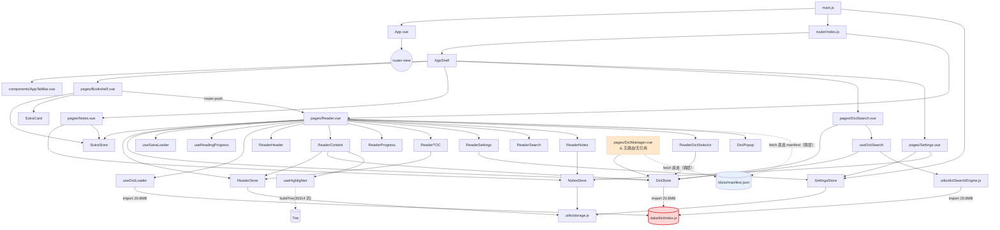
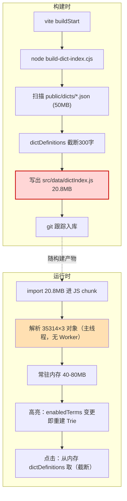

# 般若佛经阅读器 v3.1.0 — 架构诊断报告

> 作者：高见远（架构师）· 团队 software-buddhist-reader
> 日期：2026-09-29
> 范围：`src/`（35 文件 / 3979 行，不含自动生成的 20.8MB `src/data/dictIndex.js`）+ `public/` + `scripts/` + 构建/部署配置
> 方法：纯只读静态分析（读文件、grep 引用、统计行数/体积），未修改任何业务代码、未安装依赖、未跑构建
> 所有结论均附 **文件:行 / 字节偏移 / 命令输出** 作为证据

---

## 0. 结论速览（TL;DR）

| 维度 | 评级 | 一句话依据 |
|------|------|-----------|
| **整体健康度** | **C（亚健康，可救）** | 分层目录结构清晰、高亮引擎有测试、主题 token 体系完整；但**数据层严重失控**、阅读页/内容组件已长成上帝组件、构建产物入库、测试覆盖近乎为零 |
| 分层与模块边界 | B- | pages/components/composables/stores/utils/styles 职责基本清晰，**无循环依赖**；但有孤儿页面、跨层直连 fetch、重复实现 |
| 数据层与加载策略 | **F（致命）** | 20.8MB 内联词典塞进 JS bundle；两套分片机制 67MB 全是死资产；设计文档承诺的"按需 fetch / LRU / Worker"**一个都没落地** |
| 状态管理 | C+ | 5 个 store 边界基本合理，但 dict store 强绑 20.8MB 数据、reader store 混入 UI 状态、settings store 在 watcher 里做 DOM 副作用 |
| 组件复杂度 | C | `Reader.vue`(319) + `ReaderContent.vue`(322) 是上帝组件；词典名硬编码在 3 处；50 处 `console.log` 调试残留 |
| 路由/导航 | B | AppShell+AppTabBar 设计良好；`DictManager.vue`(168 行) 是**无路由孤儿**；hash 路由与 Vercel rewrite 冗余 |
| 样式体系 | B- | token 体系设计优秀，但有硬编码色值绕过 token、`rgba` 遮罩复制 6 次、主题 tag 色不随主题变化 |
| 测试/工程化 | **D** | 仅 2 个 composable 测试 + 1 个构建脚本测试（vs 3979 行源码）；CI 只构建不 lint/test；20.8MB 产物 + 67MB 死资产 + 205MB archive 全部入库（.git 达 127MB） |

**技术债统计：P0 阻断 4 条 · P1 严重 9 条 · P2 一般 8 条 · P3 优化 6 条（合计 27 条，见 §8）**

**最致命三连（详见 §8 P0）：**
1. **20.8MB `src/data/dictIndex.js` 静态内联进 bundle**，其中 19.4MB 是"截断到 300 字"的释义副本 —— 用户进阅读页要下载/解析一个 20MB 的 JS 文件。
2. **两套分片机制全是死资产**：`public/dict-chunks`(48MB, 完整释义) + `public/dict-defs`(19MB, 截断释义) **在 `src/` 中零引用**，纯占仓库和部署体积，且与内联方案功能重叠。
3. **设计意图与实现严重背离**：`docs/plans/2026-05-03-v3.0-architecture-design.md` 明确要求"索引在线 + 释义按需 fetch（~1MB 索引）"，实际实现把全部释义内联成 19.4MB，且 LRU(T-10)/Worker(T-11) 调研结论完全未落地。

**推荐策略：渐进式重构（Strangler Fig），不建议推倒重写。** 理由：数据资产（30 经书 / 3 词典 / 转换脚本）与样式 token 体系是可复用核心资产，UI 组件逻辑大体正确，问题集中在"数据加载层"这一条纵向切片；重写会重复踩 v1.0/v2.0 已被归档否决的坑（AGENTS.md:6-9 明确"不要复用 v2.0 架构"）。**粗估 12–16 人天 / 3 阶段。**

---

## 1. 模块划分与依赖关系

### 1.1 各层实际职责

| 层 | 目录 | 文件数 | 实际职责 | 评价 |
|----|------|--------|----------|------|
| 入口 | `src/` | 3 | `main.js`(42) `App.vue`(40) | 入口干净，但 `main.js` 把 6 处 `console.log` + settings 初始化 + 路由日志钩子混在一起 |
| 路由 | `router/` | 1 | 2 个顶级路由（AppShell 壳 + Reader） | 合理 |
| 页面 | `pages/` | 6 | Bookshelf/Reader/DictSearch/Notes/Settings/DictManager | DictManager 是孤儿（见下） |
| 组件 | `components/` | 12 | AppShell/AppTabBar + bookshelf(1) + dict(1) + reader(8) | reader/ 下 8 个组件均被 Reader 组装 |
| 组合式 | `composables/` | 5(+2 测试) | 加载/高亮/进度/搜索 | 职责清晰，但 useDictLoader 与 dictSearchEngine 功能重叠 |
| 状态 | `stores/` | 5 | dict/notes/reader/settings/sutra | 见 §3 |
| 工具 | `utils/` | 3 | dictSearchEngine/storage/text | dictSearchEngine 直接 import 20.8MB 数据 |
| 样式 | `styles/` | 3 | tokens/themes/base | 设计良好，见 §6 |
| **数据（自动生成）** | `data/` | 1 | `dictIndex.js` 20.8MB | **反模式，见 §2** |

### 1.2 实际依赖图（Mermaid，含发现的问题）



### 1.3 发现的具体问题

| # | 问题 | 证据 | 影响 |
|---|------|------|------|
| M1 | **孤儿页面** `DictManager.vue`(168 行) 无路由、无 import | `router/index.js:3-19` 无该路由；`grep -rn "DictManager" src` 仅命中自身 | 死代码，维护者困惑；其功能与 `ReaderDictSelector` + `DictSearch` 重复 |
| M2 | **跨层直连 fetch**：页面绕过 store 直接拉 manifest | `Reader.vue:274`、`DictManager.vue:81` 各自 `fetch(dicts/manifest.json)` | 数据源分散，无法统一缓存/错误处理；dict 元数据被拉取 2 次 |
| M3 | **重复实现**：`useDictLoader.lookupTerm` 与 `dictSearchEngine.getTermDefinitions` 逻辑几乎相同，都从 `dictDefinitions` 查词 | `useDictLoader.js:7-25` vs `dictSearchEngine.js:50-61` | 双份维护 |
| M4 | **重复实现**：`formatDefinition` 在 `DictSearch.vue:118-122` 又手写一份，未复用 `utils/text.js:34` | 同上 | 释义清洗规则不一致 |
| M5 | **词典名硬编码 3 处** | `DictPopup.vue:69-73`、`DictSearch.vue:103-113`、`ReaderDictSelector` 依赖 manifest | 新增词典要改多处 |
| M6 | 未发现循环依赖 | 依赖图为 DAG | ✅ 优点 |
| M7 | 组合式函数返回 ref 又被 `.value` 二次解包，心智负担高 | `Reader.vue:7,16,43` 用 `loader.loading.value` / `progress.savedPosition.value`（模板里还要 `.value`） | 可读性差，易错 |

---

## 2. 数据层与加载策略（重点）

### 2.1 20.8MB `src/data/dictIndex.js` 解剖

命令实测（字节偏移 + `stat`）：

| 导出块 | 字节区间 | 大小 | 说明 |
|--------|----------|------|------|
| `dictIndex`（term → dictIds 映射） | 51 – 881,376 | **861 KB** | 35314 个词条 → 归属词典 |
| `dictTerms`（词条数组） | 881,376 – 1,374,247 | **481 KB** | 35314 个词 |
| `dictDefinitions`（dictId → {term: 释义}） | 1,374,247 – 20,786,635 | **≈ 19.4 MB** | **截断到 300 字**的释义副本 |
| **合计** | | **20,786,635 B ≈ 20.8 MB** | |

> 关键观察：**索引本身只有 1.37MB**（与设计文档 §4.2 的"~1MB 索引"一致），但额外塞进了 **19.4MB 释义**，占整个文件 93%。

生成逻辑证据 —— `scripts/build-dict-index.cjs:39-40`：
```js
// Truncate to 300 chars for inline embedding
const summary = definition.length > 300 ? definition.slice(0, 300) + '...' : definition
```
`vite.config.js:16-24` 在 `buildStart` 里 `execSync('node scripts/build-dict-index.cjs')`，**每次构建都重新生成**；且 `src/data/dictIndex.js` 被 **git 跟踪**（`git ls-files src/data/` → `src/data/dictIndex.js`），20.8MB 二进制级文本进了仓库。

**后果（用户侧）：**
- **首屏/进阅读页体积**：静态 `import`（`stores/dict.js:3`、`utils/dictSearchEngine.js:1`、`composables/useDictLoader.js:2`），dict store 被 Reader / DictSearch / DictManager 引入 → 进入阅读页或词典页必下载 ~20MB JS（gzip 后中文文本约压缩 3–4 倍，仍有 **~5MB 网络传输**）。
- **解析耗时**：浏览器需解析 20.8MB JS 字面量（35,314×3 层对象），中端手机预估 **1–3s 主线程阻塞**（无 Worker）。
- **内存占用**：JS 字符串以 UTF-16 存储，19.4MB 文本 → 堆内 ≈ **40–80MB**，移动端低端机接近 WebView 内存红线。
- **缓存策略**：作为 JS chunk 走 HTTP 缓存，但**每次构建 hash 变化 + 内容随词典更新而变**，无法增量；且 20MB 无法进 Service Worker 预缓存（无 PWA，见 §7）。

### 2.2 两套机制为何并存、谁在用

实测 `grep -rn "dict-chunks|dict-defs" src/` → **零命中**（仅 `scripts/` 与 `docs/` 提及）。

| 机制 | 生成脚本 | 产物 | 体积 | 释义完整度 | **运行时是否被引用** |
|------|----------|------|------|-----------|---------------------|
| **内联索引** | `build-dict-index.cjs` | `src/data/dictIndex.js` | 20.8MB | **截断 300 字** | ✅ 被 `stores/dict.js` / `dictSearchEngine` / `useDictLoader` 使用 |
| 分片 | `build-dict-chunks.cjs` | `public/dict-chunks/*.json`(75 文件) | 48MB | **完整** | ❌ **死资产**（src 零引用） |
| 分片（每词典一文件） | `build-dict-defs.cjs` | `public/dict-defs/dict-{1,2,3}.json` | 19MB | **截断 300 字** | ❌ **死资产** |
| MDX 解压 | — | `public/lzo-wasm.wasm` | 20KB | — | ❌ **死资产**（AGENTS.md:36 已确认 v3 不用 MDX） |

**结论**：这是三次架构迭代（v2.0 的 chunk 分片 → 过渡的 dict-defs → v3.0 的内联）**层层叠加、旧方案未清理**的结果。当前**唯一在用**的是最差的内联方案；**唯一提供完整释义**的 `dict-chunks` 反而没人用。

**功能缺陷推论**：因为 `dictDefinitions` 被截断到 300 字，`DictPopup.vue:45-47` 展示的释义是**被截断的**（尾随 `...`），用户看不到完整词条——这是内联方案引入的**功能性回归**。

### 2.3 经书与词典的完整数据流

**经书链路（健康）：**

经书链路是**按需加载、分文件、体积可控**的 ✅ 正确示范。

**词典链路（病态）：**


### 2.4 LRU / Worker / 按需加载是否落地

| 优化项 | 调研文档 | 设计承诺 | **实际落地** | 证据 |
|--------|----------|----------|-------------|------|
| LRU 缓存 | `docs/plans/research/T-10-lru-cache-strategy.md`(502 行) | v2.0 内存 LRU，1000 条上限 | ❌ **未落地** | `stores/dict.js:8` `definitionCache = ref({})` 从未写入；`clearCache()` 仅重置空对象（`dict.js:40`） |
| Web Worker | `docs/plans/research/T-11-web-worker-strategy.md`(697 行) | Trie 构建/MDX 解析移入 Worker | ❌ **未落地** | `find src -name "*worker*"` → 无；Trie 在 `useHighlighter.js:48-52` 主线程 `computed` 内构建 |
| 释义按需 fetch | `2026-05-03-v3.0-architecture-design.md:4.2 / 5.3 / 8.2` | "并行 fetch 启用的词典 JSON，查完释放" | ❌ **反其道而行**：全部内联 | `stores/dict.js:3` 静态 import 20.8MB |
| 词典缓存 5 分钟过期 | 同上 §8.2 | TTL 缓存 | ❌ 未实现 | 无 TTL 相关代码 |
| 虚拟滚动/可视区高亮 | 同上 §8.2 | "只在可视区域高亮" | ❌ 全量渲染 | `ReaderContent.vue:7-44` `v-for` 渲染全部段落，每段调用 `getSegments` |
| 滚动节流 | 同上 §8.2 | 100ms | ✅ 已实现 | `ReaderContent.vue:148-161` 100ms 节流 |

**结论**：性能优化调研（T-10/T-11/T-47，合计 1900+ 行）**全部停留在文档**，代码零落地。这是"文档债"——大量高成本调研未转化为实现。

---

## 3. 状态管理

### 3.1 5 个 Store 职责边界

| Store | 行数 | 实际持有 | 边界评价 |
|-------|------|----------|----------|
| `sutra.js` | 66 | sutraList / currentSutra / loading / error / categories / activeCategory / filteredList + fetch | ✅ 边界清晰；但含**分类常量**（`sutra.js:12-20`）与 fetch 副作用 |
| `dict.js` | 46 | **import 20.8MB** / definitionCache(空) / enabledDicts / lookupResult / refreshKey | ❌ 强绑巨型数据；`definitionCache`/`lookupResult`/`lookupLoading` 是**未使用死状态** |
| `reader.js` | 48 | scrollPosition / bookmarks / readingTime / currentChapter / **showTOC / showSettings** | ❌ 混入 **UI 面板开关**（`reader.js:10-11`），与 `ReaderTOC.vue:9,18,65` 直接读写 store 耦合 |
| `settings.js` | 60 | 字号/行距/主题索引 + `applyBodyStyles()`(DOM) + `setTheme`(DOM) | ⚠️ 在 store 内做 **DOM 副作用**（`settings.js:38-41,35`）+ `watch` 里再写 DOM（`:50-53`），**不可测试** |
| `notes.js` | 78 | allNotes + CRUD | ✅ 相对干净；但 `addNote` 同时写 `time` 和 `createdAt` 两个时间字段（`notes.js:32-33`），排序逻辑兼容二者（`:22`） |

### 3.2 耦合与隐式依赖

- **隐式依赖**：`notes.js` 的 `getAllNotes()` 产出 `{...note, sutraId}`，但**不解析 sutra 标题**；标题解析被塞进视图层 `Notes.vue:117-141`（computed 里遍历 `sutraStore.sutraList` 反查）。Store 与 store 之间靠**页面层手工缝合**。
- **跨 store 编排**：`Reader.vue` 同时持有 sutra/reader/dict 三个 store + 3 个 composable（`Reader.vue:126-130`），是事实上的"协调层"，但职责全部压在一个页面组件里。
- **持久化耦合**：storage key 前缀 `br-`（`storage.js:1`）+ 各 store 直接拼 key（`notes.js:9` `notes-${sutraId}`、`reader.js:20` `bookmarks-${sutraId}`、`Reader.vue:257` `reading-time-${id}`、`useReadingProgress.js:10` `progress-${id}`）。**key 命名无集中管理**，散落 4 处，易冲突/遗漏。
- **`dictStore.refreshKey` 被当 `:key` 强制重挂载**（`Reader.vue:40` `:key="dictStore.refreshKey"`）——用"销毁重建整个阅读内容"来响应词典开关，代价是**重排 + 重新高亮全文**，粗暴且低效。

---

## 4. 组件层复杂度

### 4.1 体量与职责评估

| 组件 | 行数 | 职责数 | 可测试性 | 备注 |
|------|------|--------|----------|------|
| **`Reader.vue`** | **319** | **≈9**（加载经书/进度/7 个面板开关/选词/笔记/计时/拉 manifest/词典查询/返回导航） | 差 | **上帝组件** |
| **`ReaderContent.vue`** | **322** | **≈6**（高亮/搜索高亮/滚动进度/章节跳转/段落定位/TreeWalker 精确定位） | 差（23 处 `console.log`） | **上帝组件** |
| `Notes.vue` | 318 | 4（列表/搜索/按经书筛选/编辑删除/跳转） | 中 | 体量偏大 |
| `ReaderNotes.vue` | 198 | 3 | 中 | |
| `DictSearch.vue` | 220 | 4（搜索/词典开关/结果渲染/本地 formatDefinition） | 中 | 与 DictManager 功能重叠 |
| `DictManager.vue` | 168 | 2 | 中 | **孤儿** |
| `Settings.vue` | 221 | 4 | 中 | |
| `ReaderSearch.vue` | 163 | 3（搜索/高亮/跳转） | 中 | `v-html` + 自写 escape（`:110-120`），XSS 面需关注 |
| `ReaderDictSelector.vue` | 140 | 2 | 中 | |
| `ReaderSettings.vue` | 147 | 2 | 中 | 与 Settings.vue 字号/行距/主题**三处 UI 重复** |
| `ReaderTOC.vue` | 166 | 2 | 中 | 直接读写 `readerStore.showTOC` |
| 其余（SutraCard/ReaderHeader/ReaderProgress/AppShell/AppTabBar） | 38–76 | 1 | 好 | ✅ |

### 4.2 核心链路质量：高亮引擎 + 词典弹窗

**`useHighlighter.js`（94 行）——本项目最优质代码** ✅
- Trie 最长匹配 + 数字短语排除（`useHighlighter.js:33-45`），设计正确
- **有 7 个单测**（`__tests__/useHighlighter.test.js`），覆盖长词优先/数字上下文/空输入
- 隐患：`trie` 是 `computed`（`useHighlighter.js:48`），入参 `dictStore.enabledTerms` 是**35314 词的数组**，任一词典开关变更即**全量重建 Trie**（无缓存/无 Worker）。

**`DictPopup.vue`（126 行）——展示层健康，但受数据层拖累** ⚠️
- 组件本身是纯展示（props: visible/term/results/loading），设计干净
- **但 `results` 的释义来自被截断 300 字的 `dictDefinitions`**（见 §2.2），用户看到的是**不完整释义**——这是数据层缺陷外溢到 UI 的典型症状。

**`ReaderContent.vue`（322 行）——技术债重灾区** ❌
- `getSegments()` 在**模板 `v-for` 内逐段调用**（`ReaderContent.vue:27`），每次渲染对每段文本重跑高亮 + 搜索高亮插入，无 memo
- `scrollToPara` 用 `document.createTreeWalker` + `querySelectorAll` 手工数 `charCount` 定位（`:189-249`），脆弱
- **23 处 `console.log`**（含 `:241-247` 打印 DOM 矩形），git log 显示针对"搜索高亮 + 滚动定位"的 fix/debug 提交**连续 8 次以上**（`git log --oneline` 顶部 `c24a851`→`de5922...`），说明这块**反复修不好**——复杂度已超出手工维护阈值。

---

## 5. 路由与页面结构

### 5.1 路由设计

`router/index.js:3-19`：
```js
/                        → AppShell（含 AppTabBar）
  ├─ '' (bookshelf)      → Bookshelf.vue   [KeepAlive]
  ├─ 'notes'             → Notes.vue       [KeepAlive]
  ├─ 'dicts'             → DictSearch.vue  [KeepAlive]
  └─ 'settings'          → Settings.vue    [KeepAlive]
/reader/:id              → Reader.vue（不在壳内，全屏）
```

| 观察 | 评价 |
|------|------|
| 用 `createWebHashHistory`（`router/index.js:22`） | ⚠️ 与 `vercel.json` 的全量 rewrite 到 `index.html` **功能冗余**（hash 路由本就不需要服务端 rewrite）；`AGENTS.md` 说是为兼容 GitHub Pages |
| `Reader` 用 `route.params.id` 承载**中文文件名** | ⚠️ `Reader.vue:141` `decodeURIComponent(route.params.id)`，且 `goBack` 里判断 `from.startsWith('/#/')`（`Reader.vue:242`）——**用字符串前缀 hack 处理导航来源**，脆弱 |
| `KeepAlive :include`（`AppShell.vue:6`） | ✅ 设计正确，但依赖组件 `defineOptions({name})` 与 include 字符串**手工对齐**，漏改即失效 |
| 4 个 tab 页 + 1 个全屏 reader | ✅ 信息架构合理 |

### 5.2 页面/组件复用度

- `DictSearch.vue` 与 `DictManager.vue` **功能重叠**（都列词典 + 开关），但代码各写一份
- 字号/行距/主题选择 UI 在 `Settings.vue:29-55` 与 `ReaderSettings.vue:24-70` **重复两份**
- `formatDefinition` 重复（见 §1.3 M4）
- `SutraCard` / `ReaderHeader` / `ReaderProgress` 是干净的可复用组件 ✅

---

## 6. 样式体系

### 6.1 设计意图 vs 实际一致性

| 文件 | 行数 | 意图 | 评价 |
|------|------|------|------|
| `tokens.css` | 114 | 单一事实源：色/字/距/圆角/断点 + 语义别名（btn/card/input/tag） | ✅ 体系完整、命名规范 |
| `themes.css` | 49 | `[data-theme]` 覆盖色板（night/eye-care/paper） | ⚠️ `paper`（`:35-50`）与 `:root`（`tokens.css:6-19`）**值重复**，双份维护 |
| `base.css` | 75 | 重置 + 排版 + 滚动条 | ✅ |

### 6.2 硬编码色值绕过 token（证据）

| 文件:行 | 硬编码值 | 应使用 |
|---------|----------|--------|
| `ReaderContent.vue:312` | `background: #fbbf24`（搜索高亮黄） | 应入 token（如 `--color-highlight-search`） |
| `ReaderSearch.vue:155-156` | `background: #fff3cd; color: #2c2c2c` | 同上，且 `#2c2c2c` 硬编码墨色，**夜间主题下不可读** |
| `DictPopup.vue:80` / `ReaderNotes.vue:142` / `ReaderSearch.vue:125` / `ReaderSettings.vue:104` / `ReaderDictSelector.vue:83` | `rgba(0,0,0,0.2)` 遮罩 | 应统一为 `--color-overlay`（**同一值复制 6 次**） |
| `ReaderTOC.vue:84` | `rgba(0,0,0,0.3)` | 同上，且与其余 0.2 不一致 |
| `tokens.css:103-114` | tag 分类色 `#fff3e0/#e65100/...` 直接写死 | 主题切换时 tag 色**不变**，夜间主题下亮色 tag 突兀 |

### 6.3 主题切换实现

- 机制：`document.documentElement.setAttribute('data-theme', name)`（`settings.js:35,52`）→ CSS 变量级联 ✅ 方案正确、无闪烁
- 缺陷：副作用写在 store 内 + `watch`（`settings.js:48-53`），且 `initFromStorage` 在 `main.js:29-31` **在 mount 之后**才调用（`main.js:26` 先 mount）→ 首帧可能闪一下默认主题

---

## 7. 测试与工程化现状

### 7.1 测试覆盖

| 类型 | 数量 | 覆盖对象 | 缺口 |
|------|------|----------|------|
| Composable 单测 | 2 | `useHighlighter`(7 case)、`useReadingProgress`(5 case) | 其余 3 个 composable、5 个 store、12 个组件 **0 覆盖** |
| 构建脚本测试 | 1 | `build-dict-index.cjs` 产物结构 | — |
| 组件/E2E | **0** | — | 阅读主链路（点击查词/搜索跳转/笔记）**无任何自动化** |

**覆盖率粗估：3979 行源码中约 145 行被测试触及 ≈ 3.6%**（且未含 dictIndex 20.8MB）。

### 7.2 Lint / 构建 / CI

| 项 | 现状 | 证据 |
|----|------|------|
| ESLint | 有配置（`.eslintrc.cjs`），但 `ignorePatterns` 排除 `scripts/`、`src/data/dictIndex.js` | `.eslintrc.cjs:2` |
| Lint 脚本 | `npm run lint` = `eslint . --fix`（**默认带 --fix 会自动改文件**） | `package.json:11` |
| CI | **仅** GitHub Pages 部署（`build:ghpages`），**不跑 lint、不跑 test** | `.github/workflows/deploy.yml` 无 lint/test step |
| CI 目标 vs 实际部署 | CI 部署 GitHub Pages，`AGENTS.md:31-33` 说实际用 **Vercel** | 双轨部署，配置漂移 |
| 测试脚本 | `npm test` = `vitest run`，配置内联在 `vite.config.js:31-34` | 无独立 `vitest.config` |

### 7.3 Git 跟踪构建产物（工程卫生问题）

| 产物 | 体积 | 是否入库 | 证据 |
|------|------|----------|------|
| `src/data/dictIndex.js` | 20.8MB | ✅ **入库** | `git ls-files src/data/dictIndex.js` 命中；`.gitignore` 未排除 |
| `public/dict-chunks/*.json` | 48MB（75 文件） | ✅ 入库 | `git ls-files public/` → 115 文件全部跟踪 |
| `public/dict-defs/*.json` | 19MB | ✅ 入库 | 同上 |
| `archive/v1.0,v2.0` | 205MB | ✅ 入库 | `git ls-files archive/` → 303 文件 |
| `.git` 仓库 | **127MB** | — | `du -sh .git` |

工作区总量 **346MB**（不含 node_modules），其中 **~290MB 是构建产物 / 死资产 / 归档**，真实源码仅 ~4MB。

### 7.4 调试残留

**50 处 `console.log`**（`grep -rc` 实测）：`ReaderContent.vue:23`、`Reader.vue:6`、`main.js:6`、`ReaderSearch.vue:5`…… 其中 `ReaderContent.vue:241-247` 打印 DOM 矩形、`Reader.vue:228` 打印 keyword 类型——**生产代码带调试输出**。

---

## 8. 技术债清单（按严重度分级）

### P0 — 阻断级（必须优先解决）

| ID | 问题 | 证据（文件:行/命令） | 影响 | 修复方向 |
|----|------|---------------------|------|----------|
| **P0-1** | 20.8MB `dictIndex.js` 静态内联进 bundle，其中 19.4MB 是截断释义 | `stat src/data/dictIndex.js`=20786635；`stores/dict.js:3`；`build-dict-index.cjs:39` | 进阅读页下载~20MB JS、解析阻塞主线程 1–3s、内存 40–80MB | 索引与释义解耦：仅内联 1.37MB 索引（或更小的前缀索引），释义改为按需 fetch |
| **P0-2** | 内联释义被**截断到 300 字**，用户看到不完整词条（功能性回归） | `build-dict-index.cjs:39-40`；`DictPopup.vue:45-47` | 核心功能"查释义"结果不完整 | 恢复完整释义（改用 dict-chunks 或按需 fetch 完整 JSON） |
| **P0-3** | 两套分片机制（67MB）全为死资产，且与内联方案重叠 | `grep -rn "dict-chunks\|dict-defs" src` → 0 命中；`du -sh public/dict-chunks`=48M/`dict-defs`=19M | 仓库/部署体积浪费 67MB，维护者认知负担 | 明确单一数据方案后删除死资产与对应脚本 |
| **P0-4** | 构建产物 + 死资产 + 归档入库，`.git` 127MB | `git ls-files src/data/dictIndex.js`；`git ls-files public/`=115；`du -sh .git`=127M | 克隆慢、仓库膨胀、diff 噪声 | `git rm --cached` + `.gitignore`；`dictIndex.js` 改为构建期生成不追踪 |

### P1 — 严重（重构核心）

| ID | 问题 | 证据 | 影响 | 修复方向 |
|----|------|------|------|----------|
| P1-1 | `Reader.vue`(319) 上帝组件，9 类职责 | `Reader.vue:104-289` | 难测、难改、易回归 | 拆分：加载/面板协调/选词/计时 各自成 composable |
| P1-2 | `ReaderContent.vue`(322) 上帝组件 + 23 处日志 + 脆弱 TreeWalker | `ReaderContent.vue:68-249`；git log 连续 8+ fix | 搜索高亮/滚动定位反复出 bug | 抽出 `useScrollAnchor`/`useSearchHighlight`；移除日志 |
| P1-3 | 设计承诺的 LRU(T-10)/Worker(T-11) 零落地 | `stores/dict.js:8,40` 空缓存；`find src -name "*worker*"` 无 | 重复查询无缓存、Trie 构建阻塞主线程 | 落实现金 LRU + 可选 Worker 构建 Trie |
| P1-4 | 全量渲染 + 逐段高亮（无虚拟滚动/可视区优化） | `ReaderContent.vue:7-44`；`useHighlighter.js:48` | 长经书首屏渲染卡顿 | 可视区高亮 + 段落级 memo |
| P1-5 | 测试覆盖≈3.6%，阅读主链路 0 覆盖 | 仅 `__tests__` 2 文件；`git ls-files src/**/__tests__` | 重构无安全网 | 补 store/关键 composable/主链路单测 |
| P1-6 | `DictManager.vue`(168) 孤儿页面 | `router/index.js:3-19` 无路由 | 死代码误导维护 | 删除或接入路由并去重 |
| P1-7 | 跨层直连 fetch，dict 元数据多处重复拉取 | `Reader.vue:274`；`DictManager.vue:81` | 缓存/错误处理不统一 | 元数据统一进 dict store |
| P1-8 | settings store 内做 DOM 副作用，`initFromStorage` 在 mount 后才调用 | `settings.js:35-53`；`main.js:26,29-31` | 不可测；首帧可能闪主题 | 副作用移出 store；初始化提前到 mount 前 |
| P1-9 | `refreshKey` 用整页重挂载响应词典开关 | `Reader.vue:40` | 开关词典=重排+全文重高亮 | 精确响应式更新 enabledTerms |

### P2 — 一般

| ID | 问题 | 证据 |
|----|------|------|
| P2-1 | `formatDefinition` 重复实现 | `DictSearch.vue:118-122` vs `utils/text.js:34` |
| P2-2 | 词典名硬编码 3 处 | `DictPopup.vue:69-73`、`DictSearch.vue:103-113` |
| P2-3 | 字号/行距/主题 UI 在 Settings 与 ReaderSettings 重复 | `Settings.vue:29-55` vs `ReaderSettings.vue:24-70` |
| P2-4 | `useDictLoader` 与 `dictSearchEngine` 查词逻辑重复 | `useDictLoader.js:7-25` vs `dictSearchEngine.js:50-61` |
| P2-5 | 硬编码色值/遮罩绕过 token（6 处遮罩 + 高亮黄） | `ReaderContent.vue:312`、`ReaderSearch.vue:155-156`、6 处 `rgba(0,0,0,.2)` |
| P2-6 | storage key 命名散落 4 处无集中管理 | `notes.js:9`、`reader.js:20`、`Reader.vue:257`、`useReadingProgress.js:10` |
| P2-7 | reader store 混入 UI 面板开关 | `reader.js:10-11` |
| P2-8 | `Notes.vue` 在 computed 里反查 sutra 标题（视图层缝合 store） | `Notes.vue:117-141` |

### P3 — 优化

| ID | 问题 | 证据 |
|----|------|------|
| P3-1 | 50 处 `console.log` 生产残留 | `grep -rc "console.log" src` |
| P3-2 | `npm run lint` 默认 `--fix` 自动改文件 | `package.json:11` |
| P3-3 | CI 不跑 lint/test；CI(GH Pages) 与实际部署(Vercel) 双轨漂移 | `.github/workflows/deploy.yml`；`AGENTS.md:31-33` |
| P3-4 | hash 路由 + vercel 全量 rewrite 冗余 | `router/index.js:22`；`vercel.json` |
| P3-5 | 主题 tag 色不随主题变化 | `tokens.css:103-114` |
| P3-6 | `lzo-wasm.wasm`(20KB) 死资产 | `public/lzo-wasm.wasm`，AGENTS.md:36 确认不用 |

---

## 9. 重构方案建议

### 9.1 目标架构

核心思想：**把"数据加载"这条纵向切片做对**，其余保持稳定。引入一个**词典数据服务层**作为唯一数据出口，把 20.8MB 内联换成"小索引 + 按需 fetch 完整释义 + LRU"。

```mermaid
graph TD
    subgraph UI 层
      Pages[pages: Bookshelf/Reader/DictSearch/Notes/Settings]
      Comp[components: reader/* dict/* bookshelf/*]
    end
    subgraph 状态层
      Stores[stores: sutra/reader/dict/settings/notes]
    end
    subgraph 领域服务层（新增）
      DictService[services/dictService.js<br/>索引查询+释义 fetch+LRU]
      SutraService[services/sutraService.js]
      HighlightEngine[engine/highlighter.js<br/>Trie（可选 Worker）]
    end
    subgraph 数据访问层
      Repo[data/repositories<br/>fetch JSON / 缓存]
      Storage[utils/storage.js]
    end
    subgraph 资产
      IndexAsset["/dict-index.json（前缀索引 ~1.4MB, 或更小）"]
      DefAsset["/dict-defs/{id}.json（完整释义, 按需）"]
      SutraAsset["/sutras/*.json"]
    end

    Pages --> Stores
    Comp --> Stores
    Comp --> HighlightEngine
    Stores --> DictService
    Stores --> SutraService
    DictService --> Repo
    DictService --> HighlightEngine
    Repo --> IndexAsset
    Repo --> DefAsset
    Repo --> SutraAsset
    Stores --> Storage

    style DictService fill:#d6f5d6,stroke:#090,stroke-width:2px
    style HighlightEngine fill:#d6f5d6,stroke:#090,stroke-width:2px
    style IndexAsset fill:#e6f0ff
```

**关键设计决策：**

| 决策 | 方案 | 理由 |
|------|------|------|
| 索引 | 只内联/预取**词条→词典映射**（当前 861KB，可再压缩为前缀结构） | 高亮需要全量词表，但**不需要释义** |
| 释义 | 按需 `fetch('/dict-defs/{id}.json')`，用**完整**释义文件（替代截断） | 落实设计文档 §4.2；恢复功能完整性 |
| 缓存 | `services/` 内实现 Map-LRU（T-10 已有现成方案，~15 行） | 重复查询零成本 |
| Trie | 保持主线程，但**加 memo + 增量更新**；长经书场景可选 Worker | 优先解决 90% 场景，Worker 列为可选 |
| 高亮 | 段落级 memo，避免 `v-for` 内重复计算 | 消除最大渲染瓶颈 |
| 数据方案 | **二选一**：保留 `dict-chunks`(完整) 或 `dict-defs`，删除另一个 | 消除死资产与歧义 |

### 9.2 迁移策略对比

| 维度 | 渐进式重构（Strangler） | 推倒重写 |
|------|------------------------|----------|
| 风险 | 低，可增量验证、随时回滚 | 高，一次大爆炸 |
| 复用 | 复用全部经书/词典数据、token 体系、高亮引擎、UI 组件 | 大概率重造轮子 |
| 线上影响 | 可分阶段灰度，Vercel 不中断 | 需并行维护双版本 |
| 时间 | 12–16 人天 | 25–40 人天（且要重踩 v1/v2 坑） |
| 与历史一致 | 与"v2→v3 已重构过一次仍失控"的教训吻合：**问题在数据层而非整体** | AGENTS.md 明确禁止复用 v2 架构，重写无历史收益 |

**推荐：渐进式重构。** 依据：`archive/v1.0`、`archive/v2.0` 两代已被否决，说明"整体重写"在本项目**已被证明低效**；而本次诊断显示问题高度集中在 §2 数据层 + 2 个上帝组件，是可外科手术式切除的局部病灶。

### 9.3 分阶段路线图

| 阶段 | 目标 | 涉及范围 | 验收标准 | 预估 |
|------|------|----------|----------|------|
| **阶段一：止血 + 数据层解耦** | 消除 20.8MB 内联；恢复完整释义；清死资产 | `scripts/build-dict-index.cjs`、`src/data/`、`stores/dict.js`、`utils/dictSearchEngine.js`、新增 `services/dictService.js`、`.gitignore` | 进阅读页传输 <2MB；词条释义完整（非截断）；`public` 体积下降 ≥67MB；`dictIndex.js` 不再入库 | 4–6 人天 |
| **阶段二：组件解耦 + 状态治理** | 拆上帝组件；副作用出 store；清孤儿/重复 | `Reader.vue`→拆分、`ReaderContent.vue`→抽 composable、`settings.js`、`DictManager.vue`、`DictSearch/ReaderSettings` 去重 | Reader ≤150 行、ReaderContent ≤180 行；`grep console.log` 归零；无孤儿文件 | 5–6 人天 |
| **阶段三：质量加固** | 建安全网；CI 补 lint/test；修样式绕过 | 补 store/主链路测试、`.github/workflows`、`tokens.css` 补 overlay/highlight token、清理 archive | 关键 store/composable 覆盖 ≥60%；CI 跑 lint+test；无硬编码色值 | 3–4 人天 |

> 每阶段独立可交付、可单独上线；阶段一完成即产生**用户可感知的最大收益**（加载体积）。

### 9.4 风险清单

| 风险 | 等级 | 缓解措施 |
|------|------|----------|
| **数据资产 119MB + archive 205MB 处理** | 高 | archive 移出 git（转 release/外部存储）而非删除；public 数据保留但删死资产前先确认无引用；先 `git rm --cached` 减 .git 体积 |
| **构建产物 20MB 治理** | 高 | `dictIndex.js` 加入 `.gitignore`，改为 `predev/prebuild` 生成；确认 Vercel 构建环境能跑生成脚本 |
| **重构期间 Vercel 线上不能挂** | 高 | 每阶段在 feature 分支 + 预览部署验证；数据层改造保持"旧内联路径"回退开关一个版本；不删 `public/dicts/*.json` 源数据 |
| **词典完整释义体积**（完整 dict-chunks 48MB） | 中 | 按词典拆分按需加载，单次只取用户启用词典；配 LRU 上限；避免一次拉全部 |
| **中文文件名路由 + hash/rewrite 双轨** | 中 | 阶段二统一路由策略，保留现有 hash 行为直到迁移完成 |
| **移动端内存** | 中 | 释义按需加载后，内存从 40–80MB 降至 <15MB；不引入 SharedArrayBuffer |
| **无测试的安全网缺口** | 中 | 阶段三优先补测试；阶段一/二改动前先对受影响 composable 补最小回归测试 |

### 9.5 工作量粗估

| 阶段 | 人天 | 产出 |
|------|------|------|
| 阶段一 数据层解耦 | 4–6 | 体积/功能双修 |
| 阶段二 组件与状态 | 5–6 | 可维护性 |
| 阶段三 质量加固 | 3–4 | 测试/CI/样式 |
| **合计** | **12–16 人天** | 3 次可独立上线 |

---

## 10. 附：诊断方法与可复现命令

```bash
# 源码规模（不含 20.8MB dictIndex）
find src -type f \( -name "*.js" -o -name "*.vue" -o -name "*.css" \) ! -name dictIndex.js -exec wc -l {} +

# dictIndex 体积与结构
stat -c%s src/data/dictIndex.js          # 20786635
grep -bo "export const dictIndex = " src/data/dictIndex.js
grep -bo "export const dictTerms = " src/data/dictIndex.js
grep -bo "export const dictDefinitions = " src/data/dictIndex.js

# 死资产验证
grep -rn "dict-chunks\|dict-defs" src/   # 0 命中

# 优化是否落地
find src -name "*worker*"                 # 无
grep -rn "console.log" src --include=*.vue --include=*.js | wc -l   # 50

# 工程卫生
git ls-files src/data/                    # dictIndex.js 被跟踪
du -sh .git public archive src            # 127M / 118M / 205M / 21M
```

---

*报告完。本文件为只读分析产出，未改动任何业务代码。*
