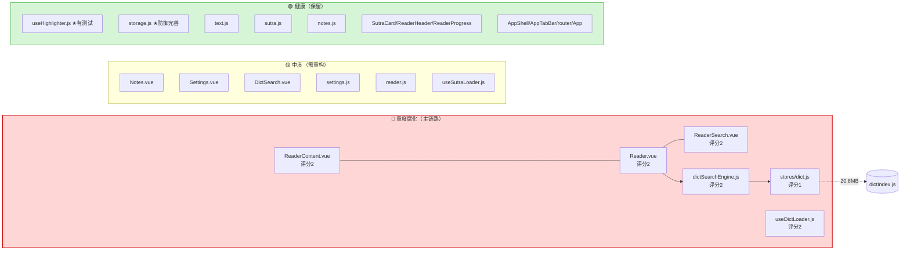
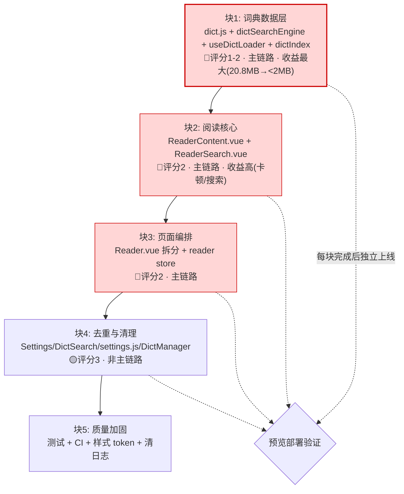

# 代码级腐化度评估：局部还是系统性？

> 作者：高见远（架构师）· 团队 software-buddhist-reader
> 日期：2026-09-29
> 目的：回应用户质疑（"低级 AI 模型写的、修修补补、质量是渣"），从**代码级**（非结构级）复核腐化程度，判定腐化是**局部**还是**系统性**，据此复核 A 方案是否成立
> 方法：只读分析（逐文件函数体量/复杂度/重复/死代码/隐式耦合统计 + grep 引用 + git 历史）
> 上游：`docs/refactor/2026-09-29-architecture-diagnosis.md`（结构级，C 级）、`2026-09-29-refactor-vs-rewrite-decision.md`

---

## 0. 复核声明（先认错）

> **上一轮的结构级诊断（分层清晰、无循环依赖、C 级）在"代码级质量"维度上确实偏乐观。**
> 用户是对的：本项目**确实存在严重的代码级腐化**——上帝组件、61 行超长函数、23 处调试日志残留、DOM 手写 hack、死代码、静默吞异常。这些都是**结构图看不出来**的。
> **本报告据此把整体健康度从 C 下调为 C−（结构 B−，代码级 D+）。**
> **但核心问题的答案仍然是：腐化是"局部的"，不是"系统性的"——且这个"局部"恰好压在主链路上。**（论证见 §2–§4）

---

## 1. 代码级腐化度量化（逐文件，36 个 .vue/.js 文件）

> 指标：`总行` / `脚本行` / `最长函数` / `函数数` / `决策点(if/for/&&/?: 计数，复杂度代理)` / `console.log` / `try-catch` / `直接DOM` / `v-html` / `可维护性(1-5)` / `处置`
> 数据来源：`/tmp/rot_analyze.py`（只读统计）+ grep 引用核验

| 文件 | 总行 | 脚本 | 最长函数 | 函数数 | 决策点 | clog | DOM | 评分 | 处置 |
|------|-----:|-----:|---------|-----:|-----:|----:|----:|:----:|------|
| `components/reader/ReaderContent.vue` | 323 | 227 | **61** `scrollToPara` | 8 | **39** | **23** | 3 | **2** | 🔴 重写核心 |
| `pages/Reader.vue` | 320 | 187 | 13 | **15** | 14 | 6 | 7 | **2** | 🔴 重写核心 |
| `pages/Notes.vue` | 319 | 81 | 9 | 4 | 7 | 1 | 0 | 3 | 🟡 重构 |
| `pages/Settings.vue` | 222 | 39 | 11 | 5 | 1 | 1 | 2 | 3 | 🟡 重构 |
| `pages/DictSearch.vue` | 221 | 44 | 5 | 3 | 3 | 3 | 1 | 3 | 🟡 重构 |
| `components/reader/ReaderNotes.vue` | 199 | 50 | 7 | 5 | 1 | 0 | 0 | 4 | 🟢 保留 |
| `pages/DictManager.vue` | 169 | 25 | 13 | 1 | 2 | 0 | 0 | **2** | ⚫ 删除（孤儿） |
| `components/AppTabBar.vue` | 168 | 22 | 4 | 1 | 1 | 1 | 0 | 4 | 🟢 保留 |
| `components/reader/ReaderTOC.vue` | 167 | 15 | 4 | 1 | 0 | 0 | 0 | 4 | 🟡 轻重构（解耦 store UI 状态） |
| `components/reader/ReaderSearch.vue` | 164 | 68 | **37** `onSearch` | 4 | 10 | 5 | 0 | **2** | 🔴 重写核心（含 v-html） |
| `pages/Bookshelf.vue` | 156 | 25 | 6 | 1 | 0 | 2 | 0 | 4 | 🟢 保留 |
| `components/reader/ReaderSettings.vue` | 148 | 16 | 1 | 3 | 0 | 0 | 0 | 4 | 🟡 轻重构（与 Settings 去重） |
| `components/reader/ReaderDictSelector.vue` | 141 | 19 | 0 | 0 | 0 | 0 | 0 | 4 | 🟢 保留 |
| `components/dict/DictPopup.vue` | 127 | 22 | 1 | 2 | 0 | 0 | 0 | 4 | 🟡 轻重构（词典名去重） |
| `composables/useHighlighter.js` | 95 | 95 | 35 | 6 | 22 | 0 | 0 | **5** | 🟢 保留（有测试） |
| `stores/notes.js` | 79 | 79 | 16 | 6 | 5 | 0 | 0 | 4 | 🟢 保留 |
| `components/reader/ReaderHeader.vue` | 77 | 4 | 0 | 0 | 0 | 0 | 0 | **5** | 🟢 保留 |
| `components/bookshelf/SutraCard.vue` | 67 | 12 | 1 | 2 | 0 | 0 | 0 | **5** | 🟢 保留 |
| `stores/sutra.js` | 67 | 67 | 13 | 4 | 5 | 0 | 0 | 4 | 🟢 保留 |
| `utils/dictSearchEngine.js` | 62 | 62 | **46** `searchDictTerms` | 2 | **16** | 0 | 0 | **2** | 🔴 重写核心 |
| `stores/settings.js` | 61 | 61 | 5 | 5 | 0 | 0 | **4** | 3 | 🟡 重构（副作用出 store） |
| `composables/__tests__/useHighlighter.test.js` | 56 | 56 | 0 | 0 | 1 | 0 | 0 | **5** | 🟢 保留 |
| `utils/storage.js` | 54 | 54 | 10 | 3 | 7 | 0 | 0 | **5** | 🟢 保留 |
| `composables/useDictSearch.js` | 53 | 53 | **48** | 3 | 1 | 0 | 0 | 4 | 🟡 重构 |
| `composables/__tests__/useReadingProgress.test.js` | 52 | 52 | 0 | 0 | 0 | 0 | 0 | **5** | 🟢 保留 |
| `stores/reader.js` | 49 | 49 | 12 | 4 | 4 | 0 | 0 | 3 | 🟡 重构（UI 状态出 store） |
| `composables/useSutraLoader.js` | 47 | 47 | 42 | 3 | 6 | 0 | 0 | 3 | 🟡 重构 |
| `stores/dict.js` | 47 | 47 | 5 | 5 | 0 | 0 | 0 | **1** | 🔴 重写（绑 20.8MB + 死代码） |
| `components/reader/ReaderProgress.vue` | 44 | 3 | 0 | 0 | 0 | 0 | 0 | **5** | 🟢 保留 |
| `main.js` | 43 | 43 | 0 | 0 | 0 | 6 | 0 | 3 | 🟡 重构（清日志） |
| `composables/useReadingProgress.js` | 42 | 42 | 39 | 5 | 6 | 0 | 0 | **5** | 🟢 保留（有测试） |
| `App.vue` | 41 | 20 | 3 | 1 | 0 | 0 | 4 | **5** | 🟢 保留 |
| `components/AppShell.vue` | 39 | 6 | 0 | 0 | 0 | 2 | 0 | **5** | 🟢 保留 |
| `utils/text.js` | 39 | 39 | 19 | 3 | 6 | 0 | 0 | 4 | 🟢 保留 |
| `composables/useDictLoader.js` | 30 | 30 | 27 | 3 | 3 | 0 | 0 | **2** | 🔴 重写（重复+空实现） |
| `router/index.js` | 27 | 27 | 0 | 0 | 0 | 0 | 0 | **5** | 🟢 保留 |

**分布统计（36 文件）：**
- 🔴 重写（评分 ≤2）：**7 个** — ReaderContent、Reader、ReaderSearch、dictSearchEngine、dict、useDictLoader、DictManager
- 🟡 重构（评分 3）：**7 个** — Notes、Settings、DictSearch、settings、reader、useSutraLoader、main
- 🟢 保留（评分 ≥4）：**22 个**（其中满分 5 分 13 个）
- **平均可维护性 = 3.69 / 5**

> **第一层结论**：坏文件（≤2 分）只有 7/36，健康文件（≥4 分）有 22/36。**腐化不是"处处烂"，而是"少数文件烂透"。**

---

## 2. 「屎山」具体证据：最烂的 10 段代码

> 判据：函数体量 + 复杂度 + 可读性 + 是否主链路。**8/10 处于主链路**——这是最危险的信号。

| # | 位置 | 烂在哪（代码证据） | 主链路? |
|---|------|-------------------|:------:|
| **1** | `ReaderContent.vue:189-249` `scrollToPara`（**61 行**） | 用 `document.createTreeWalker` 手工遍历文本节点、自增 `charCount` 来定位关键词，内含 **8 处 console.log**（`:203,214,217,227,230,241,242,243,245,247`）；魔法偏移 `-40`（`:244`）。这是**本仓库最长的函数**，且是搜索跳转的唯一实现。 | ✅ 是 |
| **2** | `ReaderContent.vue:87-142` `insertSearchHighlights`（**56 行**） | 两个几乎复制粘贴的分支（`seg.type==='term'` 与 else），各自一遍 `indexOf` 循环；与 `useHighlighter.highlight` 职责重叠。 | ✅ 是 |
| **3** | `pages/Reader.vue:104-289` 整个 `<script setup>` | **15 个函数、9 类职责**塞在一个页面：加载经书/进度/7 个面板开关/选词/笔记/计时器/拉 manifest/词典查询/返回导航。上帝组件。 | ✅ 是 |
| **4** | `ReaderSearch.vue:110-120` + `:39` `v-html` | 手写 `escapeHtml` + `new RegExp` 拼接后 `v-html` 注入（`:39`）。虽做了转义，但**手写 XSS 防护 + v-html** 是典型高危反模式（`v-html` 全仓库仅此一处，却是搜索主链路）。 | ✅ 是 |
| **5** | `utils/dictSearchEngine.js:3-48` `searchDictTerms`（**46 行**） | 每次按键遍历 **35314** 个词条做 `===/startsWith/includes` 三连（`:12-20`），再遍历一遍做 `definition.includes` 全文本扫描（`:25-37`）。决策点 16。无索引、无缓存。 | ✅ 是 |
| **6** | `stores/dict.js:7-45` | 顶部 `import { dictIndex, dictTerms }` 引入 **20.8MB**；导出 `definitionCache`/`lookupResult`/`lookupLoading` **三个从未被读取的死状态**（全仓库引用仅在本文件）；`clearCache()` 是空操作。 | ✅ 是 |
| **7** | `pages/Reader.vue:152-164` `onTermClick` | `catch { lookupResults.value = [] }` —— **静默吞掉所有查词异常**（`:159`），用户只会看到"暂无释义"，无法区分"没收录"和"程序崩了"。 | ✅ 是 |
| **8** | `ReaderContent.vue:68-85` `getSegments` | 在**模板 `v-for` 内逐段调用**（`:27`），内含 5 处 console.log（`:72,75,78,80`）；每段文本每次渲染都重跑高亮+搜索高亮，无 memo。 | ✅ 是 |
| **9** | `pages/Reader.vue:166-196` 触摸选词 4 函数 | `onTouchStart/onTouchEnd/lookupSelection/noteSelection` 用魔法延时（`500ms`/`300ms`）+ `window.getSelection()` 硬编码交互，行为不可预测、无法单测。 | ✅ 是 |
| **10** | `stores/settings.js:33-53` | store 内直接 `document.documentElement.setAttribute/style.setProperty`（`:35,39,40,52`）——**状态层做 DOM 副作用**，与 Vue 响应式脱钩，单测必须 mock DOM。 | ✅ 是（全局） |

**旁证（"勉强能跑"的硬证据）：**
- **最近 12 个提交中 11 个是 fix/debug/refactor**，其中 `de482d4 fix: missing parenthesis in while loop syntax` —— **一个语法错误级别的 bug 被提交**，说明本地验证极弱。
- `c24a851`→`d969d3f` 连续 4 个提交只在调"搜索高亮的滚动偏移量"（-120 → -40），是典型的**试错式修补**。
- `console.log` 分布：**50 处中 40 处集中在 reader 切片的 4 个文件**（ReaderContent 23 / Reader 6 / main 6 / ReaderSearch 5）。

---

## 3. 关键量化：A 方案实际会重写/替换多少代码？

> 口径说明：`保留`=整文件不动；`重构`=文件内部分改写；`重写`=整块替换或删除。分母 = 36 个 .vue/.js 文件实测总行数 **4015 行**（不含 20.8MB dictIndex 与 3 个 CSS；与常引用的"3979 行"差异仅因统计口径，比例结论不变）。

| 处置 | 文件数 | 行数 | 占比 | 说明 |
|------|:-----:|-----:|:----:|------|
| 🟢 保留（不动） | 18 | **1443** | **35.9%** | App/router/AppShell/SutraCard/ReaderHeader/ReaderProgress/ReaderNotes/ReaderDictSelector/AppTabBar/Bookshelf/useHighlighter(2 测试)/useReadingProgress(1 测试)/storage/sutra/notes/text |
| 🟡 重构（部分改写） | 16 | **2356** | **58.7%** | ReaderContent/Reader/ReaderSearch/DictSearch/Notes/Settings/ReaderTOC/ReaderSettings/DictPopup/settings/reader/useSutraLoader/useDictSearch/dictSearchEngine/main/useDictLoader |
| 🔴 重写（整块替换/删除） | 2 | **216** | **5.4%** | `stores/dict.js`(47) + `pages/DictManager.vue`(169, 删除) |
| **文件触达率（重构+重写）** | **18** | **2572** | **64.1%** | — |

**但"文件触达率"会夸大工作量**。按"实际改写行数"估算（对每个重构文件估实际改动比例）：

| 文件 | 行数 | 实际改动估 | 改动行 |
|------|-----:|:----------:|-------:|
| ReaderContent.vue | 323 | ~70% | 226 |
| Reader.vue | 320 | ~50% | 160 |
| ReaderSearch.vue | 164 | ~40% | 66 |
| dictSearchEngine.js | 62 | ~60% | 37 |
| settings.js | 61 | ~50% | 30 |
| Notes.vue | 319 | ~25% | 80 |
| Settings.vue | 222 | ~30% | 67 |
| DictSearch.vue | 221 | ~30% | 66 |
| 其余重构文件（ReaderTOC/ReaderSettings/DictPopup/reader/useSutraLoader/useDictSearch/main/useDictLoader） | 545 | ~20% | 109 |
| dict.js（重写） | 47 | 100% | 47 |
| DictManager.vue（删） | 169 | 100% | 169 |
| **合计实际改动** | | | **≈ 1187** |

**→ 实际改写 ≈ 1187 行 ≈ 29.6%。**

### 3.1 对 team-lead 假设的直接回应

> **按"文件触达"口径 = 64.1%（>60%）：A 确实不是"修修补补"，应正名为"受控分块重写"。用户的担忧部分成立——它不是点状打补丁。**
> **但按"实际改写行数"口径 ≈ 30%（<60%）：改动是"广而不深"——大量文件只做小手术（去重、解耦、抽 composable、删日志），真正深改集中在 reader 核心 3 文件 + dict 数据层。**
>
> **两个口径都指向同一结论：A 的工作量真实、不可轻描淡写（触达 64% 文件），但它仍是"有边界的"，而非"推翻重来"（实际深改仅 ~30% 行）。**

---

## 4. 核心问题：腐化是「局部」还是「系统性」？

### 4.1 判定：**局部（且集中在主链路）**

| 判定维度 | 观察 | 是否系统性? |
|----------|------|:-----------:|
| 边界是否消失 | 分层目录仍在，**无循环依赖**（诊断报告 §1.3 M6） | ❌ 不系统 |
| 是否处处烂 | 坏文件 7/36，健康文件 22/36（§1） | ❌ 不系统 |
| 烂点是否扩散 | 50 处日志中 40 处在 reader 切片 4 文件；死代码集中在 dict store；重复集中在 dict/reader 面板 | ❌ **局部聚集** |
| 是否存在全局无边界耦合 | 无；耦合以"组件直接读写 store"为主（Pinia 标准用法，非病态） | ❌ 不系统 |
| 命名/结构是否失控 | BEM 类名、函数命名清晰、无 TODO/FIXME 堆积 | ❌ 不系统 |
| 外围是否可用 | storage/text/useHighlighter(有测试)/sutra/notes/router/AppShell **干净可用** | ❌ 不系统 |

**腐化地图（Mermaid）：**



### 4.2 为什么这个结论重要

- **若系统性**：意味着"没有可用边界、处处隐式耦合"→ 分块重写无从下手 → **B 才对**。
- **实际是局部**：存在明确的"健康边界"（storage/highlighter/store 层/外壳），可以把烂块**整块切下、单独重写**而不牵动外围 → **分块重写可行 → A 成立**。

---

## 5. 修正结论

### 5.1 健康度评级修正

| 维度 | 上一轮 | 本轮修正 | 依据 |
|------|:------:|:--------:|------|
| 结构级 | C | **B−** | 分层清晰、无循环依赖、边界存在（维持） |
| **代码级** | （未评） | **D+** | 上帝组件、61 行函数、23 处日志、DOM hack、死代码、静默吞异常 |
| **综合** | C | **C−** | 结构尚可但代码质量拖累；主链路腐化严重 |

> **明确修正：上一轮 C 级在代码级维度偏乐观，下调为 C−。**

### 5.2 A 是否依然成立？——**成立，但需重新框定**

> **我上一轮的 A 方案结论不需要推翻，但需要"正名 + 加严"。**

**A 依然成立的 3 个理由：**
1. **腐化是局部的**（§4）：22/36 文件评分 ≥4（其中 18 个可原样保留）、有明确边界 → 可整块切除烂块，无需全量重写。
2. **重写历史已证伪 B**（决策报告 §2）：两次重写均未解决问题，第二次还让数据层更差。
3. **烂块集中且有界**：真正需深改的是 **reader 核心 3 文件 + dict 数据层**（≈ 5–6 文件、≈1100 行），不是"整个 4015 行"。

**A 必须加严的地方（诚实修正）：**
- ❌ 不能说 A 是"修修补补"——它触达 **64%** 文件，**本质是"受控分块重写"**。
- ✅ 正确表述：**"分块重写"——按模块整块替换烂块，保留健康块，全程灰度不中断。**

> **最终结论：腐化局部（非系统性）→ 分块重写可行 → A（受控分块重写）依然成立；但必须按 §6 的重写顺序与"不挂"策略执行，而非零敲碎打。**

---

## 6. 方案重新框定：受控分块重写（Controlled Chunked Rewrite）

### 6.1 定义

> 把 A 从"渐进式重构（修补）"正名为 **"受控分块重写"**：
> **以"模块"为单位整块重写腐化单元（而非逐行打补丁），每块重写后独立验证、灰度上线，保留所有健康模块不动。**

### 6.2 分块顺序（原则：先重写"腐化最重 + 主链路 + 收益可感知"的块）



| 块 | 范围 | 为什么这个顺序 | 预估 |
|----|------|---------------|-----:|
| **块1** | `stores/dict.js` 重写 + `dictIndex.js` 拆分 + `dictSearchEngine` 重构 + `useDictLoader` 合并 | 评分最低(1)、在主链路、**收益最可感知**（20.8MB→<2MB、恢复完整释义）、依赖最少可先做 | 4–6 人天 |
| **块2** | `ReaderContent.vue` 重写（抽 `useHighlighter`/`useScrollAnchor`/`useSearchHighlight`）+ `ReaderSearch.vue` 重写（去 v-html） | 评分 2、主链路、当前 bug 最密集（8+ 次修复史） | 4–5 人天 |
| **块3** | `Reader.vue` 拆分（抽 `useDictLookup`/`useSelection`/`useReadingTimer`）+ `reader.js` 去 UI 状态 | 评分 2、主链路、依赖块2 的抽象 | 3–4 人天 |
| **块4** | `Settings.vue`/`DictSearch.vue` 去重 + `settings.js` 副作用外移 + 删 `DictManager.vue` | 评分 3、非主链路、风险低可最后做 | 2–3 人天 |
| **块5** | 补测试 + CI(lint/test) + 样式 token 收口 + 清 50 处日志 | 建安全网，防止再次腐化 | 3–4 人天 |
| | | **合计** | **16–22 人天** |

> 注：因块 2/3 确认为"重写"（非补丁），成本从上一轮 12–16 上浮至 **16–22 人天**（与决策报告 §5.2 的 A 最坏情况 ~22 人天吻合）。

### 6.3 每块如何保证线上不挂

| 手段 | 具体做法 |
|------|----------|
| **分支隔离** | 每块在独立 feature 分支（`YYMMDD-refactor-<chunk>`），`main` 始终可发布 |
| **预览部署** | 用 Vercel Preview Deployment 验证后再合并（`AGENTS.md:31` 已依赖 Vercel 自动部署） |
| **回退开关** | 块1 保留"旧内联 dictIndex 路径"一个版本，用环境变量/常量切换，出问题秒回滚 |
| **接口先行** | 每块重写前先冻结对外接口（store 方法签名/composable 返回值），内部随便换，外围不受影响 |
| **最小回归测试** | 每块重写前对受影响的 composable 补 1–2 个测试（如块1 补 `dictService` 测试、块2 补高亮+搜索跳转测试） |
| **数据不动** | `public/dicts`、`public/sutras`、`tokens.css`、`storage.js`、`useHighlighter` **整块不动**，降低爆炸半径 |

---

## 7. 附：证据索引（可复现命令）

```bash
# 逐文件函数体量/复杂度（本报告 §1 数据源）
python3 /tmp/rot_analyze.py
# 最烂函数 TOP
grep -n "scrollToPara\|insertSearchHighlights\|onSearch\|searchDictTerms" src/**/*.vue src/**/*.js
# 死代码（dict store 3 个未读状态）
grep -rn "definitionCache\|lookupResult\|lookupLoading" src        # 仅 stores/dict.js 自身
# 日志集中度
grep -rc "console.log" src --include=*.vue | sort -t: -k2 -rn
# 静默吞异常
grep -rn "catch {" src --include=*.vue --include=*.js             # Reader.vue:159
# 试错式修补史
git log --oneline -12                                              # 11/12 为 fix/debug
# 语法错误级提交（验证薄弱）
git log --oneline | grep "missing parenthesis"
# DOM 副作用在 store
grep -n "document\." src/stores/settings.js
```

---

*报告完。本文件为只读分析产出，未改动任何业务代码。*
