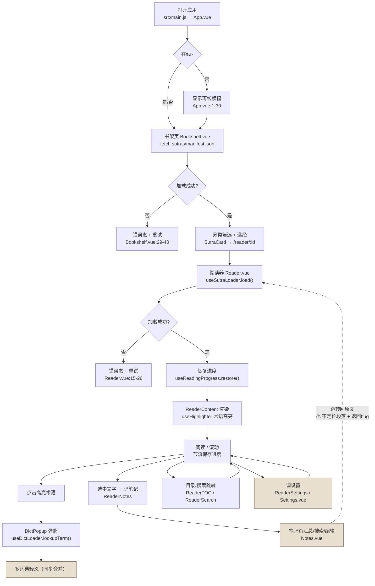

# 般若佛经阅读器 v3.1.0 — 功能全景地图

> 分析日期：2026-09-29
> 分析人：许清楚（产品经理）
> 分析对象：`D:/AI-Project/buddhist-reader`（v3.1.0，Vue 3 + Vite 5 + Pinia + Vue Router 4，localStorage）
> 方法：通读 67 份文档 + 逐文件核对 `src/`（35 文件 / ~3979 行，不含自动生成的 `src/data/dictIndex.js` 20.8MB）
> 核心目标：**区分「文档里设计过」与「代码里真跑起来」的功能**，为重构提供产品侧决策输入

---

## 0. 结论摘要（TL;DR）

| # | 关键发现 | 证据 |
|---|----------|------|
| 1 | **词典全量打包进 JS**，与 v3.0 架构「索引在线 + 释义按需 fetch」的设计完全相反。启动即加载 20.8MB 的 `src/data/dictIndex.js`（内含全部 35781 条释义） | `src/data/dictIndex.js`（20.8MB）、`vite.config.js` buildDictIndexPlugin |
| 2 | `public/dict-chunks/`（75 文件）与 `public/dict-defs/`（3 文件，19MB）**是死数据**，无任何运行时代码引用 | 全仓 grep 仅命中 `scripts/build-dict-*.cjs` |
| 3 | `src/pages/DictManager.vue` **存在但未接入路由**，页面不可达；Settings 中的词典管理已被删除（commit `956f7f2`），导致词典管理入口整体缺失 | `src/router/index.js`、`Settings.vue` |
| 4 | **书签只写不读**：可添加、持久化，但全应用无书签列表/回看 UI | `src/stores/reader.js:26`、`ReaderHeader.vue`（仅 addBookmark 按钮） |
| 5 | **阅读时长只采集不展示**：计时并写入 localStorage，但无任何页面读取显示（v2 的 Stats 页已丢失） | `Reader.vue:249-259`，全仓无 `reading-time` 读取处 |
| 6 | 主题设计 4 套（日间/夜间/护眼/宣纸），**实际只实现 3 套**，无「日间」 | `src/styles/themes.css`、`stores/settings.js:7` |
| 7 | 笔记「跳转回原文」**不定位段落**（`paragraphId` 恒为空），且返回逻辑有 bug（`from='#/notes'` 不匹配 `startsWith('/#/')`） | `Notes.vue:153-158`、`Reader.vue:240-247`、`stores/notes.js:34` |
| 8 | 文档声称「多词典并行查询、先返回先显示」，**实际为同步合并**（`dictDefinitions` 内存查表），无流式/并行 | `composables/useDictLoader.js:7-25` |
| 9 | v2.0 大量功能（Stats、TTS、拼音、词典导入、版本管理、经书导入、Service 层、IndexedDB、PWA、分页）**全部未迁移到 v3.1** | `archive/v2.0/src/` vs `src/` |

**功能盘点总数：约 55 个功能点 → 已实现 ~30、部分实现 ~8、仅设计未实现 ~15、已废弃/名存实亡 ~4。**

---

## 1. 产品定位与用户画像

### 1.1 一句话定位
> 一个**禅意极简、完全离线**的佛经阅读器：阅读时遇到晦涩术语**点击即查**多部佛教词典释义。

### 1.2 目标用户画像

| 维度 | 描述 | 来源依据 |
|------|------|----------|
| 核心人群 | 佛学研习者 / 修行者，尤其关注唐密（冯达庵、唐普式系列） | `public/sutras/manifest.json` 30 部经全部为唐密/唯识/禅宗论著 |
| 阅读特征 | 读长论著（单部最高 578K 字量级），需长时间连续阅读、做批注 | 数据资产规模、`ReaderContent` 连续滚动设计 |
| 术语门槛 | 大量专有名词（般若、阿赖耶识、末那识…），需随时查典 | 35781 条词典数据、术语高亮机制 |
| 使用场景 | 个人移动端阅读为主，弱网/离线可用 | `App.vue` 离线横幅、`AppTabBar` 移动端优先布局 |
| 技术素养 | 普通用户，不做复杂配置 | 设置项仅 3 组 |

### 1.3 核心使用场景
1. **随手翻阅**：打开应用 → 书架按分类筛选 → 选经 → 接着上次进度继续读。
2. **术语速查**：阅读中看到高亮术语 → 点击 → 底部弹窗看多部词典释义。
3. **摘录批注**：选中经文片段 → 记笔记 → 在「笔记」页统一回看、检索、编辑。
4. **个性化阅读**：调节字号/行距/主题（宣纸/墨夜/护眼），获得舒适阅读体验。

---

## 2. 功能清单表（按模块分组）

> 完成度图例：✅ 已实现 ｜ 🟡 部分实现 ｜ 📝 仅设计未实现 ｜ ⚰️ 已废弃/名存实亡

### 2.1 导航框架（AppShell / AppTabBar / Router）

| 功能名 | 功能描述 | 用户价值 | 实现位置 | 完成度 | 健康度评价 |
|--------|----------|----------|----------|--------|-----------|
| 响应式 Tab 导航 | 窄屏底部 Tab、宽屏左侧竖排 Tab，4 个入口 | 移动/桌面统一入口 | `src/components/AppTabBar.vue`、`AppShell.vue` | ✅ | 良好；图标为内联 SVG，注释含大量 `console.log` 调试残留 |
| 嵌套路由 + KeepAlive | 4 个 Tab 页缓存，切换不丢状态 | 切换页签不重载 | `src/router/index.js`、`AppShell.vue:6` | ✅ | 良好；`KeepAlive :include` 用组件名，依赖各页 `defineOptions({name})` |
| 离线状态横幅 | `navigator.onLine` 监听，离线时顶部提示 | 弱网可用感 | `src/App.vue:1-30` | ✅ | 一般；**无 Service Worker，所谓「完全离线」首次加载仍需网络**（v2 的 PWA 已丢） |
| 阅读器独立全屏路由 | `/reader/:id` 脱离 Tab 壳 | 沉浸阅读 | `src/router/index.js:14-18` | ✅ | 良好 |
| 返回来源逻辑 | 阅读器返回时回到来源页 | 符合直觉的返回 | `Reader.vue:240-247` | 🟡 | **有 bug**：`Notes.vue` 传 `from:'#/notes'`，但判断 `from.startsWith('/#/')` 不匹配，返回落到书架 |

### 2.2 书库（Bookshelf）

| 功能名 | 功能描述 | 用户价值 | 实现位置 | 完成度 | 健康度评价 |
|--------|----------|----------|----------|--------|-----------|
| 经书卡片列表 | 网格卡片显示标题/作者/字数/分类标签 | 浏览经书 | `pages/Bookshelf.vue:42-52`、`components/bookshelf/SutraCard.vue` | ✅ | 良好 |
| 分类筛选 | 全部/般若/唯识/禅宗/密咒/通论/传记 | 快速定位 | `Bookshelf.vue:3-12`、`stores/sutra.js:12-27` | ✅ | 良好 |
| 骨架屏 / 空态 / 错误重试 | 加载中骨架、空提示、失败重试 | 体验完整 | `Bookshelf.vue:14-59` | ✅ | 良好 |
| 书架页标题 | — | — | `Bookshelf.vue`（有 `.bookshelf__title` CSS 但无对应元素） | ⚰️ | 死样式，Tab 设计已移除自建 header |
| 书架搜索 | 全库搜经名 | — | 设计于 `docs/plans/analysis/T-22-sutra-search.md` | 📝 | 未实现（T-22 实际落到了阅读器内搜文） |
| 排序/分组/封面 | 最近阅读、自定义分组、生成封面 | — | 设计于 `docs/plans/analysis/T-16-bookshelf-design.md` | 📝 | 未实现 |
| 经书导入 | 导入本地 txt 为经书 | — | 设计于 `docs/plans/analysis/T-25-sutra-import.md` | 📝 | 未实现 |

### 2.3 阅读器（Reader）

| 功能名 | 功能描述 | 用户价值 | 实现位置 | 完成度 | 健康度评价 |
|--------|----------|----------|----------|--------|-----------|
| 连续滚动阅读 | 章节+段落连续滚动，非分页 | 沉浸阅读 | `components/reader/ReaderContent.vue` | ✅ | 良好；`scrollToPara` 内嵌大量调试日志与 TreeWalker 定位逻辑，复杂度偏高 |
| 术语自动高亮 | Trie 最长匹配 + 数字短语过滤 | 识别术语 | `composables/useHighlighter.js`、`ReaderContent.vue:64` | ✅ | 良好；有单测 `useHighlighter.test.js` |
| 目录跳转 | 侧栏章节/段落列表点击跳转 | 快速定位 | `components/reader/ReaderTOC.vue` | ✅ | 良好；段落级目录（按 `para.id`）比一般阅读器更细 |
| 阅读进度条 | 顶部百分比进度 | 进度感知 | `components/reader/ReaderProgress.vue` | ✅ | 良好 |
| 阅读进度保存/恢复 | 滚动位置 + 百分比存 localStorage | 续读 | `composables/useReadingProgress.js` | ✅ | 良好；有单测 `useReadingProgress.test.js` |
| 全文搜索（当前经书） | 经内关键词搜索、上下文列表、命中高亮、精确跳转 | 定位经文 | `components/reader/ReaderSearch.vue`、`ReaderContent.vue:87-142` | ✅ | 一般；`ReaderContent` 搜索高亮与滚动定位逻辑多次返工（git 历史 10+ 次 fix），脆弱 |
| 书签添加 | 记录章/位置/标签到 localStorage | 标记重点 | `stores/reader.js:26-31`、`ReaderHeader.vue` | 🟡 | **只写不读**：无书签列表 UI，`removeBookmark` 无调用方 |
| 笔记面板（阅读内） | 选中文字添加/查看/删除笔记 | 边读边记 | `components/reader/ReaderNotes.vue` | ✅ | 良好 |
| 长按选词查 | 长按 500ms 出「查释义/笔记」浮动按钮 | 查任意词 | `Reader.vue:166-196` | 🟡 | 仅触摸事件（`touchstart/touchend`），桌面鼠标选中不触发 |
| 阅读设置快捷面板 | 阅读中调字号/行距/主题 | 不打断阅读 | `components/reader/ReaderSettings.vue` | ✅ | 良好 |
| 阅读时长统计 | 计时并累计到 localStorage | 修行激励 | `Reader.vue:249-259`、`stores/reader.js:8` | 🟡 | **只采集不展示**，无读取方，等于无效数据 |
| 分页阅读 | 2000 字/页翻页 | — | v2.0 遗留（`archive/v2.0/src/components/reader/ReaderPagination.vue`） | ⚰️ | v3 已改为滚动，彻底废弃 |
| TTS 朗读 | Web Speech 朗读经文 | — | 设计于 `docs/plans/research/T-08-web-speech-tts.md`、v2 `TTSServiceLocal.js` | 📝 | 未迁移 |
| 拼音标注 | 术语上方注音 | — | 设计于 `docs/plans/analysis/T-24-settings-page.md`、v2 `engine/pinyin.js` | 📝 | 未迁移 |

### 2.4 词典查询（Dict）

| 功能名 | 功能描述 | 用户价值 | 实现位置 | 完成度 | 健康度评价 |
|--------|----------|----------|----------|--------|-----------|
| 点击词条查释义 | 点击高亮词 → 底部弹窗多词典释义 | **产品核心卖点** | `Reader.vue:152-164`、`components/dict/DictPopup.vue` | ✅ | 良好 |
| 词典搜索页 | 独立搜索页，完全/前缀/包含/释义四级匹配 | 主动查词 | `pages/DictSearch.vue`、`composables/useDictSearch.js`、`utils/dictSearchEngine.js` | ✅ | 良好；debounce 300ms、上限 200 条 |
| 词典来源开关（搜索页） | 勾选参与搜索的词典 | 控制范围 | `DictSearch.vue:25-39`、`stores/dict.js:27` | ✅ | 良好 |
| 释义清洗/格式化 | 去制表符/参阅/水印等噪声 | 可读性 | `utils/text.js` | ✅ | 良好 |
| 多词典「并行」查询 | 文档称并行 fetch、先到先显 | — | `composables/useDictLoader.js:7-25` | 🟡 | **名不副实**：实为同步内存查表，无流式 |
| 词典索引构建 | 构建期扫描词典生成索引 | 支撑高亮 | `scripts/build-dict-index.cjs`、`vite.config.js` | ✅ | 一般；**产物含全量释义 → 20.8MB**，见 §0-1 |

### 2.5 词典管理（DictManager）

| 功能名 | 功能描述 | 用户价值 | 实现位置 | 完成度 | 健康度评价 |
|--------|----------|----------|----------|--------|-----------|
| 词典列表 + 启停 | 列出词典、开关切换 | 管理词典 | `pages/DictManager.vue` | 🟡 | **页面未接入路由，用户不可达**（孤儿页面） |
| 词典启停（阅读器内） | 阅读器侧栏内开关词典 | 阅读中切换 | `components/reader/ReaderDictSelector.vue` | ✅ | 良好；含「强制刷新」「已启用 N 部/词条数」 |
| 词典导入 | 上传 JSON/CSV/MDX | — | 设计于 `docs/plans/analysis/T-18-dict-management.md` | 📝 | 未实现 |
| 词典版本管理 | 版本链/回滚/差异对比 | — | 设计于 `docs/plans/analysis/T-26-dict-version-management.md` | 📝 | 未实现 |
| 释义按需懒加载 | 索引在线 + 释义 fetch | 首屏性能 | 设计于 `docs/plans/2026-05-03-v3.0-architecture-design.md` §4.2/§5.3 | 📝 | **未实现，且方向相反**（全量打包） |

### 2.6 笔记（Notes）

| 功能名 | 功能描述 | 用户价值 | 实现位置 | 完成度 | 健康度评价 |
|--------|----------|----------|----------|--------|-----------|
| 笔记汇总页 | 跨经书汇总全部笔记 | 统一回看 | `pages/Notes.vue` | ✅ | 良好 |
| 笔记搜索 | 按引用/正文关键词搜索 | 检索 | `Notes.vue:131-141`、`stores/notes.js:59-67` | ✅ | 良好 |
| 按经书筛选 | 顶部按钮按经书过滤 | 聚焦 | `Notes.vue:19-28` | ✅ | 良好 |
| 笔记编辑 | 行内展开编辑保存 | 修改 | `Notes.vue:64-87`、`stores/notes.js:42` | ✅ | 良好 |
| 笔记删除 | 删除（带 confirm） | 清理 | `Notes.vue:160-165`、`ReaderNotes.vue:126` | ✅ | 良好 |
| 笔记跳回原文 | 跳转阅读器并定位 | 上下文回看 | `Notes.vue:153-158` | 🟡 | **不定位段落**（`paragraphId` 恒空）+ 返回来源 bug |
| 笔记导出 JSON | 导出全部笔记为 JSON | 备份 | `pages/Settings.vue:116-126` | ✅ | 良好 |
| 笔记↔词条关联 | 词条笔记与释义分层 | — | 设计于 `docs/plans/analysis/T-20-definition-display.md`（D10） | 📝 | 未实现 |

### 2.7 设置（Settings）

| 功能名 | 功能描述 | 用户价值 | 实现位置 | 完成度 | 健康度评价 |
|--------|----------|----------|----------|--------|-----------|
| 主题切换 | 宣纸/墨夜/护眼 | 视觉舒适 | `Settings.vue:13-22`、`stores/settings.js:7`、`styles/themes.css` | ✅ | 一般；**仅 3 套，缺设计中的「日间」** |
| 字号调整 | 小/中/大/特大（14/17/20/24px） | 可读性 | `Settings.vue:29-41`、`stores/settings.js:5` | ✅ | 良好 |
| 行距调整 | 紧凑/舒适/宽松（1.5/1.65/1.8） | 可读性 | `Settings.vue:42-54`、`stores/settings.js:6` | ✅ | 良好 |
| 清除缓存 | `localStorage.clear()` + 刷新 | 重置 | `Settings.vue:128-133` | 🟡 | **过粗**：一键抹掉进度/笔记/书签/时长，无分项/二次确认细节 |
| 关于/版本 | 版本号 + GitHub 链接 | 信息 | `Settings.vue:77-93` | ✅ | 良好 |
| 字体选择（宋/黑） | 字体族切换 | — | 设计于 `docs/plans/analysis/T-24-settings-page.md`、`docs/plans/2026-05-20-...-design.md` | 📝 | 未实现 |
| 设置导入/导出 | 备份偏好设置 | — | 设计于 `docs/plans/analysis/T-24-settings-page.md` | 📝 | 未实现 |

### 2.8 统计（Stats）

| 功能名 | 功能描述 | 用户价值 | 实现位置 | 完成度 | 健康度评价 |
|--------|----------|----------|----------|--------|-----------|
| 功德统计页 | 天/周/月诵读次数、时长、连续天数、图表 | 修行激励 | 设计于 `docs/plans/analysis/T-23-merit-stats.md`；v2 有 `archive/v2.0/src/pages/Stats.vue` | 📝 | **v3 完全未迁移**，仅剩无展示的时长采集 |

---

## 3. 核心用户旅程

**旅程断点标注：**

| 步骤 | 断点/风险 | 证据 |
|------|-----------|------|
| 打开应用 | 「完全离线」不成立：无 SW，首屏需网络 | `vite.config.js`（无 PWA 插件） |
| 首屏 | 需先下载 20.8MB `dictIndex.js` 才能高亮 | `src/data/dictIndex.js` |
| 恢复进度 | 依赖 `ReaderContent` 的 `watch(chapters.length)` 触发滚动，时序脆弱 | `ReaderContent.vue:257-264` |
| 查词 | 非流式，等待同步合并；宣传语「先返回先显示」不成立 | `useDictLoader.js` |
| 记笔记→回原文 | 不定位段落，返回落到书架 | `Notes.vue:153-158`、`Reader.vue:242` |
| 书签 | 旅程断裂：能加不能看 | `stores/reader.js`、`ReaderHeader.vue` |

---

## 4. 版本演进脉络

| 阶段 | 时间 | 做了什么 | 留下的遗产 / 遗留 |
|------|------|----------|-------------------|
| **v1.0** | 2026-04-29 | 基础阅读 + 简单词典查询 + MDX 词典支持 | 归档 `archive/v1.0/`（106 文件）。含 AudioPlayer、ThemeToggle、ignoredTerms、mdxParser、发音映射等；**AGENTS.md 明令「不要参考其模式」**。原始 MDX 词典与 TXT 经文成为数据源头 |
| **v2.0** | 2026-05-02 | 完整书架/分页阅读/词典管理/设置/统计页；Vant 4 + IndexedDB + PWA + Trie 引擎 + Service 层 | 归档 `archive/v2.0/`（173 文件）。**设计系统 tokens 可复用**；但 Service/Store 边界模糊、IndexedDB 无法迁移到 v3。遗留 Stats.vue、NoteEditor、SearchBar、ThemeSwitcher、MarkdownRenderer、TTS、拼音、ReaderPagination **均未进 v3** |
| **v2.1** | 2026-05-03 | 分页系统（2000 字/页）、3 部外部词典（35781 条）、高亮+点击查询 | 35781 条词典数据沿用至今；分页模式被 v3 废弃 |
| **v3.0** | 2026-05-13 起 | 推倒重来：Pinia 职责单一、去 Vant 手写组件、滚动阅读、localStorage 取代 IndexedDB、CSS 变量主题 | 现 `src/` 主体。设计中的「词典懒加载」未落地 |
| **v3.1.0** | 2026-05-20 起 | Tab 导航框架（4 页签）、词典搜索页、笔记页、设置页；版本号置 3.1.0 | 新增 `AppShell/AppTabBar/Notes/DictSearch/Settings`；**DictManager 被弃用成孤儿页**；Settings 词典管理被移除（`956f7f2`） |

> 注：`docs/plans/tasklist.md` 是 **v2.0 任务清单**（标题即「v2.0 开发任务清单」），其中大量「✅ 完成」的产物（Stats.vue、NoteEditor、Service 层、MDX 解析等）**在 v3.1 中并不存在**，属历史文档，切勿当作 v3.1 现状。

---

## 5. 功能成熟度矩阵

| 功能 | 成熟度 | 稳定性 | 用户可见问题 |
|------|--------|--------|--------------|
| 书架浏览 + 分类筛选 | 高 | 高 | 无 |
| 连续滚动阅读 | 高 | 中 | 长经滚动性能未优化 |
| 术语高亮 | 高 | 中 | 全量词条构建 Trie，首屏内存/耗时高 |
| 点击查释义 | 高 | 高 | 无 |
| 词典搜索页 | 高 | 中 | 依赖 20.8MB 索引 |
| 阅读进度保存/恢复 | 高 | 中 | 恢复时序脆弱 |
| 经内全文搜索 | 中 | 低 | 高亮/定位逻辑反复返工，易出偏差 |
| 目录跳转 | 高 | 中 | 段落级目录对超长经书渲染较重 |
| 笔记增删改查 + 搜索 | 高 | 高 | 无 |
| 笔记跳回原文 | 低 | 低 | 不定位段落；返回来源错 |
| 主题切换 | 中 | 高 | 缺「日间」主题 |
| 字号/行距 | 高 | 高 | 无 |
| 书签 | 低 | 中 | 只写不读，形同虚设 |
| 阅读时长统计 | 低 | — | 无展示入口 |
| 词典管理（页面） | 低 | — | 页面不可达 |
| 长按选词 | 中 | 中 | 仅触摸端可用 |
| 清除缓存 | 中 | 中 | 一刀切清空全部数据 |
| 离线能力 | 低 | 中 | 无 SW，「完全离线」不成立 |

---

## 6. 功能缺口与冗余

### 6.1 半成品（有骨架无闭环）
- **书签**：`addBookmark`/`removeBookmark`/持久化齐全，但**无查看/跳转 UI**，`removeBookmark` 零调用（`stores/reader.js`、`ReaderHeader.vue`）。
- **阅读时长统计**：采集写入 `reading-time-{filename}`，**无任何读取/展示**（`Reader.vue:249-259`）。
- **笔记跳转定位**：`note.paragraphId` 恒为 `''`，跳转不带位置参数（`stores/notes.js:34`、`Notes.vue:153`）。
- **DictManager 页面**：完整实现但**未接入路由**（`router/index.js` 无 `/dict-manager`）。

### 6.2 冗余 / 重复
- **词典启停两处入口**：`DictManager.vue`（不可达）与 `ReaderDictSelector.vue`（可用）逻辑重叠。
- **设置项双入口**：`ReaderSettings.vue` 与 `Settings.vue` 都含字号/行距/主题（设计上允许，但实现为两套 label 映射，易不一致——注意两处主题文案「墨夜」vs「夜间」已不一致）。
- **死数据**：`public/dict-chunks/`（75 文件）、`public/dict-defs/`（3 文件 / 19MB）无运行时引用。
- **死样式**：`Bookshelf.vue` 的 `.bookshelf__title` 无对应元素。
- **调试残留**：`AppShell/AppTabBar/Bookshelf/DictSearch/Notes/Settings/ReaderContent/ReaderSearch` 遍布 `console.log`；`main.js` 注册全局路由日志。

### 6.3 名存实亡
- **「完全离线」**（README 卖点）：无 Service Worker，仅静态资源浏览器缓存（`App.vue` 仅提示，不保障）。
- **「多词典并行、先返回先显示」**（README 卖点）：实为同步内存查表（`useDictLoader.js`）。
- **「四主题」**（CHANGELOG）：实为三主题（`themes.css`）。

### 6.4 文档说了但代码没有（重点清单）

| 声称来源 | 声称内容 | 代码现状 |
|----------|----------|----------|
| `CHANGELOG.md` v3.0.0 | 「词典加载改为索引在线 + 释义按需」 | ❌ 全量打包 `dictIndex.js` |
| `CHANGELOG.md` v3.0.0 | 「主题系统：日间/夜间/护眼/宣纸四主题」 | ❌ 仅 3 主题，无日间 |
| `CHANGELOG.md` v3.0.0 | 「阅读时长统计」 | 🟡 仅采集无展示 |
| `README.md` | 「多词典并行，先返回先显示」 | ❌ 同步合并 |
| `README.md` | 「完全离线」 | ❌ 无 SW |
| `v3.0-migration-guide.md` §3 | 路由简化为 2 条（/、/reader/:id） | ❌ 实为 4 页签 + 阅读器 |
| `2026-05-20-tab-nav-...-design.md` §6 | 设置页整合词典管理，`DictManager.vue` 可删除 | ❌ 词典管理被删且未迁入 Settings，DictManager 成孤儿 |
| `docs/API.md` | 经书章节为 `chapters[].content`（字符串） | ❌ 实为 `chapters[].paragraphs[].{id,text}` |
| `docs/plans/tasklist.md` | Stats.vue / Service 层 / MDX / TTS 等「✅完成」 | ❌ 属 v2.0，v3.1 无 |

---

## 7. 面向重构的功能决策建议

> 视角：产品价值 × 现状健康度。**不含技术实现方案**（架构师负责）。

### 7.1 建议保留（核心价值，重构时保行为、改实现）

| 功能 | 理由 |
|------|------|
| 书架浏览 + 分类筛选 | 产品骨架，稳定可用 |
| 连续滚动阅读 + 术语高亮 | 核心阅读体验，高亮是卖点前置能力 |
| 点击查释义（DictPopup） | **产品第一卖点**，必须保留 |
| 词典搜索页 | 主动查词刚需，逻辑完整 |
| 目录跳转 + 进度条 + 进度续读 | 长经阅读必需 |
| 经内全文搜索 | 刚需，但需重写为稳健实现 |
| 笔记增删改查 + 搜索 + 导出 | 完整闭环，价值高 |
| 字号/行距/主题 | 阅读舒适度基础项 |
| Tab 导航 + KeepAlive | 信息架构合理 |

### 7.2 建议合并

| 合并项 | 理由 |
|--------|------|
| 词典启停：`DictManager` 与 `ReaderDictSelector` | 同一能力两处实现，应收敛为单一「词典管理」入口（建议并入 Settings，与 2026-05-20 设计一致） |
| 设置项：`ReaderSettings` 与 `Settings` | 保留「阅读中快捷面板」，但字号/行距/主题的选项定义应单一数据源，消除「墨夜/夜间」文案不一致 |
| 搜索能力：书内搜索（ReaderSearch）与词典搜索（DictSearch） | 交互形态不同，但「高亮+结果列表+跳转」可复用同一套展示与匹配基础设施 |

### 7.3 建议裁剪（低价值 / 名存实亡）

| 裁剪项 | 理由 |
|--------|------|
| `public/dict-chunks/` + `public/dict-defs/` | 死数据（19MB+），无引用 |
| `src/pages/DictManager.vue` | 孤儿页；能力合并到词典管理入口后删除 |
| 书签（当前形态） | 只写不读；**要么补全闭环，要么彻底移除**，不要半吊子保留 |
| 阅读时长采集（当前形态） | 无展示则无价值；**要么接入统计展示，要么移除** |
| 调试日志 | 全量 `console.log` 清理 |
| 死样式 `.bookshelf__title` | 无对应元素 |

### 7.4 建议重做（方向对但现状不达标）

| 重做项 | 理由 |
|--------|------|
| **词典加载策略** | 现状 20.8MB 全量打包，与「点击即查」定位冲突，首屏/内存代价大。重做方向：索引与释义分离、按需加载 |
| 经内搜索的高亮与滚动定位 | 历史多次返工，脆弱；需以稳定方案重写 |
| 笔记跳转定位 | 需真正记录并跳转到段落位置 |
| 离线能力 | 「完全离线」需以 Service Worker 等落地，否则删除该卖点 |
| 「多词典并行」措辞与实现 | 若保留卖点需实现流式；否则修正文案 |

### 7.5 建议补齐（有价值但缺失）

| 补齐项 | 理由 |
|--------|------|
| 词典管理入口（并入 Settings） | 现完全不可达 |
| 统计/阅读时长展示 | 已有采集基础，差一个展示层 |
| 主题补「日间」 | 设计已定，实现缺失 |
| 经书导入 / 词典导入 | 用户侧扩展诉求（历史设计 T-25/T-18），可列为 P2 后续 |

### 7.6 优先级建议（供排期参考）

- **P0（重构必须解决）**：词典加载策略、核心阅读链路稳定化、清理死数据/孤儿页/调试残留。
- **P1（建议同期补齐）**：书签闭环、笔记跳转定位、词典管理入口、返回来源 bug、设置项单一数据源。
- **P2（可延后）**：统计页、主题补日间、经书/词典导入、TTS、拼音、离线增强。

---

## 附录 A. 证据索引（关键文件）

| 关注点 | 文件 |
|--------|------|
| 路由/页面 | `src/router/index.js`、`src/pages/*.vue` |
| 导航框架 | `src/components/AppShell.vue`、`AppTabBar.vue` |
| 阅读核心 | `src/components/reader/ReaderContent.vue`、`Reader.vue` |
| 词典 | `src/stores/dict.js`、`composables/useDictLoader.js`、`useDictSearch.js`、`utils/dictSearchEngine.js`、`data/dictIndex.js` |
| 高亮 | `src/composables/useHighlighter.js` |
| 笔记 | `src/stores/notes.js`、`pages/Notes.vue`、`components/reader/ReaderNotes.vue` |
| 设置 | `src/stores/settings.js`、`styles/themes.css`、`pages/Settings.vue` |
| 构建 | `vite.config.js`、`scripts/build-dict-*.cjs` |
| 数据 | `public/sutras/*`、`public/dicts/*`、`public/dict-chunks/*`、`public/dict-defs/*` |
| 历史 | `archive/v1.0`、`archive/v2.0`、`archive/v3.0-prototype` |

## 附录 B. 数据资产现状

| 资产 | 数量/规模 | 运行时状态 |
|------|-----------|------------|
| 经书 | 30 部（`public/sutras/`，含 `manifest.json`） | ✅ 运行时按需 fetch |
| 词典源文件 | 3 部（`public/dicts/`，最大 31MB） | ⚰️ 运行时不直接读（仅 manifest 用于列表展示） |
| 词典索引 | `src/data/dictIndex.js`（20.8MB，构建期生成） | ✅ 全量 import（**性能隐患**） |
| 词典分片 | `public/dict-chunks/`（75 文件）、`public/dict-defs/`（3 文件 / 19MB） | ⚰️ 无引用 |
| 原始素材 | `temp-sutras/*.txt`、`archive/v1.0/mdict/*.mdx` | ⚰️ 仅再生成用 |
| 自动化测试 | 2 个（`useHighlighter.test.js`、`useReadingProgress.test.js`） | 🟡 仅覆盖 2 个 composable |
