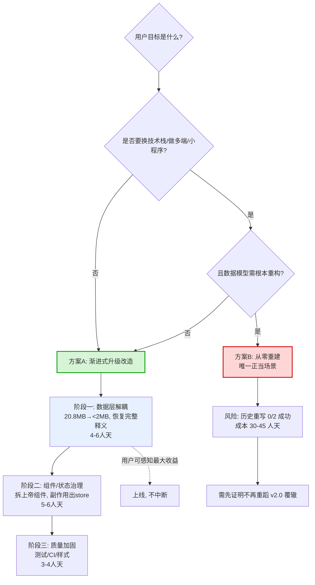

# 决策论证：升级改造（A）vs 从零重建（B）

> 作者：高见远（架构师）· 团队 software-buddhist-reader
> 日期：2026-09-29
> 目的：为"在源代码上升级改造 vs 放弃这版从零重建"提供**可据以拍板**的决策依据
> 方法：只读分析（读源码/归档/git 全历史/文档/联网核实生态版本）；未修改任何业务代码
> 上游依据：`docs/refactor/2026-09-29-architecture-diagnosis.md`（架构诊断，27 条技术债）
> 所有结论附证据（文件:行 / commit hash / 版本号 / 命令输出）

---

## 0. 一句话结论

> **用户"代码已过时、不能用"的前提不成立——技术栈（Vue 3 + Composition API + Pinia + Vite + Router 4）正是 2026 年的主流推荐栈，依赖仅落后半个到一个大版本，可机械升级；真正坏掉的是"数据加载层"这一处项目自伤，而非范式过时。**
> **本项目已完整重写过两次（v1.0→v2.0→v3.0），且第二次重写把数据层做得比第一代更差；本项目自身历史就是"重写无法解决问题"的最强反证。**
> **推荐方案：A（渐进式升级改造），12–16 人天。** B（从零重建）成本 30–45 人天且会第三次重复历史错误。

---

## 1. 验证用户假设：「代码已过时」是否成立

必须严格区分两件事——**(a) 依赖版本落后**（机械升级，低成本）与 **(b) 架构范式过时**（需要重写）。二者常被混为一谈，但决策后果天差地别。

### 1.1 依赖版本现状 vs 2026 生态（联网核实）

| 依赖 | 本项目锁定 | 2026 稳定推荐 | 差距 | 升级性质 |
|------|-----------|--------------|------|----------|
| `vue` | `^3.4.27` | **3.5**（2024-09 起稳定；3.6 仍 beta） | 1 个 minor | 🟢 机械升级，`npm update` 级别 |
| `vite` | `^5.2.12` | **6.x**（Rolldown beta 可选） | 1 个 major | 🟡 需改配置，官方有迁移指南，无框架级破坏 |
| `pinia` | `^2.1.7` | **2.x** | 基本持平 | 🟢 已是最新一代 |
| `vue-router` | `^4.3.2` | **4.5+** | 1 个 minor | 🟢 机械升级 |
| `@vitejs/plugin-vue` | `^5.0.5` | 5.x | 持平 | 🟢 |

**证据**：`package.json:16-27`；生态版本核实自《Vue 3 生态完全指南（2026 版）》（2026-04）与 `vue3-News/Vue3_2025-2026_Analysis.md`（2026-06）。

### 1.2 架构范式是否过时

| 判断维度 | 本项目所用 | 2026 主流/推荐 | 是否过时 |
|----------|-----------|---------------|----------|
| 框架范式 | Vue 3 + Composition API + `<script setup>` | **完全相同**，且 3.5 增强响应式 props 解构 | ❌ 不过时 |
| 构建 | Vite（ESM 原生、Rollup 产物） | **Vite 是官方推荐，Webpack 已退场** | ❌ 不过时 |
| 状态 | Pinia Setup Store | **官方推荐**（Vuex 已弃用） | ❌ 不过时 |
| 路由 | Vue Router 4 | **4.5+ 是当前版本** | ❌ 不过时 |
| 样式 | 原生 CSS 变量 + `[data-theme]` | 与 Tailwind/原子化并存，**CSS 变量主题切换仍是标准做法** | ❌ 不过时 |
| 纯手写组件（无 UI 库） | ✅ 有意选择（`2026-05-03-v3.0-architecture-design.md:424`） | 与 shadcn-vue「代码所有权归己」理念一致 | ❌ 不过时 |

**结论（第 1 点）：**
- **(a) 版本落后 = 成立但轻微**：仅 Vite 落后 1 个 major，其余为 minor。**升级成本 ≈ 0.5–1 人天**（改 `vite.config.js` + 回归验证），风险低。
- **(b) 架构范式过时 = 不成立**：本项目的技术栈在架构层面**恰恰是当前主流**，不存在"必须换范式"的问题。
- **⚠️ 唯一值得纳入考量的是"缺 TypeScript"**（2026 指南强烈推荐 TS，本项目为纯 JS）。但这是**增量增强项**，不是"过时"，且可在 A 方案中增量引入，**不构成重写理由**。

> **因此：用户"代码肯定过时、不能用"的判断，在技术栈维度上是误判。真正的问题在 §2 之后——是一处项目自伤的数据层缺陷。**

---

## 2. 历史证据核实（本任务最关键的一环）

### 2.1 三代版本是否为完整独立应用

| 版本 | 目录 | src 文件数 | 技术栈 | 完整度 | 归档时间 |
|------|------|-----------|--------|--------|----------|
| **v1.0** | `archive/v1.0/` | 34 | Vue3 + **Vant 4** + Pinia + SCSS + IndexedDB | 有 TTS/MDX/AudioPlayer，**内置词典文件缺失**（T-12 确认未完成） | 2026-05-02 |
| **v2.0** | `archive/v2.0/` | **59** | Vue3 + Vant4 + Pinia + **@vueuse + idb + markdown-it + mdx + turndown** + IndexedDB(13 表) | **三层架构**：`engine/`(Trie/高亮/格式化/MDX) + `services/`(接口+6 实现) + `storage/`(IndexedDB)；**tasklist 33 完成 / 24 待开始，未完成** | 2026-05-13 |
| v3.0-prototype | `archive/v3.0-prototype/` | 12 | — | **仅原型**（2 页 + 样式），非完整应用 | — |
| **v3.0（当前）** | `src/` | 40 | Vue3 + **无 UI 库** + Pinia + localStorage | 功能完整但带 4 条 P0 | 2026-05-28（最后提交） |

**证据**：`find archive/*/src -type f`；`archive/v2.0/package.json`；`archive/v2.0/docs/plans/tasklist.md:5`。

### 2.2 项目历史上是否已发生过整体重写/重建——**是，且发生了两次**

git 全历史（172 commits）中的关键里程碑：

| 日期 | commit | 事件 | 含义 |
|------|--------|------|------|
| 2026-04-26 | `a718ff9` | Initial commit: 般若佛经阅读器 MVP | **v1.0 诞生** |
| 2026-05-02 | `8568fd8` | chore: archive v1.0 code and create v2.0 project plan | **第一次整体重写：v1.0 → v2.0** |
| 2026-05-03 | — | feat(v2): Phase 2 存储层+数据层 - IndexedDB 13 张表 | v2.0 建成 IndexedDB 数据层 |
| **2026-05-13** | `43c0800` | **chore: 归档 v2.0，清空 src 为 v3.0 开发做准备** | **第二次整体重写：v2.0 → v3.0（src 被清空）** |
| 2026-05-13 | `4f3acb4` | docs: v3.0 架构设计文档 — 禅意阅读器重构方案 | 再次从零设计 |
| 2026-05-15 | `4b41589` | merge: v3.0 全功能开发完成 (14 项任务) | v3.0 号称完成 |
| 2026-05-16 ~ 05-28 | — | 43 个 fix/debug 提交 | v3.0 完成即进入密集修 bug |

**证据**：`git log --pretty=format:"%ad | %h | %s"`；`AGENTS.md:6-9`（明确列出 v1.0 已弃、v2.0 已归档、v3.0 活跃）。

### 2.3 前几代重写的结果——**没有解决问题，反而欠下新债**

这是全篇最有分量的证据链：

**① 重写频次异常高：**
- v1.0 存活 **~6 天**（04-26 → 05-02）→ 被重写
- v2.0 存活 **~11 天**（05-02 → 05-13）→ 被重写
- v3.0 存活至今（05-13 → 05-28 最后提交，此后停滞）
- **三代合计仅 ~32 天**，平均每 ~8 天换一次架构。

**② 重写规模巨大且被浪费：**
- v2.0 计划 **80–120 小时**（`archive/v2.0/docs/plans/tasklist.md:5`），建成 `engine/`+`services/`+`storage/` 三层 + IndexedDB 13 张表，结果 **11 天后整体归档、从未上线**。

**③ 第二次重写让数据层变得更差（致命）：**
- v2.0 **已有**正确的按需加载架构：`archive/v2.0/src/services/impl/DictServiceLocal.js`(214 行) + `archive/v2.0/src/storage/dictStore.js`(81 行, IndexedDB 按 dictId 分表查询)。
- v3.0 把上述架构**全部丢弃**，改为 **20.8MB `src/data/dictIndex.js` 静态内联**（详见诊断报告 §2）。
- 即：**v2.0 的数据层是"对的但被弃"，v3.0 的数据层是"错的重建"**。重写不但没解决问题，还制造了当前的头号 P0。

**④ 每次重写都重新踩一遍同类 bug：**
- v3.0 完成（05-15）后，**80 个提交中有 43 个是 fix/debug（占 54%）**；其中"搜索高亮 + 滚动定位"一个问题连续修了 8+ 次（`c24a851`→`de5922`…，见 `git log`）。
- 说明：重写会**丢失隐性修复经验**，被迫重新发现同样的坑。

**⑤ 官方文档已自我否认前代架构：**
- `AGENTS.md:6-9`：「v2.0 的架构不可复用」「不要复用 v2.0 的 Service/Store 架构（模块边界差）」——**这正是 v2.0 重写产物被否定的书面证据**。

> **第 2 点结论：本项目已经历两次完整重写（v1→v2、v2→v3），且证据表明重写并未解决问题——第二次重写反而使数据层劣化，并把修复经验清零重来。以本项目自身历史为参照，"再来一次从零重建"是已被证伪的路径。**

---

## 3. 量化对比：A 升级改造 vs B 从零重建（14 维度）

| # | 维度 | **A 升级改造** | **B 从零重建** | 优势方 |
|---|------|---------------|---------------|--------|
| 1 | 技术栈时效 | 升级 Vue 3.4→3.5 / Vite 5→6，0.5–1 人天 | 可从零选最新栈，但**当前栈本就是主流**，收益≈0 | A |
| 2 | 可复用代码资产 | 复用 40 文件/4217 行中约 70%（高亮引擎、UI 组件、storage） | **全部作废重写**（v2.0 教训：59 文件 11 天报废） | **A** |
| 3 | 数据资产（30 经书 / 35781 词典 / 转换脚本） | 直接沿用，零迁移 | 数据可迁移，但**加载逻辑必须重写**（且易重犯内联错误） | A |
| 4 | 样式 token 体系 | `tokens.css`/`themes.css`/`base.css` 已成熟，直接复用 | 可复用 token 值，但需重建组件与主题联动 | A |
| 5 | 60+ 份设计文档复用价值 | 作为改造输入，直接指导数据层重设计 | 大部分是 v1/v2 遗留，**需重新甄别**，价值稀释 | A |
| 6 | 已修 bug 的隐性经验（172 commits/55 fix） | **保留**，不必重踩 | **清零**，历史已证明会重踩（v3.0 的 43 个 fix） | **A** |
| 7 | 风险等级 | 🟢 低：分阶段、可回滚、可灰度 | 🔴 高：一次性大爆炸，且历史重写 2/2 失败 | **A** |
| 8 | 成本（人天） | **12–16**（诊断报告已算） | **30–45**（见 §5） | **A** |
| 9 | 周期 | 3 阶段，每阶段可独立上线 | 单次长周期，中途无可用产出（v2.0 就是反例） | A |
| 10 | 上线中断风险 | 🟢 Vercel 不中断，feature 分支 + 预览部署 | 🔴 需并行维护或承担切换风险 | A |
| 11 | 长期可维护性 | 结构已清晰，只需补服务层 + 测试 | 新结构可能更好，但**需要先证明不再重蹈覆辙** | 平（B 理论优，实践存疑） |
| 12 | 认知负担 | 团队已熟悉现有代码 | 需重建全部心智模型 | A |
| 13 | 未知风险 | 低：改造中发现深层问题可增量处理 | 高：数据模型/边界情况在重写中才暴露 | A |
| 14 | 与用户"想要焕然一新"的心理预期 | 需沟通"内在焕新≠外表重做" | 满足"从零"心理，但代价高昂 | B（仅心理层面） |

**计分：A 胜 12 / 平 1 / B 胜 1（且 B 唯一胜项是心理预期）。**

---

## 4. 资产可迁移性分析（若走 B，逐类说明）

| 资产 | 类型 | 走 B 时的处置 | 迁移难度 |
|------|------|--------------|----------|
| `public/sutras/*.json` + `manifest.json`（30 经书, 2.1MB） | 数据 | **可直接迁移**，格式稳定（`{title,chapters:[{paragraphs:[{id,text}]}]}`），与框架无关 | 🟢 零 |
| `public/dicts/*.json` + `manifest.json`（3 词典, 35781 条, 50MB） | 数据 | **可直接迁移**（源数据），但**加载策略必须重写**——若重写者再犯内联错误则前功尽弃 | 🟡 中 |
| `public/dict-chunks`(48MB)/`dict-defs`(19MB) | 死资产 | **建议随重构一并清理**（诊断 §2.2：src 零引用） | 🟢 删 |
| `scripts/convert-sutras.cjs` / `convert-dictionary.cjs` | 工具 | **可直接迁移**（纯 Node，产物是标准 JSON） | 🟢 零 |
| `scripts/build-dict-*.cjs` | 工具 | **需重写或废弃**（正是错误内联方案的产物） | 🟡 中 |
| `src/styles/tokens.css` + `themes.css` + `base.css` | 样式 | **可直接迁移**（纯 CSS 变量，无框架绑定） | 🟢 零 |
| `src/composables/useHighlighter.js` | 逻辑 | **建议迁移**（Trie 最长匹配 + 数字排除，且有 7 个单测） | 🟢 低 |
| `src/utils/text.js`（释义清洗）、`storage.js` | 工具 | **可直接迁移** | 🟢 零 |
| `src/components/**`（12 组件） | UI | **大部分可迁移**（SutraCard/ReaderHeader/ReaderProgress 干净；ReaderContent 需拆） | 🟡 中 |
| `src/stores/**`（5 store） | 状态 | 可迁移，但 dict store 需随数据层重写 | 🟡 中 |
| `docs/**`（60+ 设计文档） | 文档 | v3.0 相关可复用；v1/v2 遗留需甄别（价值稀释） | 🟡 中 |
| `src/composables/__tests__`（2 测试） | 测试 | 可直接迁移（2 个文件） | 🟢 零 |
| `archive/**`（205MB） | 归档 | 与决策无关，建议移出 git | 🟢 — |

**结论：走 B 时，约 60% 的资产（数据/样式/转换脚本/高亮引擎/部分组件）可迁移，但"数据加载逻辑"与"组件编排"这两块**必须重写**——而这两块恰恰是当前唯一的病灶所在。也就是说，**B 的可迁移部分主要是没坏的部分，必须重做的部分正是 A 也能精准修好的部分**。B 的边际收益极低。**

---

## 5. 成本量化 + 敏感性分析

### 5.1 基准估算

| 方案 | 组成 | 人天 |
|------|------|------|
| **A 升级改造** | 阶段一 数据层解耦 4–6 + 阶段二 组件/状态 5–6 + 阶段三 质量加固 3–4（诊断报告 §9.3） | **12–16** |
| **B 从零重建** | 见下分解 | **30–45** |

**B 的分解依据：**
- v2.0 重写（范围更大：engine+services+storage+IndexedDB+TTS+MDX）计划 80–120h ≈ **10–15 人天**，但**未完成且未上线**（tasklist 33/57 完成）。
- 当前 v3.0 功能面（阅读/高亮/查词/搜索/笔记/书签/主题/进度）重建到等价功能 + 修好数据层，保守 **25–35 人天**；
- 加上重建过程中必然重踩的 bug（v3.0 已证明需 43 个 fix 提交）与联调，**合计 30–45 人天**（约为 A 的 2.5–3.5 倍）。

### 5.2 敏感性分析

**A 的成本上浮区间：**
| 触发条件 | 上浮 | 上限 |
|----------|------|------|
| 发现数据模型需调整（如索引格式重构、词典源需重新解析） | +2–3 人天 | 18 |
| 需增量引入 TypeScript | +2–4 人天 | 20 |
| 需补 Worker/虚拟滚动（长经书性能） | +2 人天 | 22 |
| **A 最坏情况** | | **≤ 22 人天** |

**B 的乐观下浮空间：**
| 触发条件 | 下浮 | 下限 |
|----------|------|------|
| 100% 迁移数据+样式+高亮引擎，仅重写数据层与编排 | −8 人天 | 22 |
| 复用现有 60% 组件不改 | −4 人天 | 18 |
| **B 理论最优** | | **≥ 18 人天（且需一次成功，无历史先例）** |

> **关键结论：即使 B 取理论最优（~18 人天），也只与 A 的最坏情况（~22 人天）相当；而 B 的历史成功率是 0/2（两次重写均未解决问题）。A 的期望成本与风险显著更优。**

---

## 6. 明确结论、推荐与反方论证

### 6.1 推荐：**A（渐进式升级改造）**

**理由（按权重）：**
1. **前提证伪**：技术栈不过时（§1），"过时"是误判；真正的病灶是单一数据层缺陷。
2. **历史证伪**：本项目两次重写（v1→v2→v3）均未解决问题，第二次还让数据层更差（§2.3）——重写是被本项目自身历史证伪的路径。
3. **成本与风险**：A 12–16 人天 vs B 30–45 人天；A 可分阶段灰度、Vercel 不中断，B 高风险且无中途可用产出。
4. **边际收益**：B 可迁移的是"没坏的部分"，必须重做的恰是"A 也能精准修好的部分"（§4）。

**执行要点**：先做 A 的**阶段一（数据层解耦）**——它单独就能把 20.8MB 降到 <2MB 并恢复完整释义，是**用户可感知收益最大、风险最低**的一步；做完再评估是否需要后续阶段。

### 6.2 反方论证：什么条件下「从零重建」才是正确的

| 触发条件 | 说明 | **本项目是否成立** |
|----------|------|-------------------|
| ① 要更换技术栈范式 | 如 Vue→React、或必须上 Vue 3.6 Vapor Mode / SSR / Nuxt | ❌ 不成立：当前栈是 2026 主流，Vapor 仍 beta，无强制需求 |
| ② 要做多端 / 小程序 | 需要跨端框架（uni-app/Taro）或原生小程序 | ❌ 不成立：当前仅 Web SPA，无多端诉求 |
| ③ 数据模型需根本性重构 | 如词典/经书数据结构需推倒重设计 | ⚠️ **部分沾边**：词典加载策略需改，但**数据结构本身稳定**，改的是"加载方式"而非"数据模型" |
| ④ 要脱离当前数据源 | 如换词典来源、换经书版权方 | ❌ 不成立：数据资产是项目核心且可复用 |
| ⑤ 现有代码不可维护（腐烂到无法增量修改） | 需代码完全失控 | ❌ 不成立：诊断显示结构清晰、无循环依赖、高亮引擎有测试，属"亚健康可救" |
| ⑥ 团队/技术负责人更替，需统一新规范 | 组织因素 | ⚠️ 需用户确认；但即便成立，也应"新代码按新规范 + 旧代码渐进改造"，而非全量重写 |

> **反方结论：六个触发条件中，5 个明确不成立，1 个（数据模型）仅"加载策略"沾边——而加载策略恰恰是 A 阶段一专门解决的问题。因此从零重建在当前项目中不成立。**
>
> **唯一应重新评估 B 的信号**：如果用户**同时**要（i）上小程序/多端 **且**（ii）换技术栈 **且**（iii）重构数据模型——三者叠加时，重写才有正当性。建议在开工前与用户确认这三点。

### 6.3 决策树



---

## 7. 附：证据索引（可复现命令）

```bash
# 技术栈版本
cat package.json                              # vue ^3.4.27 / vite ^5.2.12 / pinia ^2.1.7 / router ^4.3.2
# 历史两次重写
git log --pretty=format:"%ad | %h | %s" --date=short | grep -i "archive\|归档\|清空"
#   → 8568fd8 (2026-05-02) archive v1.0 ; 43c0800 (2026-05-13) 归档 v2.0, 清空 src
# 前代规模
find archive/v1.0/src -type f | wc -l          # 34
find archive/v2.0/src -type f | wc -l          # 59
find src -type f | wc -l                        # 40
# v2.0 已有正确的按需加载层（被 v3.0 丢弃）
ls archive/v2.0/src/services/impl/ archive/v2.0/src/storage/
# v2.0 未完成
grep -c "✅ 完成" archive/v2.0/docs/plans/tasklist.md   # 33
grep -c "待开始" archive/v2.0/docs/plans/tasklist.md     # 24
# 重写后密集修 bug
git log --since=2026-05-13 --pretty=format:"%s" | grep -ci "fix\|debug"   # 43 / 80
# 官方否定 v2.0 架构
sed -n '6,9p' AGENTS.md
```

---

*报告完。本文件为只读分析产出，未改动任何业务代码。*
