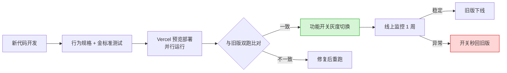
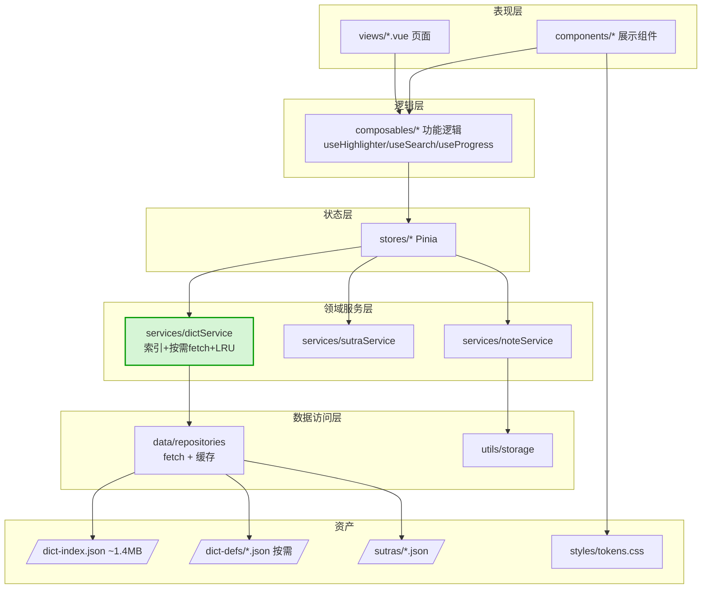

# 全量重写可行性重估（Part E）

> 作者：高见远（架构师）· 团队 software-buddhist-reader
> 日期：2026-09-29
> 触发：用户明确倾向彻底推倒重构——「按现在 AI 的能力，重新开发也用不了多少时间，而且代码质量还更好」
> 上游：`2026-09-29-architecture-diagnosis.md`、`-refactor-vs-rewrite-decision.md`、`-code-rot-assessment.md`（架构师）；`-feature-inventory.md`、`-rewrite-cost-inventory.md`（产品经理）；`-code-quality-audit.md`（工程师）
> 约束：只读分析，未改动任何业务代码

---

## 0. 结论摘要（含立场修正）

| 焦点问题 | 结论 |
|----------|------|
| **历史两次重写失败，主因是策略错还是工具弱？** | **主因是流程/策略（约 70%），工具弱是放大因素（约 30%）。** → 我上一轮把「历史 0/2」当作核心论据**权重过高**，予以修正。 |
| **AI 加持后 B 的真实成本** | B1（naive 全弃）≈ **35–45 人天**；**B2（保留资产+行为规格）≈ 22–30 人天**。相比纯人工 60–75 人天，AI 砍掉 ~55–60%。**用户「用不了多少时间」方向正确，但绝不等于「很快」——仍是一个月量级。** |
| **A 与 B 最终质量差异** | **差异很小，且差异恰好落在「已经很好的那 36% 代码」上。** 若 A 重写了三面承重墙，A 的产出与 B 在**坏代码部分完全等同**，唯一区别是 A 保留了 36% 健康代码（而这部分正是你想要的）。 |
| **推荐方案** | **B2（以重写为主 + 保留资产 + 行为规格驱动）**，前提是先产出《行为规格文档》。**这修正了我上一轮偏向 A 的立场。** 若用户首要目标是「最低风险/最快见效」，A 仍成立。 |

> **诚实声明：用户是对的——AI 能力提升确实让重写重新变得可行，我上一轮的核心论据（历史重写 0/2）被削弱。但我必须补一句：真正决定成败的不是「AI 更强了」，而是「流程是否修好了」。同一套坏流程 + 更强的 AI，仍会产出屎山。**

---

## 1. 历史两次重写失败：主因是「策略错」还是「工具弱」？

必须把这个问题拆成两个**独立轴**来评：**工具能力** × **流程质量**。二者互不替代。

| 维度 | v1.0→v2.0（2026-05-02→05-13） | v2.0→v3.0（2026-05-13→05-28） | 主因归类 |
|------|-------------------------------|-------------------------------|----------|
| 直接死因 | **范围爆炸**：为一个 ~4000 行的应用设计了 **52 个调研任务(T-01~T-52) + 6 层架构(engine/services/storage…) + IndexedDB 13 表**，计划 80–120h，**11 天后整体归档、从未上线** | **完成即腐化**：15 天建成能跑的 v3.0，但**违反自己的设计文档**（文档要求「~1MB 索引 + 释义按需 fetch」，实现却把 19.4MB 释义全内联）；随后 **80 提交中 43 个是 fix/debug（54%）** | **策略/流程** |
| 是否有行为规格？ | ❌ 无 | ❌ 无（设计文档被实现无视） | 流程 |
| 是否有测试护栏？ | ❌ 无 | ⚠️ 仅 2 个 composable 测试（≈3.6% 覆盖） | 流程 |
| 是否继承前代知识？ | ❌ v1.0 归档即丢弃 | ❌ **丢弃了 v2.0 已有的正确数据层**（`DictServiceLocal`+IndexedDB），改为内联 20.8MB | 流程 |
| 工具弱是否有关？ | ⚠️ 部分：弱模型难以对「过度设计」提出反驳 | ⚠️ 部分：弱模型难忠实实现「按需 fetch」设计；`de482d4 fix: missing parenthesis` 说明自检弱 | **工具（次要）** |

### 1.1 判定

> **主因 = 流程/策略（约 70%）：范围爆炸 + 无行为规格 + 无测试 + 不继承知识。工具弱 = 放大因素（约 30%）。**

**为什么这个判定重要（决定性逻辑）：**
- 如果主因是**工具弱** → 换更强 AI 即可 → **重写必然成功** → 我的 A 建议失效。
- 如果主因是**流程错** → 换更强 AI **不解决** → 必须同时修流程 → **A/B 之争取决于成本与风险，而非「重写能否成功」。**

**证据支持「流程错」占主导：**
1. v2.0 的失败是**规划失败**（52 个调研任务对 4000 行应用）——这是**人类级别的过度设计**，不是模型写不出代码。更强的模型如果仍被要求「做 52 个调研 + 6 层架构」，照样翻车。
2. v3.0 的腐化是**验证失败**（实现与设计文档背离却无人发现）——缺的是「对照验收」，不是「写代码能力」。
3. 两次重写**都没有行为规格**，导致「等价性」无法验证，只能靠感觉——这是流程缺陷。

### 1.2 对 A 建议的修正

- ❌ **撤回**「历史重写 0/2 所以不该重写」这一论据的**主导地位**——它被工具能力这一混淆变量污染。
- ✅ **保留**其**残余价值**：历史证明「无规格、无测试、范围失控」会必然导致失败——因此**无论 A 还是 B，都必须先补规格与测试**。
- 🔄 **承认**：AI 能力提升对 **B 的增益 > 对 A 的增益**（B 是更多的新代码，而写代码正是 AI 最擅长的），因此 A/B 成本差距被**显著拉近**。

---

## 2. 重写成本结构拆解（四块 × AI 加速）

> 基准：产品经理《重建成本与隐性资产盘点》给出**纯人工 60–75 人天**（功能净重做 43.25 + 隐性资产重现 20–30 + 联调）。
> 本节在其上叠加 **AI 加速系数**（诚实估计，非乐观）。

| 成本块 | 纯人工(人天) | AI 加速率 | AI 后(人天) | 加速说明 |
|--------|:-----------:|:---------:|:-----------:|----------|
| **a. 写新代码**（≈4000 行等价功能） | 43 | **60–70%** | **13–17** | ✅ AI 最强项：脚手架/组件/store/CRUD 一次成型 |
| **b. 数据资产迁移**（30 经书 + 35781 词条 + scripts + manifest + 分片格式） | 6–8 | 30–40% | **4–6**（若保留资产则 →**1–2**） | ⚠️ 数据可复用，主要是「接线 + 校验」；AI 帮不上「校验真实性」 |
| **c. 踩坑重现**（搜索高亮+滚动定位试了 **39 次相关提交**、Trie 最长匹配+数字短语过滤、进度恢复时序、释义清洗 10 条正则） | 20–30 | **20–30%**（naive）<br>**70%**（有行为规格） | **15–22**（naive）<br>**6–9**（有规格） | ❌ **AI 最弱项**：这些坑靠**运行时试错**发现，AI 生成代码时无法预知；**唯一解药是先抽出规格** |
| **d. 功能验收**（55 功能点等价性验证） | 5–6 | 40–50% | **3–4** | ✅ AI 可生成测试脚手架与对照清单 |
| **合计** | **60–75** | — | **B1 ≈ 35–45**<br>**B2 ≈ 22–30** | — |

### 2.1 结论：用户「用不了多少时间」是否成立？

> **方向正确，程度被高估。**
> - ✅ 成立的部分：AI 把「写代码」（块 a）压缩 60–70%，纯人工 60–75 人天 → **B2 约 22–30 人天**，砍掉 ~55–60%。**「重新开发用不了多少时间」在相对意义上是对的。**
> - ❌ 被高估的部分：**块 c「踩坑重现」是 AI 的盲区**（20–30 人天，AI 只能砍 20–30%）。**若不先抽行为规格，B1 仍要 35–45 人天**，其中近半是「重新踩一遍旧坑」。
> - 🎯 **决定性杠杆**：**先产出一份《行为规格文档》**，可把块 c 从 15–22 人天压到 6–9 人天——**这是 B 从「昂贵」变「可行」的唯一开关。**

**一句话**：**AI 让重写变快，但「快」的前提是你先把旧代码里的隐性知识固化成规格——否则 AI 会飞快地帮你重新踩一遍坑。**

---

## 3. 焦点问题：A 与 B 的最终质量差异到底有多大？

### 3.1 分析

A 的重写范围（据 `code-rot-assessment.md`）：**三面承重墙全部重写**——
- `ReaderContent.vue`（评分 2，重写）
- `pages/Reader.vue`（评分 2，重写）
- 词典数据层（`stores/dict.js` 评分 1 + `dictSearchEngine` + `dictIndex` 重写）

**若 A 重写了这三面墙，则 A 的产出 =**
> 「全部烂代码已换成新代码」+「保留 36% 健康代码（1443 行）」

**B 的产出 =**
> 「全部代码都是新代码」

**两者差异 = 那 36% 健康代码是否被重写。** 而这 36% 是：

| 被 A 保留的「健康 36%」 | 评分 | 重写它有意义吗？ |
|------------------------|:----:|------------------|
| `styles/tokens.css`+`themes.css`+`base.css`（238 行） | 5 | ❌ 无——重写只会重新调一遍色板 |
| `composables/useHighlighter.js`（95 行，含 7 个单测） | 5 | ❌ 无——Trie 最长匹配已验证正确 |
| `utils/storage.js`（54 行，防御完善） | 5 | ❌ 无 |
| `stores/sutra.js`（67）/`notes.js`（79） | 4 | ❌ 无 |
| `AppShell`/`AppTabBar`/`router`/`SutraCard`/`ReaderHeader`/`ReaderProgress` 等小组件 | 4–5 | ❌ 无 |

### 3.2 判断

> **是的——A 与 B 的最终质量差异，本质上仅限那 35.9% 的健康代码，以及「新旧代码的接口一致性」这一点。**
>
> **而这个差异的方向对 B 并不有利：**
> - 那 35.9% 是**已经验证过、评分 5 分**的代码，重写它是**纯风险、零质量增益**；
> - B 唯一的真实优势是**内部一致性**（新代码无需迁就旧接口），属于**中等价值**。

**关键推论（对用户论据的正面回应）：**
> 用户认为「重写 → 代码质量更好」。**这个判断在「烂代码部分」成立**（重写三面墙确实等价于彻底重写），**但在「健康 36% 部分」不成立**——重写它们不会更好，只会更险。
>
> **所以「A 与 B 最终质量差异不大」是我诚实的结论**；真正的变量不是 A/B，而是**「有没有行为规格 + 测试护栏」**——没有它们，A 和 B 都会继续腐化。

---

## 4. 全量重写的最优方案（B2 设计）

> 前提：用户坚持重写。以下给出**专业方案**，而非劝阻。

### 4.1 必须保留的资产清单（重写这些 = 浪费）

| 类别 | 具体资产 | 保留方式 |
|------|----------|----------|
| 数据 | `public/sutras/*.json` + `manifest.json`（30 经书） | 原样复用 |
| 数据 | `public/dicts/*.json` + `manifest.json`（35781 条） | 原样复用（作为数据源） |
| 脚本 | `scripts/convert-sutras.cjs` / `convert-dictionary.cjs` | 原样复用 |
| 设计 | `styles/tokens.css` / `themes.css` / `base.css` | 原样复用 |
| 算法 | `useHighlighter` 的 Trie 最长匹配 + 数字短语过滤 | **以规格形式继承**，可原样搬运 |
| 规则 | `utils/text.js` 释义清洗 10 条正则 | 以规格形式继承 |
| 存储 | `utils/storage.js` 的 `br-` key 命名 + 降级策略 | 原样复用 |

### 4.2 隐性知识继承机制（**B2 的核心**）

> **必须在写任何新代码之前，先产出一份《行为规格文档》**，把现有代码里「只能靠试错得到」的知识固化下来。这是把块 c 从 15–22 人天压到 6–9 人天的唯一办法。

《行为规格文档》应包含（从现有代码 + git log + docs 反向提取）：

| 规格条目 | 来源证据 | 内容 |
|----------|----------|------|
| 经内搜索高亮 + 精确滚动定位 | 39 个相关提交（`c24a851`…`d969d3f`） | 匹配算法、分段渲染、`paraOffset` 定位语义、偏移量规则 |
| Trie 最长匹配 + 数字短语过滤 | `useHighlighter.js:33-45` + 7 个单测 | 为何「十七尊」在「三十七尊」中不高亮 |
| 进度恢复时序 | `ReaderContent.vue:257-271` + `useReadingProgress.js` | `watch(chapters.length)` 与 `initialPosition` 双 watch 的触发顺序 |
| 释义清洗规则 | `utils/text.js:14-32` | 10 条正则的意图与边界 |
| 词典数据流 | 诊断报告 §2.3 | 索引 vs 释义的职责边界、按需加载契约 |
| 中文文件名 + 双部署 | `1faf8cc`→`592716c`→`c06fc19` | hash 路由 + Vercel/GH Pages rewrite 的约束 |

### 4.3 验收基准设计（证明 55 功能点等价）

| 方法 | 适用对象 | 说明 |
|------|----------|------|
| **金标准对照（golden master）** | 纯函数：`useHighlighter`、`text.js` 清洗、搜索匹配 | 用旧实现批量跑输入，存快照；新实现逐条比对输出必须一致 |
| **功能点对照清单** | 55 个功能点（PM `feature-inventory.md`） | 逐项标注「已实现/部分/仅设计/废弃」，只验收「已实现+部分」约 38 项 |
| **关键路径人工验收** | 阅读/查词/搜索跳转/笔记/进度恢复 5 条主链路 | 真机（移动端）手工走查，含边界（无网、空数据、超长经书） |
| **双跑比对** | 可选：旧版 vs 新版并行部署 | 同输入同场景，人工比对结果一致性 |

### 4.4 上线策略（避免「一次性切换」灾难）



- **并行不切换**：Vercel 预览部署新版本，旧版 `main` 持续可用；
- **功能开关（feature flag）** 控制切换，出问题**秒回滚**；
- **禁止**「开发完成 → 直接替换 main」的一次性切换。

### 4.5 技术栈选择

| 决策 | 选择 | 理由 |
|------|------|------|
| 框架 | **继续 Vue 3 + Vite + Pinia + Router**（升级到 3.5 / Vite 6 / Pinia 2.x / Router 4.5） | 当前栈就是 2026 主流（见决策报告 §1），换栈是**无收益的巨大风险** |
| **类型系统** | **✅ 引入 TypeScript（strict）** | **这是重写相对 A 的最大质量增益**——类型安全能挡住「语法错误级提交」类问题 |
| 测试 | Vitest（单测）+ Playwright（E2E 关键路径） | 建护栏 |
| 样式 | 保留 CSS 变量 token 体系 | 已验证 |
| 词典数据 | **索引按需加载 + LRU 缓存**（落实原设计文档） | 修复 20.8MB 内联 |

### 4.6 目标架构



**与 v2.0 的教训对照**：v2.0 有 `services/`+`storage/` 层却因**过度设计（6 层 + IndexedDB 13 表）** 而失败。B2 的层数更少（**4 层**）、更克制，且**必须配规格与测试**。

### 4.7 防复发机制（针对「TreeWalker 定位」「20MB 内联」类设计错误）

| 机制 | 拦截的具体错误 | 实现 |
|------|---------------|------|
| **TypeScript strict** | 语法错误、类型错配（`de482d4`） | `tsc --noEmit` 进 CI |
| **构建期 bundle 预算** | 20.8MB 全量内联 | CI 校验：任一 chunk > 2MB 即 **build 失败** |
| **ESLint 规则** | 23 处 console.log、v-html、DOM 手写 | `no-console: error`、`vue/no-v-html`、`no-restricted-globals`（组件内禁 `document`/`window` 直操） |
| **架构适应度函数** | 跨层引用、循环依赖 | `dependency-cruiser` 校验分层规则，违规即 CI 失败 |
| **行为规格 + 金标准测试** | 重踩旧坑、功能不等价 | 规格文档为验收契约，关键路径测试必过 |
| **「手工 DOM 定位」禁令** | TreeWalker 数 charCount | 规格中明确：定位必须基于**数据模型（paraId + offset）**，禁止基于渲染后 DOM 坐标 |

---

## 5. 三方案对比与推荐

| 维度 | **A 分块重写**（保留 36%） | **B1 全量重写**（丢弃全部） | **B2 重写为主 + 保留资产** |
|------|---------------------------|----------------------------|---------------------------|
| 代码最终质量 | 坏代码=新，健康 36%=旧 | 100% 新 | 坏代码=新，健康 36% 以规格继承 |
| 与 B 质量差异 | — | — | **差异仅在「旧胶水代码」** |
| AI 后成本 | **16–22 人天** | **35–45 人天** | **22–30 人天** |
| 风险 | 🟢 低（增量、可回滚） | 🔴 高（重踩坑 + 一次性切换） | 🟡 中（规格驱动 + 并行部署） |
| 隐性知识 | 天然保留（代码即知识） | ❌ 全丢，必重踩 | ✅ 规格继承（需先抽取） |
| 内部一致性 | 🟡 新旧混用 | 🟢 全新 | 🟢 全新（胶水也重写） |
| 满足用户「要干净代码」 | 🟡 部分 | 🟢 完全 | 🟢 完全 |
| 数据/算法浪费 | 无 | 严重 | 无 |
| 前提条件 | 无 | 无 | **必须先产出行为规格** |

### 5.1 推荐：**B2**（修正我上一轮的 A 倾向）

> **B2 很可能正是用户真正想要的答案。** 理由：
> 1. **满足用户核心诉求**：得到**全新、干净、带 TS + 测试**的代码库（A 做不到——A 会留下 36% 旧代码）；
> 2. **避开 B1 的浪费**：数据/脚本/算法/设计 token 全部保留，不做无意义重写；
> 3. **成本可控**：AI 后 22–30 人天，与 A（16–22）差距被拉近到 5–8 人天；
> 4. **历史教训已内化**：B2 用「行为规格 + 测试护栏 + 并行部署」正面修复了 v2.0/v3.0 失败的**流程主因**。

**B2 的三个硬性前提（缺一不可）：**
1. **先写《行为规格文档》**（否则块 c 成本翻倍、必重踩坑）；
2. **保留全部数据/脚本/算法/设计 token**（否则重写无意义部分）；
3. **并行部署 + 功能开关**（否则一次性切换风险失控）。

### 5.2 何时仍应选 A

- 用户首要目标是**最低风险 + 最快见效**，且能接受「36% 旧代码仍在」；
- 团队无人力产出并维护《行为规格文档》；
- 预算严格受限（A 比 B2 省 5–8 人天）。

### 5.3 何时才是 B1

- 几乎不存在正当场景。仅当**数据源、数据格式、技术栈、多端目标同时全换**时，B1 才成立——而本项目这四项均不满足（见决策报告 §6.2）。

---

## 6. 附：证据索引

```bash
# 搜索/滚动相关提交（39 个）——块 c「踩坑重现」成本的直接证据
git log --oneline --all | grep -icE "highlight|scroll|search|定位|高亮"    # 39
# 历史两次重写
git log --pretty=format:"%ad | %h | %s" --date=short | grep -i "archive\|归档\|清空"
# v3.0 腐化率
git log --since=2026-05-13 --pretty=format:"%s" | grep -ci "fix\|debug"    # 43 / 80
# 产品经理成本基准
grep -nE "净合计|总成本|隐性资产" docs/refactor/2026-09-29-rewrite-cost-inventory.md
# 功能点总数
grep -n "55 个功能点" docs/refactor/2026-09-29-feature-inventory.md
# 三面承重墙（A/B 差异分析依据）
grep -nE "评分 \*\*2\*\*|评分 \*\*1\*\*" docs/refactor/2026-09-29-code-rot-assessment.md
```

---

*报告完。本文件为只读分析产出，未改动任何业务代码。*
